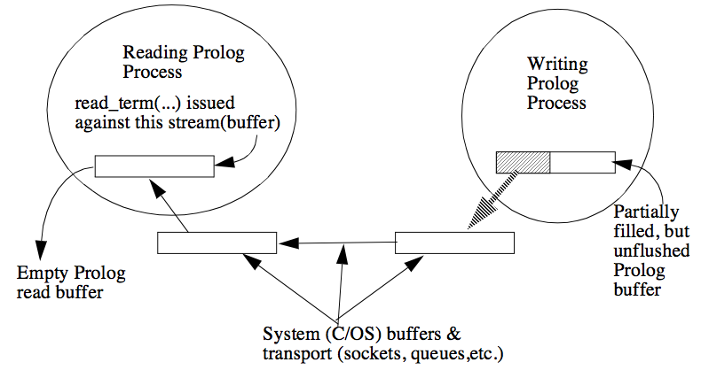

---
---

# 10 Prolog I/O
{:.no_toc}

* TOC
{:toc}

Most programs need to communicate with the outside world. There are a wide variety of outside entities with which a program can communicate, ranging from the
screen, keyboard, and files to other programs over networks. This section describes
the facilities which ALS Prolog provides for input/output (I/O) communication.
The initial sections describe the fundamental stream-based communication facilities of ALS Prolog. Following this, the earlier so-called DEC-10-style facilities are
described; these are implemented in terms of the stream-based facilities.  Except for the most primitive aspects, the I/O system for ALS Prolog is entirely
implemented in ALS Prolog itself. Almost all of this code is contained in the following
builtins files: sio.pro, sio_wt.pro, sio_rt.pro, and blt_io.pro.

## 10.1 Streams, Sources, and Sinks
No matter how sophisticated the point of view one chooses to take, at bottom, computer communication is based on the notion of sequences of characters. Such sequences are generated by typing on keyboards, can appear on screens, can be recorded in files, can be transmitted across networks, etc. These sequences of characters are called streams, or, when more precision is necessary, character streams.

The word 'stream' is used in this context both because it conveys a sense of motion
and because it also conveys a sense of direction, as with the natural notion of stream
illustrated in the Figure below (Natural Streams).


Figure.  Natural Streams.


In addition, natural streams have a notion of source (the 'headwaters') and sink or
ultimate destination (the 'estuary'). Finally, a natural stream also conveys the notion of a point on the bank where one can stand and watch the stream flow by. All
of these natural notions have corresponding concepts in the computer notion of
character streams.

From the logical point of view, the notions of stream, source, and sink are fundamental notions. However, as indicated above, a stream is a finite or potentially infinite sequence of characters. Every stream is associated with a source and a sink.
When a stream is manipulated by a program, the program itself is either the source
or the sink of the stream. If the program is consuming the stream, the program is
then the sink for the stream. If the program is producing or generating the stream,
the program is then the source of the stream. (It is also possible for the same program to be both source and sink for a stream.)

When the program is the sink for the stream, in general some other entity in the
computing environment is the source for the stream. Possible external sources include files, keyboards, devices such as tapes cd-roms, and other programs communicating with the program in question via interprocess communication facilities, either locally or remotely. When the program is the source for the stream, some other
entity is normally the sink for the stream. In this case, the normal possible external
sinks include files, screens (or windows on screens), devices, and again, other programs. The notions of source and sink correspond to the notion of direction of flow
for natural streams. The characters in a computer stream flow from the source to
the sink.

Streams always have a beginning, but have an end only if they are finite. In principle, there is a sense of location, called the stream position, for all streams. This
sense of location, or stream position, corresponds to the natural notion of the point
on the bank of the stream where one stands and watches the stream flow by. In the
natural world, one can sometimes change the stream position by running along the
bank, thereby either viewing an earlier portion of the stream (the water) or advancing to a later portion. Some kinds of character streams allow this sort of repositioning, while others do not.

A fundamental principle underlying the notion of stream is this:

> A program manipulating a stream need have no knowledge of what lies at the other end of the stream.

Thus, a program which is the source of a stream (is producing a stream) need have
no knowledge of what is consuming the stream, and a program which is the sink for
a stream (is consuming a stream) need have no knowledge of what is producing the
stream.

Internally, a stream consists of an open source or sink of characters (e.g., a file, a
socket, a window, etc.), a pointer to the next place to read or write, and a buffer for
holding information until it's reasonable to transmit. The internal components illustrated in the Figure below are the following:
* the (open) file;
* the pointer to the next place to read or write is called the file pointer. It is
set to the beginning of the file when the file is opened. Whenever a read or
write operation is performed on the file, the file pointer is moved.
* The buffer is used for efficiency. Reading or writing one character at a time
from or to the disk (or most other sources or destinations of characters)
would be very slow. Instead, for output, characters are written to the memory-resident buffer. The buffer is flushed when it reaches its capacity.
Flushing causes the contents of the buffer to be written to disk. For input,
blocks of characters are moved from the disk to the memory resident buffer.
Prolog can then read the characters one at a time from the buffer much more
efficiently.


Figure. A Look Inside a Stream to a File.

The operations for dealing with streams fall into three groups:
* Operations for opening (or creating) streams.
* Operations for manipulating streams which are open (i.e., which exist).
* Operations for closing (or destroying) streams.

The only time a program must concern itself with what is at the other end of the
stream is when it must open or create the stream. At this time, the program must
specify what is to be at the other end of the stream. That is, it must specify what is
to be the source or the sink for the stream. Thereafter, whether manipulating or
closing the stream, the program need not worry about the nature or identity of the
source or sink at the other end of the stream. It is the job of the underlying implementation of the stream facilities (provided by ALS Prolog) to take care of all of the
details of moving the character stream between the program and the source or sink.

Under normal conditions, every ALS Prolog program automatically has two I/O
character streams automatically opened for it by the underlying ALS Prolog system.
These are called the default I/O streams. One of them is the default input stream
and is normally connected to the keyboard, while the other is the default output
stream, and is normally connected to the computer screen, or to a particular window
on the screen when running under a graphical operating system. These will be discussed in more detail in a later section. All other streams which the program seeks
to manipulate must be explicitly opened by the program, and should also be closed
by the program when they are no longer required.  
Under normal circumstances, all
streams which remain open when an ALS Prolog program exits to the operating system are automatically closed.

All streams have both a mode and a type. The mode of a stream basically reflects
the direction of flow of information in the stream. The two fundamental stream
modes are read and write. In read mode, the program is the consuming the
stream's information, so that the program is the sink for the stream. In write mode,
the program is producing the information on the stream, so that the program is the
stream's source. Other modes are possible and will be discussed later.

The type of a stream reflects deeper information about the computing environment.
The great majority of computing systems and programming languages (including
earlier versions of Prolog and ALS Prolog) identify characters with bytes. However, this does not provide good support for alphabets with larger numbers of characters, and so a distinction is made between characters and bytes in the Prolog standard. Characters are internally represented as Prolog atoms, while bytes, as normally done, are represented by small integers. At bottom, a computer really moves
bytes around, not characters. So at bottom, what a program thinks of as a stream of
characters is really a stream of bytes. Since there is now a distinction between the
notions of characters and bytes, a program can choose to view a data stream as either a stream of characters or as a stream of bytes. The type of a stream indicates
this distinction. A text stream is a stream that is being viewed as a stream of characters. A binary stream is a stream that is being viewed as a stream of bytes. Facilities are provided for opening streams either as text or binary, and for manipulating them in both modes.

## 10.2 Opening and Closing Streams

To open (or create) a stream, a program must indicate a source/sink for the stream
(the other end from the program), must indicate a mode for the stream, and possible
should indicate some options for the creation of the stream. Moreover, the process
of opening or creating the stream should provide the program with some descriptor
or handle with which to refer to the created stream for future manipulation.
### 10.2.1 Stream opening predicates
There are two predicates used for opening streams:
```
open/3
open(SourceSink, Mode, Descriptor)
open(+, +, -)

open/4
open(SourceSink,Mode,Descriptor,Options)
open(+, +, -, +)
```
The three-argument version is simply definable in terms the four-argument version
by:
```
open(SourceSink, Mode, Descriptor)
    :- open(SourceSink, Mode, Descriptor, []).
```
The arguments for open/4 are described below.

### 10.2.2 SourceSink Terms

A sourcesink term describes a target 'other end' of a stream. (The Prolog program
of course holds on to 'this end' of the stream.) The particular sourcesink terms correspond to the various kinds of entities which can act as sources or sinks.

#### Files

If the target source or sink is to be a file, the sourcesink term is a Prolog atom which
is a name for the file, possibly including path information. (And conversely, an
atom in the sourcesink position can only indicate a file as target source or sink.) As
with consult/1, the file name may be either an absolute path name or a relative path
name. (On most operating systems, the 'raw' keyboard and screen are handled
more or less as special files. They will be discussed later.)

#### Strings

Prolog strings (lists of characters) are acceptable sources and sinks for streams.
When used as a source, a Prolog string S must be ground (fully instantiated), while
when used as a sink, the string S must be an uninstantiated variable (which could be
the tail of a larger list). In these cases, the sourcesink term is of the form

    string(S)

When used as a sink, a string S (initially an uninstantiated variable) is viewed as a
potentially infinite stream, which grows as characters are written to it.

#### Atoms and UIAs

Atoms and UIAs are also acceptable sources and sinks for streams. In this case,
the sourcesink term is of the form

    atom(A)

where A is the atom or UIA in question. When used as a sink, the atom or UIA A
is a stream of finite length, and any characters initially contained in A are gradually
overwritten by the output process.

#### Sockets

Sockets may also be used as source or sinks. The sourcesink term is of one of the
following two forms:

    socket(Target)     socket(DescriptionList)

In the first case, Target is any atom. This first case is a shorthand for a particular
instance of the second case, namely,

    socket([target=Target]).

In the second case, which is the general case, DescriptionList is a list of equations, each of which is of the form

    Tag = Value.

The possible values Tag may take on are:
```
domain type protocol port target.
```

The expressions which Value may take on are determined by the value of Tag. The
only required tag which must appear is the target tag. Default values are supplied
for all other tags if no equation is present. The socket tags, the range of corresponding values, and their defaults, are described below.
```
domain: values = [af_unix, af_inet]; default = af_unix

type: values = [sock_stream, sock_dgram]; default = sock_stream

protocol: values = [0, ip, icmp, tcp, udp]; default = ip

port: 
    values = any acceptable port number; 
    default: sock_stream = 1599; sock_dgram = 1598.

target:
    values = an atom which is an acceptable machine name;
```

When the socket is a read (incoming) socket, the null atom '' can be used.
Here are several simple examples:
```
socket(jarrett)
socket('')
socket([target='', domain=af_inet, type=sock_stream])
socket([target=jarrett, domain=af_inet, type=sock_dgram])
```

#### Windows

When running the Tcl/Tk windowed version of ALS Prolog, text windows are acceptable sources and sinks for streams. In this case, the sourcesink term is of the
form

    tk_win(Interp, Name)

where Interp is the Tcl/Tk interpreter under which the text window has already
been created, and Name is an atom which is a name for the target window (see the
Sections on use of the Tcl/Tk interface in the Development Tools part of the manuals).

#### Null Streams

For various design reasons, it is sometimes convenient to utilize null streams: i.e.,
virtual empty or infinite streams which are not attached to any system resource.
Such streams are analogous to the ersatz device /dev/null on Unix. These null
streams are available on all computing platforms in ALS Prolog, and are available
both for output and for input. To utilize a null stream for output, execute the goal

    open(null_stream(Name),write, S, Options),

where Name is an atom (which is not taken as an alias for the stream). Then arbitrarily much output can be written to the stream S with no effect on computing resources. Similarly, to utilize a null stream for input, execute

    open(null_stream(Name), read, S, Options),

where Name is an atom. Then any input operations from stream S will always encounter the end_of_file condition without errors.

#### URLs: Internet Streams

URLs may be used as a source or sink for a stream. When <URL> is a proper url, and <CurlOptionList> is a list of Curl options as described in Section 10.11,

    url(<URL>, <CurlOptionList>)

is a sourcesink term.  The expression url(<URL>) is equivalent to url(<URL>, []).

A stream S opened with

    open(url(<URL>, <CurlOptionList>), read, S, <possible generic stream options>)

will contain the characters returned by a GET to <URL>, conditioned by <CurlOptionList> and <possible generic stream options>.  A stream S opened with

    open(url(<URL>, <CurlOptionList>), write, S, <possible generic stream options>)

will capture all characters written to S (write,nl,printf, etc.), and when S is closed, the sequence of characters in S will be POSTed to <URL>, conditioned by <CurlOptionList>.  WARNING: The implementation of open(url(<URL>, <CurlOptionList>), write, S, …) utilizes the freeze construct.  Everything will work correctly so long as no gc (garbage collection) takes place; otherwise, Issue #87 will cause incorrect and unpredictable behavior.

For both read and write url streams, the Curl options available are exactly the same as for http/3 or curl/1-3 in Section 10.11.

Examples:
```
?- open(url('http://example.com/',[response_code(RC),total_time(TTT),result=_]), read, _,[alias(myStream)]), get_line(myStream,L),close(myStream).

RC=200
TTT=2.542704
L='<!doctype html>'

yes.

?- open(url('https://postman-echo.com/post', []), write, S, []), write(S, abcdef), close(S).

S=stream_descriptor('',closed,string,string("abcdef"),[noinput|output],false,
    43,"abcdef","f",0,0,true,0,wt_opts(78,400,flat),[],wait,text,eof_code,
    true,0)

yes.
```

### 10.2.3 Immediate versus Delayed Streams

A file sourcesink is said to be immediate in the sense that (normally) all of the characters (data) which will make up the stream are immediately available once the
stream is opened to the file. In contrast, a socket sourcesink is called delayed in the
sense that access to some (possibly) all of the characters making up the stream may
be delayed to the consuming process. We say that a stream is either immediate or
delayed if its corresponding sourcesink is immediate or delayed, respectively. This
distinction is of particular significance for term-level I/O reading from this stream,
but also has effects for character-level consumption of a delayed stream. Consider the situation sketched in the Figure below .


Figure. A Delayed Stream in a Delayed State.

When the Prolog system attempts to fill the read buffer (on the left) in response to
the read_term call, it is unable to obtain any characters from the underlying OS machinery. If the sourcesink for the reading processes were a file, this situation would
be interpreted as end of file. However, that is not what we want to do for a socket
(for example), since the writing process will presumably fill and/or flush the buffer
sooner or later, and more characters will become available to the reading process.
The refinements we introduce for this situation are detailed below.

#### Character Input from Delayed Streams

either returns (the code of) a character, which is a non-negative integer, or returns -1 to signify end of file. We extend get_char/2 to return -2 when
the stream is a delayed stream which is still open, the stream has not reached end of
stream, but no characters are available for processing.
get_char/2

#### Term Input from Delayed Streams

The behavior of read_term/3 for a delayed stream is governed by the read option blocking(Bool), where Bool is either true or false. Note that the default behavior is blocking(true) -- a blocking read. Under the default blocking(true) option, read_term/3 behaves just as it does for immediate streams. The difference
in behavior occurs for delayed streams. Suppose that the situation in the Delayed Streams Figure (above)
came about as follows. The read_term(...) goal was initiated, and at that time,
some characters were available. But before read_term can finish parsing a complete Prolog term, the characters are consumed. If the stream were an immediate
stream, we only run out of characters at end of stream, and in that case, the system
would raise an exception, indicating that end_of_file (if it were a file) was encountered improperly.

However, when the stream S is a delayed stream which is in the delayed state of Delayed Streams Figure (above) , the goal

    read_term(S, T, [blocking(false)]),

succeeds, and binds T to the distinguished term

    unfinished_read.

The tokens which were read out of the stream's buffer in attempting this read_term
are saved in the stream data structure. Subsequent calls

    read_term(S, T, [blocking(false)]),

will attempt to again read from the stream, beginning with the tokens which were
saved, and then continuing with any (possibly) new characters which have arrived
since the last unfinished read.

### 10.2.4 Modes

There are four possible modes for a stream:
```
read
write
read_write
append
```
However, only file streams support the read_write and append modes at the present
time; all other streams only support the read or write modes.
The mode names rather clearly indicate the manner in which the streams to which
they apply will be used:
* A stream opened in read mode is being consumed by the program: the program is reading from the stream.
* A stream opened in write mode is being filled by the program: the program
is writing to the stream. However, if the sink for this stream is a file which
existed prior to the stream being opened, any previously existing contents
of the file are discarded (i.e., the file is truncated).
* A stream opened in read_write mode is generally both read from and written to by the program; in general, this implies that the program's position
in such a stream can be arbitrarily set and changed.
* Finally, append mode is like write mode, except that the previously existing contents of a file which is the sink for this stream are not lost: the stream
position is automatically set to the end of the file and all output through the
stream to the file is written at the end of the file.

### 10.2.5 Options

The options argument of open/4 is a list whose elements are acceptable stream
open options. These provide additional information to the open/4 procedure for
refined control of the stream being created. These latter are different sorts of Prolog
terms. Some of the options are applicable to all streams, while others apply only to
streams connected to particular kinds or sources or sinks, or of particular modes or
types.

#### Type: text vs binary

At most one of type(text) or type(binary) can be present on the options list. When type(text) is
present, the stream is treated as a character stream. When type(binary) is present, the
stream is treated as a byte stream. If neither is present, the stream is treated as a
character stream, so that the default is type(text).

#### aliases

An alias is an atom which acts as a global name for the stream to be opened. Once
a stream has been opened, the stream descriptor (returned in the third argument of
open/3 and the fourth argument of open/4) can be passed around between procedures and used during stream manipulations (typically reads and writes). However,
if an alias is assigned to the stream, the stream descriptor which is returned by
open/[3,4] can be ignored, and all stream manipulations (e.g. reads and writes)
can refer to the stream by using the alias instead of the stream descriptor. To indicate that Atom is to be an alias for a stream to be opened, the expression

    alias(Atom)

should be included on the options list of the call to open/4 which creates the stream.
(There are also procedures for dynamically assigning an alias to a stream after
stream creation; these will be discussed later.)

#### seek_type

Some streams can be repositioned during program execution. These options indicate the type of repositioning which is requested for the stream. Not all streams support such repositioning. It the stream to be opened does not support the requested
repositioning, the repositioning request generates an exception from open/4..
There are two types of repositioning requests:
```
reposition(true)
reposition(false)
```
The first indicates that the stream should support repositioning to any meaningful
position (The ISO standard only requires that the stream should support repositioning to any previously occupied position). The second indicates simply that repositioning is not requested.

#### buffering

These options allow the programmer to control the coordination between the
stream's buffer and the ultimate external source or destination of the data. These
options are most meaningful for file streams, but also have some significance for
some other kinds of streams. A buffering option is indicated by a term of the form

    buffering(BOption)

where BOption is one of the following three atoms:
```
byte
line
block
```
These options determine how often data is moved between the stream buffer and the
source or destination. The first, byte, indicates that data should be moved on every
character or byte (according as the stream is text or binary) handled by the program; in essence, this specifies no buffering should be used. The second, line, indicates that data should be moved on a line-by-line basis. The third option, block,
essentially indicates that data should be moved in the largest units possible, as determined by the buffer size of the stream, and the block or buffer size of the external
source or sink. The default is block buffering since it is generally the most efficient.

#### bufsize

This option allows the programmer to control the size of the buffer assigned to the
stream. The option expressed by a term of the form

    bufsize(N)

where N is an integer (which should be a power of 2). The default is 1024. The
maximum value is determined by the largest contiguous area available on the Prolog heap.

#### prompt_goal

This option is useful when a pair of streams, one in read and one in write mode, are
being used for interactive communication, say to a window, or to the keyboard and
screen. However, this option strictly applies only to a single stream, and is meaningful only if the stream is in read mode. The option is of the form

    prompt_goal(Goal)

where Goal is a Prolog term which indicates a goal which can be run. Whenever
the buffer of the stream to which this option applies (which must be in read mode)
is empty, before attempting to refill the stream's buffer from the external source,
the system will first execute the goal Goal. Here is how this option is normally
used. Suppose we wish to use a read mode and write mode stream to window myWin, and that whenever the read stream buffer is empty, we want a prompt to be
printed on the window. Consider the following code fragment:
```
open(window(myWin),write, [buffering(line),text], OutStream),
open(window(myWin), read, [prompt_goal(user_prompt_goal(OutStream))], InStream),
```
Both streams are opened with line buffering; the write stream is explicitly indicated to be a text stream, while the read stream is a text stream by default (this is just by way of example). 
In addition, the read stream has a prompt_goal option
applied. Whenever the buffer of the read stream is empty, the system will first run
the generic goal
```
get_user_prompt(Prompt), put_atom(Stream,Prompt), flush_output(Stream).
```
In this case,
```
    user_prompt_goal(OutStream).
```
The code defining this goal could be:
```
user_prompt_goal(Stream)
    :- put_atom(Stream, '>>'),
       flush_output(Stream).
```
Here the desired prompt is '>>' . The I/O routines put_atom/2 and
flush_output/1 will be described in later sections.

#### eof_action

[Not yet implemented.] For a stream which is opened in read or read_write
mode, this option indicates what action the system should take if the program attempts to read beyond the end of the stream. The option is expressed by a term of
the form

    eof_action(Action)

where Action is one of the following atoms:
```
error
eof_code
reset
```
The interpretations of these action options are as follows:

* error:An I/O end-of-file error exception is raised, signifying that no more input
exists in this stream.
* eof_code:The normal end-of-stream marker is returned (i.e., end_of_file for
character and term input and -1 for character input).
* reset:The stream is reset and another attempt is made to read from it.

#### write_eoln_type

This option allow the programmer to control which end-of-line (eoln) characters are
output by nl/1. A write end-of-line option is indicated by a term of the form

    write_eoln_type(Type)

where Type is one of the following three atoms:
```
cr
lf
crlf
```
These options determine what characters are output by nl/1. The first, cr, indicates that a carriage return (“\r”) should be output. The second, lf, indicates
that a line feed (“\n”) should be output. The third, crlf, indicates that a carriage
return followed by a line feed (“\r\n”) should be output.

The default for this option varies depending on the operating system being used.
MacOS uses cr, unix systems use lf, and MS DOS and Win32 use crlf.

#### read_eoln_type

This option allows the programmer to control which characters should be used to
detect an end-of-line (eoln) by read/2 and get_line/3. A read end-of-line option is indicated by a term of the form
read_eoln_type(Type)
where Type is one of the following four atoms:
cr
lf
crlf
universal
These options determine what read/2 and get_line/3 recognize as an endof-line. The first, cr, indicates that a carriage return (“\r”) should be interpreted
as an end-of-line. The second, lf, indicates that a line feed (“\n”) should be interpreted as an end-of-line. The third, crlf, indicates that a carriage return followed by a line feed (“\r\n”) should be interpreted as an end-of-line. The fourth,
universal, indicates that any of the end-of-line types (cr, lf, crlf) should be
interpreted as an end-of-line. The default is universal since this allows the correct
end-of-line interpretation for text files on all operating systems.

#### Socket options

connects(N) - N is the number of connection requests which can be queued by
the system while it waits for the server to execute the accept system call; the default
value for N is 1; on most systems, the maximum is 5.

### 10.2.6 Stream descriptors

A stream descriptor is the term which is returned when a stream is opened (in the
third argument of open/3 and the fourth argument of open/4). It is a complex Prolog term. However, programmers should not attempt to 'look inside' of it nor attempt to rely on any of its structure. Appropriate predicates are supplied (see the
following sections) for accessing and updating it as necessary. A stream descriptor
is what the Prolog standard describes as implementation dependent. As such, implementations are free to change the structure and nature of such terms. Conceivably, this could happen to stream descriptors in future releases of ALS Prolog. The
stream descriptor is used simply as a means of referring to the stream in the predicates described in the following sections.

### 10.2.7 Closing Streams
```
close/1.
close(Stream_or_Alias).
close(+).
```
Streams are very easily closed. One simply uses the unary predicate close/1 applied
either to the stream descriptor or to an alias for the stream:

	close(Stream_or_Alias).

## 10.3 Stream Environment

The stream environment of an ALS Prolog program is made up of the collection of
streams which are open, together with the special roles which have been assigned
to some of them. This section describes this environment together with predicates
for querying and altering its state (besides the basic predicates for opening and closing streams described in the last section), together with predicates for querying the
state(s) of individual streams.

### 10.3.1 Standard Streams

Two streams are automatically opened for every ALS Prolog program. Both are
text streams, and one is in read mode while the other is in write mode. The read
mode stream is automatically assigned the alias user_input while the write mode
stream is automatically assigned the alias user_output. In addition, for compatibility with older versions of Prolog, both streams are (ambiguously) assigned the
alias user.

When ALS Prolog is run as a TTY-style program under operating systems such as
Unix or DOS, the read mode stream user_input is connected to the process's
standard input (stdin), while the write mode stream user_output is connected to
the process's standard output (stdout). When ALS Prolog is run in one of its windowing versions (e.g., Motif), both user_input and user_output are connected to
the ALS Prolog Worksheet window.

### 10.3.2 Current Streams

No matter what streams have been opened (whether automatically or by the program), ALS Prolog always maintains a notion of the current input and output
streams. The current input and output streams serve as defaults for all of the input/
ouput operations to be described in the following sections. Thus, if a a version of
an I/O operation is used without a stream argument (e.g. a read or a write without a
stream argument), the operation is applied to the appropriate current input or output
stream.

When ALS Prolog starts up, the current input and output streams are automatically
set to the standard input and output streams. However, the program can change the
settings of the current input and output streams. The following predicates are used
for manipulating the current streams.
```
current_input/1
current_input(Stream)
current_input(?)
```
The goal

    current_input(Stream)

is true iff the stream Stream is the current input stream. Operationally, this
means that current_input unifies Stream with the stream descriptor of the
current input stream. Note that this means that current_input applies to
stream descriptors. In particular, even if Alias is an alias for the current input
stream, calling current_input(Alias) will fail.
```
current_output/1
current_output(Stream)
current_output(?)
```
The goal

    current_output(Stream)

is true iff the stream Stream is the current output stream. Operationally, this
means that current_output unifies Stream with the stream descriptor of the
current output stream. Note that this means that current_output applies to
stream descriptors. In particular, even if Alias is an alias for the current output
stream, calling current_output(Alias) will fail.
```
set_input/1
set_input(Stream_or_alias)
set_input(+)
```
set_input/1 is used to set the current input stream. If Stream_or_alias
is instantiated to either a stream descriptor of a stream in either read or read_write
mode, or is instantiated to an alias for such a stream,
then a call to
set_input(Stream_or_alias) changes the current input stream to be the
stream associated with Stream_or_alias. If Stream_or_alias is inappropriate for any reason, set_input/1 raises an exception.
Thus
set_input(S_or_a) cannot fail. Either it succeeds or it raises an exception, in
which case the current input stream remains unchanged.
```
set_output/1
set_output(Stream_or_alias)
set_output(+)
```
set_output/1 is used to set the current output stream.  If Stream_or_alias is instantiated to either a stream descriptor of a stream in either write, read_write, or append mode, or is instantiated to an alias for such a
stream, then a call to

    set_output(Stream_or_alias)

changes the current output stream to be the stream associated with
Stream_or_alias. If Stream_or_alias is inappropriate for any reason,
set_output/1 raises an exception. Thus set_output(S_or_a) cannot
fail. Either it succeeds or it raises an exception, in which case the current output
stream remains unchanged. .

### 10.3.3 Stream Characteristics

```
stream_property/2
stream_property(Stream, Property)
stream_property(?, ?)
```
stream_property/2 is used to determine whether or not a given property applies to a given stream; It can also be used to enumerate or generate the (open)
streams possessing a certain property. Declaratively,

    stream_property(Stream, Property)

is true if and only if Property holds of Stream. The possible values for
Property include all of the expressions which may appear on the Options list
passed to open/4, together with the following:

    input, output, mode(M), and position(P)

where M is one of text, binary, and P is (usually) an uninstantiated variable.

From a more procedural point of view, the action of stream_property is as
follows. If both Stream is instantiated to the stream descriptor of a currently open
stream, and Property is instantiated to a property descriptor which is true of
Stream, then

    stream_property(Stream, Property)

succeeds. Either or both of Stream or Property may be uninstantiated. In this
case,

    stream_property(Stream, Property)

is resatisfiable under backtracking. Thus, the action of in this case is effectively
to compute the pairs S,P such that S is a currently open stream which has property
P, in some undetermined order, and to unify Stream with S and Property with P.

For example, consider the goal

    stream_property(S, output).

If S is instantiated to a stream descriptor, this goal will check whether output is
permitted on this stream. If S is uninstantiated, under backtracking, S will successively be instantiated to all streams currently open for output.

As another example, consider the goal

    stream_property(S, file_name(F)).

If S is instantiated to a stream descriptor, then if the source or sink for S is a file,
F will be unified with the name of the file to which S is connected; otherwise, the
goal will fail. If S is uninstantiated, but F is instantiated to an atom (which is the
name of a file), then if some currently open stream has file F as its source or sink,
S will be unified with that stream's descriptor. Finally, if both S and F are uninstantiated, this goal, under backtracking, will compute all the pairs S,F where F is
a file name and S is a currently open stream connected to F.

When used in non-determinate ways, stream_property exhibits a "logical" semantics for state changes of the stream environment. For example, consider the goal

    stream_property(S,P), write(S:P), nl, close(S), fail.

This goal will enumerate all the properties for all streams which were open before
this goal was run. Note that this example may call close(S) several times for
each stream S, but this does not cause any problem since close simply succeeds
if called on a stream which is already closed.
```
is_stream/2
is_stream(Stream_or_alias, Stream)
is_stream(+, ?)
```
Succeeds when Stream_or_alias is a stream or alias and will bind Stream to the
corresponding stream.
```
assign_alias/2.
assign_alias(Alias, Stream_or_alias)
assign_alias(+, +)
```
If Stream_or_alias is associated with the stream S, and if Alias is a term, associates Alias to S as an alias. Note that a given stream can carry more than one alias,
and that Alias can be a compound term.
```
cancel_alias/1.
cancel_alias(Alias)
cancel_alias(+)
```
If Alias is currently associated with stream S as an alias, removes the alias association between Alias and S.
```
reset_alias/2.
reset_alias(Alias, Stream_or_alias)
reset_alias(+, +)
```
If Alias is currently associated with stream S as an alias, and if Stream_or_alias
is associated with stream S', first removes the association between Alias and
stream S, and then associates Alias to stream S' as an alias.
```
current_alias/2.
current_alias(Alias,Stream)
current_alias(?,?)
```
Succeeds iff Alias is an alias which is associated with the stream Stream.

### 10.3.4 Stream Positions

```
at_end_of_stream/0
at_end_of_stream/1
at_end_of_stream(Stream_or_alias)
at_end_of_stream(+)
```
Consider a stream S which has been opened for input. If the stream S is of finite
length, it is possible to reach a state in which all the characters or bytes in the stream
S have been read by input routines

    (such as get_byte, get_code, get_char, or read),

or when set_stream_position/2 has been used to move directly to the end
of the stream. At such a point, it is still valid to call an input routine. Each of the
input routines returns a specific value to indicate that end of stream has been
reached: get_code and get_byte return -1; get_char and read each return
the atom end_of_file. When one of these terminating values has been read,
the stream is said to be past the end of the stream, while the stream is said to be
at the end of stream when no more characters or bytes are available for input, but
no such input call has been made.

    at_end_of_stream(Stream_or_alias)

succeeds if and only the stream associated with Stream_or_alias is either at
end of stream or is past end of stream.

The predicate at_end_of_stream/0 determines whether the current_input
stream is at end of stream The predicate at_end_of_stream(Stream) still
succeeds when called in the past end of stream state. A stream need not have an
end, in which case this predicate would never succeed for that stream. If the source
for S_or_a is a device such as a terminal, and if there is no input currently available on that device, then at_end_of_stream will wait for input just as get_code
would do.
```
at_end_of_line/0.
at_end_of_line/1.
at_end_of_line(Alias_or_stream)
at_end_of_line(+)
```
These predicates determine whether a stream is at positioned at the end of a line, in
an elementary way. They simply attempt to perform a peek_char on the stream,
and determine if the character returned is identical with newline (i.e., the character
with code 0'\n). The are defined by:
```
at_end_of_line
    :- get_current_input_stream(Stream),
       at_end_of_line(Stream).

at_end_of_line(Alias_or_stream)
    :- peek_char(Alias_or_stream,0'\n).
```
```
flush_output/0
flush_output/1
flush_output(Stream_or_alias)
flush_output(+)
```
If the stream associated with Stream_or_alias is a currently open output
stream, then any output which is currently buffered by the system for that stream
is (physically) sent to that stream, and flush_output(Stream_or_alias)
succeeds.

flush_output/0 flushes the current output stream; it is defined by
```
flush_output
    :- current_output(Stream),
       flush_output(Stream.
```
```
flush_input/0
flush_input/1
flush_input(Stream_or_alias)
flush_input(+)
```
If the stream associated with Stream_or_alias is a currently open input
stream, then any input which is currently buffered by the system for this stream is
discarded, and flush_input(Stream_or_alias) succeeds.
flush_input/0 flushes the current input stream; it is defined by
```
flush_input
    :- current_input(Stream),
       flush_input(Stream).
```
```
stream_position/3
stream_position(Stream_or_alias, Current_position, New_position)
stream_position(+, ?, ?)
```
If the stream associated with Stream_or_alias supports repositioning, then
the call to stream_position/3 causes Current_position to be unified
with the current stream position of the stream, and, as a side effect, the stream
position of this stream is set to the position represented by New_position.
New_position may be one of the following values:
* An absolute integer which represents the address of a character in the
stream. The beginning of the stream or the first character in the stream has
position 0. The second character in the stream has position 1 and so on.
* The atom beginning_of_stream.
* The term beginning_of_stream(N) where N is an integer greater
than zero. The position represented by this term is the beginning of the
stream plus N bytes.
* The atom end_of_stream.
* The term end_of_stream(N) where N is an integer less than or equal to
zero. This allows positions (earlier than the end of stream) to be specified
relative to the end of the stream. The position represented by this term is
the end-of-stream position plus N bytes.
* The atom current_position.
* The term current_position(N) where N is an integer. This allows positions to be specified relative to the current position in the file.
```
set_stream_position/2
set_stream_position(Stream_or_alias, Position)
set_stream_position(+, +)
```
set_stream_position(Stream_or_alias, Position) changes the position of
the stream associated with Stream_or_alias to Position. This predicate is
effectively defined by:
```
set_stream_position(Stream_or_alias, Position)
    :- stream_position(Stream_or_alias, _, Position).
```
The possible error exceptions are the same as those for stream_position/3.

## 10.4 Byte Input/Output

```
get_byte/1
get_byte(Byte)
get_byte(?)
```
Unifies Byte with the next byte obtained from the current input stream.
```
get_byte/2
get_byte(Alias_or_stream, Byte)
get_byte(+, ?)
```
Unifies Byte with the next byte obtained from the stream associated with
Alias_or_stream.
```
put_byte/1
put_byte(Byte)
put_byte(Byte)
```
Outputs the byte Byte to the current output stream.
```
put_byte/2
put_byte(Alias_or_stream,Byte)
put_byte(Alias_or_stream,Byte)
```
Outputs the byte Byte to the stream associated with Alias_or_stream.

## 10.5 Character Input/Output

The predicates in this section perform character-level input and output on streams.
While these predicates are primarily intended for use on streams opened in text
mode, they have meaning for streams opened in binary mode, unless otherwise indicated. There are related byte-oriented predicates for streams opened in binary
mode. (Note that ALS Prolog is more relaxed than the ISO standard; the latter states
that character operations cannot be performed on binary streams, and that byte operations cannot be performed on character streams)
```
get_char/1
get_char(Char)
get_char(?)

get_char/2
get_char(S_or_a, Char)
get_char(+, ?)
```
get_char(Char) is equivalent to get_char(S, Char) where S is the current input stream; that is, get_char/1 is effectively defined by:
```
get_char(Char)
    :- current_input(Stream),
       get_char(Stream, Char).
```
Let Stream_or_alias be properly instantiated, and let S be the stream associated with Stream_or_alias. Then if S is a text stream,

    get_char(Stream_or_alias, Char)

is true iff Char unifies with the next character to be read from S, while if S is a
binary stream, it is true iff Char unifies with the next byte to be read from S. If S
is at or past end of stream, the 'eof action' associated with S is performed. If S is
a delayed stream, and is in the delayed state when the goal is issued, Char is bound to -2.

#### Examples


```
get_nonblank_char/1
get_nonblank_char(Char)
get_nonblank_char(-)

get_nonblank_char/2
get_nonblank_char(Stream, Char)
get_nonblank_char(+, -)
```
get_nonblank_char/1 is defined by

```
get_nonblank_char(Char)
    :- get_current_input_stream(Stream),
       get_nonblank_char(Stream,Char).
```
get_nonblank_char(Stream, Char) unifies Char with the next nonwhitespace character obtained from the input stream associated with
Alias_or_stream, if such a character occurs before the next end of line, and
unifies Char with the atom end_of_line otherwise.
```
get_atomic_nonblank_char/1
get_atomic_nonblank_char(Char)
get_atomic_nonblank_char(-)

get_atomic_nonblank_char/2
get_atomic_nonblank_char(Stream, Char)
get_atomic_nonblank_char(+, -)
```
get_atomic_nonblank_char/1 is defined by
```
get_atomic_nonblank_char(Char)
    :- get_current_input_stream(Stream),
       get_atomic_nonblank_char(Stream,Char).
```
get_atomic_nonblank_char(Stream, Char) unifies Char with the
atomic form of the next non-whitespace character obtained from the input stream
associated with Alias_or_stream, if such a character occurs before the next
end of line, and unifies Char with the atom

    end_of_line

otherwise. It is defined by
```
get_atomic_nonblank_char(Stream,Char)
    :- get_nonblank_char(Stream,Char0),
       (Char0 = end_of_line ->
            Char0 = Char
            ;
            name(Char, [Char0])
       ).
```
```
peek_char/1.
peek_char(Char)
peek_char(-)

peek_char/2
peek_char(Alias_or_Stream, Char)
peek_char(+, -)
```
peek_char(Char) unifies Char with the next character obtained from the default input stream. However, the character is not consumed.
peek_char(Alias_or_Stream, Char) unifies Char with the next character obtained from the stream associated with Alias_or_Stream. However,
the character is not consumed.
```
put_char/1
put_char(Char)
put_char(+)

put_char/2
put_char(Stream_or_alias, Char)
put_char(+,+)
```
put_char(Char) is equivalent to put_char(S, Char) where S is the current output stream; that is, put_char/1 is effectively defined by
```
put_char(Char)
    :- current_output(Stream),
       put_char(Stream, Char).
```
If Stream_or_alias is properly instantiated, S is the stream associated with
Stream_or_alias, and Char is a character, then

    put_char(Stream_or_alias, Char)

outputs the character Char to S, and changes the stream position on S to take account of the character which has been output.

#### Examples


```
put_string/1
put_string(String)
put_string(+)

put_string/2
put_string(Alias_or_stream, String)
put_string(+, +)
```
put_string(String) is defined by
```
put_string(String)
    :- get_current_output_stream(Stream),
       put_string(Stream, String).
```
If String is a Prolog string (i.e., a list of character codes),
put_string(Alias_or_stream, String) recursively applies put_char
to String to output the characters associated with String to Alias_or_stream.
```
put_atom/2
put_atom(Alias_or_stream,Atom)
put_atom(+,+)
```
Outputs the atom Atom to the stream associated with Alias_or_stream. Very
efficient.
```
get_number/3
get_number(Alias_or_stream,InputType,Number)
get_number(+,+,?)
```
Attempts to read a number of the given type InputType from the stream associated with Alias_or_stream, and if successful, unifies the result with Number.
The possible values for InputType are:
```
InputType       Type of Number
=========       ==============
byte            signed byte (8 bit)
ubyte           unsigned byte (8 bit)
char            signed byte (8 bit) (synonymous with byte)
uchar           unsigned byte (8 bit) (synonymous with byte)
short           signed short integer (16 bit)
ushort          unsignged short integer (16 bit)
int             signed integer (32 bit)
uint            unsignged integer (32 bit)
long            signed integer (32 bit)
ulong           unsignged integer (32 bit)
float           floating point (32 bit)
double          floating point (64 bit)
```
```
put_number/3
put_number(Stream_or_alias,OutputType,Number)
put_number(+,+,+)
```
put_number(Alias_or_stream,OutputType,Number) outputs the
number Number as OutputType to the stream associated with
Stream_or_alias. OutputType may take on the following values:
```
byte   short   long   float   double.
```
```
get_line/1
get_line(Line)
get_line(?)
```
get_line(Line) is defined by
```
get_line(Line)
    :- get_current_input_stream(Stream),
       get_line(Stream,Line).
```
```
get_line/2
get_line(Stream_or_Alias, Line)
get_line(+, ?)
```
Reads the current line or remaining portion thereof from the stream associated with
Stream_or_Alias into a UIA, and unifies this UIA with Line. If end-of-file
is encountered before any characters, this predicate will fail. If end-of-file is encountered before the newline, then this predicate will unify Line with the UIA
containing the characters encountered up until the end-of-file.
```
put_line/1
put_line(Line)
put_line(+)

put_line/2
put_line(Stream,Line)
put_line(+,+)
```
put_line(Line) is defined by
```
put_line(Line)
    :- get_current_output_stream(Stream),
       put_line(Stream,Line).
```
put_line(Stream, Line) is defined by
```
put_line(Stream,Line)
    :- put_atom(Stream,Line),
       nl(Stream).
```
```
skip_line/0
skip_line/1
skip_line(Alias_or_stream)
skip_line(+)
```
skip_line/0 is defined by
```
skip_line
    :- get_current_input_stream(Stream),
       skip_line(Stream).
```
If Alias_or_stream is open for (text) input,
skip_line(Alias_or_stream) skips to the next line of input for the stream
associated with Alias_or_stream.
```
nl/0
nl/1
nl(Stream_or_alias)
nl(+)
```
nl is equivalent to nl(S) where S is the current output stream; that is,
```
nl : -
    current_output(Stream),
    nl(Stream).
```
nl(Stream_or_alias) causes the current line or record on the stream associated with Stream_or_alias to be terminated.

## 10.6 Character Code Input/Output

These predicates provide a means of directly manipulating streams at the character
code level.
```
get_code/1
get_code(Code)
get_code(?)

get_code/2
get_code(Stream_or_alias, Int)
get_code(+,?)
```
get_code(Code) is equivalent to get_code(S, Code) where S is the current input stream; i.e., get_code/1 is defined by:
```
get_code(Code)
    :- current_input(Stream),
       get_code(Stream,Code).
```
Assume that Stream_or_alias is instantiated to a stream descriptor or to the
alias of a stream descriptor, and let S be the stream associated with
Stream_or_alias. If S is a text stream then

    get_code(Stream_or_alias, Code)

is true iff Code unifies with the character code corresponding to the next character
to be read from Stream, else if S is a binary stream it is true iff Code unifies with
the next byte to be read from S.
```
put_code/1
put_code(Code)
put_code(+)
```
put_code(Code) is equivalent to put_code(S, Code) where S is the current output stream; i.e., put_code/1 is defined by:
```
put_code(Code)
    :- current_output(Stream),
       put_code(Stream, Code).
```
```
put_code/2
put_code(Stream_or_alias, Code)
put_code(+,+)
```
put_code(Stream_or_alias, Code) outputs the character with code
Code to the stream associated with Stream_or_alias, and changes the stream
position on the stream associated with Stream_or_alias to take account of the
character which has been output.

## 10.7 Term Input/Output

ALS Prolog provides a rich array of predicates for I/O at the term level. The predicates in this section provide means for reading Prolog terms from input streams and
for writing Prolog terms to output streams. For both input of terms and output of
terms, there are a variety of options which can be requested. These options are controlled through the use of options lists which are passed to the various term-level I/O predicates.

### 10.7.1 Read options

A read options list is a list of read options, where the possible read options are defined as follows. Let T be the term which is (to be) read from the input stream.

```
variables(Vars) 
    Vars is unified with a list of the variables encountered 
    in a left to right traversal of the term T.

variable_names(VNs)
    VNs is unified with a list of elements of the form
    V=A, where V is variable which occurs in the
    term T and A is the associated name of that variable; 
    the elements V=A occur in the order in which the 
    variables V are encountered in the term T when T is 
    scanned left to right.

vars_and_names(Vars,Names) 
    Vars is unified with a list of the variables encountered 
    in a left to right traversal of the term T; Names is a 
    list of the associated names of the variables. '_' is 
    the only variable name which may occur more than once on 
    the list Names.

singletons(Vars,Names)
    Vars is unified with the singleton variables (those
    occuring only once) in the term T; Names is unified 
    with a corresponding list consisting of the names of 
    those singleton variables. Variables with name '_' are 
    excluded from these lists.

syntax_errors(Val)
    Val indicates how the system is to handle any
    syntax errors which occur durin g the reading of
    T. The possible values of Val and their interpretation are:

    error
        Occurrence of a sysntax error will cause the system 
        to raise an exception, which includes outputing a
        warning message. This is the default.

    fail
        Occurrence of a syntax error will cause the attempt 
        to read T to fail, and and error message will be output.

    quiet
        Occurrence of a syntax error will cause the attempt to 
        read T to fail quietly, with no message output.

    dec10.
        Occurrence of a syntax error will cause the attempt to read 
        T to output an error message, to skip over the offending input 
        charaters, and attempt to re-read T from the source stream.

blocking(Bool)
    For streams, such as socket streams or IPC queue streams, it 
    is possible for the stream to remain open, yet there be no 
    characters available at the time a read is issued. The value 
    of Type controls the behavior of the read in this setting. 
    The values of Type are as follows:

    true
        In this type of read, the read suspends or waits until 
        enough characters are available to parse as a valid Prolog term.

    false
        In this type of read, if no characters are available, the read 
        will immediately return with success, unifying the 'read term argument'
        (which is argument 1 for read_term/2 and is argumen 2 for read_term/3) 
        with the term unfinished_read; any tokens consumed in the read attempt 
        are saved in the stream data structure, and subsequent attempts to read
        from this stream begin with these tokens, followed by tokens created
        from further characters which arrive at later times.

debugging
    This option is not handled in satisfy_options/4.  Read terms are considered 
    to be clauses and debugging information is attached. This is likely to
    of little direct use to the application programmer.

attach_fullstop(Bool)
    This option determines if a fullstop is added to the tokens comprising a 
    the term to be read. It is most | useful when used in conjunction with atom
    or list streams.
```

```
read_term/2
read_term(Term, Options)
read_term(?, +)
```
read_term(Term, Options) is equivalent to read_term(S, Term, Options) where S is the current input stream; i.e., read_term/2 is defined by:
```
read_term(Term, Options)
    :- current_input(Stream),
       read_term(Stream, Term, Options).
```
```
read_term/3
read_term(Stream_or_alias, Term, Options)
read_term(+, ?,+)
```
read_term(Stream_or_alias, Term, Options) inputs a sequence TT
of tokens from the stream associated with Stream_or_alias until an end token
has been read. It is a syntax error if end of stream is reached before an end token
is found. TT is then parsed as a Prolog term which is then unified with Term.

A 'sequence of tokens' implies that single quotes and double quotes (if included in
the standard) are balanced. That is, an apparent end token appearing inside any
kind of quotes is not an end token. However, parentheses and square brackets need
not be balanced. The effect of this predicate may be modified by clauses of the special user-defined procedure char_conversion/2.
```
read/1
read(Term)
read(?)

read/2
read(Stream_or_alias, Term)
read(+,?)
```
read(Term) is equivalent to read_term(S, Term, []) where S is the current input stream; that is, read/1 is defined by:
```
read(Term)
    :- current_input(Stream),
       read_term(Stream, Term, []).
```
read(Stream_or_alias, Term) is equivalent to

    read_term(Stream_or_alias, Term, []),

so that read/2 is defined by:
```
read(Stream_or_alias, Term)
    :- read_term(Stream_or_alias, Term, []).
```
The following convenience predicates are quite useful:
```
atomread/2
atomread(Atom,Term)
atomread(+,-)

atomread/3
atomread(Atom,Term,Options)
atomread(+,-,+)

bufread/2
bufread(String,Term)
bufread(+,-)

bufread/3
bufread(String,Term,Options)
bufread(+,-,+)
```
These are defined as follows:
```
atomread(Atom,Term)
    :- atomread(Atom,Term,[]).

atomread(Atom,Term,Options)
    :- open(atom(Atom),read,Stream),
       read_term(Stream,Term, [attach_fullstop(true)|Options]),
       close(Stream).

bufread(String,Term)
    :- bufread(String,Term,[]).

bufread(String,Term,Options)
    :- open(string(String),read,Stream),
       read_term(Stream,Term, [attach_fullstop(true)|Options]),
       close(Stream).
```

### 10.7.2 Write options

Just as the reading of terms from input streams can be affected by read options, the
writing of terms to ouptut streams can be controlled by write options. The terms
written are output in a pretty-printed format which breaks lines before wrapping,
and uses indenting for legibility. Also, by default, the variables occurring in a term
are represented using identifiers of the forms A, ...., Z, A1,....,A2,....... A write options list is a list of write options, which are one of the terms defined below. The
default setting for each of these options is indicated in square brackets following
each write option term. Let T be the term being written out, and let the expression
Bool take on one of the values true or false.
```
quoted(Bool) [default: Bool = false]
    If Bool = true, forces all symbols in T to be written out in such a manner that 
    read_term/[2,3] may be used to read them back in. Bool = false indicates that 
    symbols should be written out without any special quoting. In the latter case, 
    embedded control characters will be written out to the output device as is.

ignore_ops(Bool) [default: Bool = false]
    If Bool = true, operators in T will be output in function notation (i.e., 
    operators are ignored.) If Bool = false, operators will be printed out 
    appropriately.

portrayed(Bool)
    not implemented yet

numbervars(Bool) [default: Bool = true]
    If Bool = true, terms of the form $VAR(N) where N is an integer will print out 
    as a letter.

lettervars(Bool) [default: Bool = true]
    If Bool = true, variables occurring in T will be printed out as letters 
    A, B, ...., or letters followed by numbers: A1,...,A2,... If Bool = false, 
    variables will be printed as _N where N is computed via the internal address 
    of the variable. This latter mode will be more suited to debugging purposes 
    where correspondences between variables in various calls is required.

maxdepth(N,Atom1,Atom2) [default: maxdepth(20000,*,...)]
    N is the maximum depth to which to print; Atom1 is the atom to output when 
    this maximum depth has been reached in printing any term. Atom2 is the atom 
    to output when this depth has been reached at the tail of a list.

maxdepth(N) [default: N = 20000]
    Equivalent to maxdepth(N,*,...).

line_length(N) [default: N = 78]
    N is the length in characters of the output line.  The pretty printer will 
    attempt to put attempt to break lines before they exceed the given line length.

indent(N) [default: N = 0]
    N is the initial indentation to use.

quoted_strings(Bool)
    If Bool = true, lists of suitably small integers will print out as a double 
    quoted string. If Bool = false, these lists will print out as lists of small numbers.

depth_computation(Val) [default: Val = non-flat]
    Val may be either flat or non-flat. This setting determines the nature of the pretty 
    printer's "depth in term" computation. If Val = flat, all arguments of a term or list 
    will be treated as being at the same depth. If Val = non-flat, then each subsequent 
    argument in a term (or each sebsequent element of a list) will be considered to be at a 
    depth one greater than the depth of the preceding structure argument (or list element).

line_end(Bool) [default: Bool = true]
    When Bool = true, nl(_) is normal; when Bool = false, line-breaks (new lines) are preceded by a \ .
```
### 10.7.3 Writing output
```
write_term/2
write_term(Term, Options)
write_term(+, +)

write_term/3
write_term(Stream_or_alias, Term, Options)
write_term(+,+,+)
```
write_term(Term, Options) is equivalent to write_term(Out, Term, Options) where Out is the current output stream; that is, write_term/2 is defined by:
```
write_term(Term, Options)
    :- current_output(Stream),
       write_term(Stream, Term, Options).
```
write_term(Stream_or_alias, Term, Options) outputs Term to
the stream associated with Stream_or_alias in a form which is defined by the
write-options list Options.

#### Examples
```
write_term(S, [1,2,3]) ==> [1,2,3]
write_term(S, [1,2,3], [ignoreops(true)]) ==> .(1, .(2, .(3, [])))
write_term(S, '1 < 2' ) ==> 1<2
write_term(S, '1 < 2', [quoted(true)] ) ==> '1 < 2'
write_term(S, 'VAR'(0),[numbervars(true)]) ==> A
write_term(S, 'VAR'(1),[numbervars(true)]) ==> B
write_term(S, 'VAR'(28),[numbervars(true)]) ==> C1
```
```
write/1
write(Term)
write(+)

write/2
write(Stream_or_alias, Term)
write(+,+)
```
write(Term) is equivalent to write(Out, Term) where Out is the current
output stream; that is, write/1 can be defined by:
```
write(Term)
    :- current_output(Stream),
       write(Stream, Term).
```
write(Stream_or_alias, Term) is equivalent to

    write_term(Stream_or_alias, Term, [numbervars(true)]);

Thus, write/2 can be defined by:
```
write(Stream_or_alias, Term)
    :- write_term(Stream_or_alias, Term, [numbervars(true)]).
```
#### Examples
```
write(S, [1,2,3]) ==> [1,2,3]
write(S, 1 < 2 )  ==> 1<2
write(S, 'VAR'(0) < 'VAR(1) ) ==> A<B
```

```
writeq/1
writeq(Term)
writeq(+)

writeq/2
writeq(Stream_or_alias, Term)
writeq(+,+)
```
writeq(Term) is equivalent to writeq(Out, Term) where Out is the current output stream; i.e, writeq/1 can be defined by:
```
writeq(Term)
    :- current_output(Stream),
       writeq(Stream, Term).
```
writeq(Stream_or_alias, Term) is equivalent to

    write_term(Stream_or_alias, Term, [quoted(true), numbervars(true)]);

that is, writeq/2 can be defined by:
```
writeq(Stream_or_alias, Term)
    :- write_term(Stream_or_alias, Term, [quoted(true), numbervars(true)]).
```
#### Examples
```
writeq(S, [1, 2, 'A' ]) ==> [1, 2, 'A' ]
writeq(S, '1 < 2' ) ==> '1 < 2'
writeq(S, 'VAR'(0) < 'VAR(1) ) ==>  A<B
```
```
write_canonical/1
write_canonical(T)
write_canonical(+)

write_canonical/2
write_canonical(Stream_or_alias, Term)
write_canonical(+,+)
```
write_canonical(T) is equivalent to write_canonical(S, T) where
S is the current output stream; that is, write_canonical/1 can be defined by:
```
write_canonical(T)
    :- current_output(Stream),
       write_canonical(Stream, T).
```
write_canonical(Stream_or_alias, Term) is equivalent to

    write_term(Stream_or_alias, Term, [quoted(true), ignore_ops(true)]);

that is, write_canonical/2 can be defined by:
```
write_canonical(Stream_or_alias, Term)
    :- write_term(Stream_or_alias, Term, [quoted(true), ignore_ops(true)]).
```
#### Examples
```
write_canonical(S, [1, 2, 3 ]) ==> '.'(1, '.'(2, '.'(3, [] )))
write _canonical(S, 1 < 2 ) ==> < (1, 2 )
write _canonical(S, '1 < 2' ) ==> '1<2'
write_canonical(S, 'VAR'(0) < 'VAR'(1) ) ==> < ('VAR' (0), 'VAR' (1))
```
```
write_clause/1.
write_clause(Clause)
write_clause(+)

write_clause/2.
write_clause(Alias_or_stream, Clause)
write_clause(+, +)

write_clause/3.
write_clause(Alias_or_stream, Clause, Options)
write_clause(+, +, +)
```
These convenience predicates are defined by:
```
write_clause(Clause)
    :- get_current_output_stream(Stream),
       write_clause(Stream, Clause).
And:
write_clause(Stream, Clause)
    :- write_clause(Stream, Clause, []).
And:
write_clause(Stream, Clause, Options)
    :- write_term(Stream,Clause, Options),
       put_char(Stream, 0'.),
       nl(Stream).
```
Since one often must ouput sequences of clauses, the following predicates are useful:
```
write_clauses/1.
write_clauses(Clauses)
write_clauses(+)

write_clauses/2.
write_clauses(Alias_or_stream, Clauses)
write_clauses(+, +)
```
These predicates are defined by:
```
write_clauses(Clauses)
    :- get_current_output_stream(Stream),
       write_clauses(Stream, Clauses, []).

write_clauses(Stream, Clauses)
    :- write_clauses(Stream, Clauses, []).
```
```
write_clauses/3
write_clauses(Alias_or_stream, Clauses, Options)
write_clauses(+, +, +)
```
If Clauses is a list of terms (to be viewed as clauses), write_clauses/3 recursively applies write_clause/3 to the elements of Clauses.
### 10.7.4 Printf
The `printf` family of predicates are enhanced versions of the standard C library `printf` functionality.
A call to `printf` outputs the list of data in `ArgList` (numbers, strings, terms, etc), formatted as text based on directives in the `Format` string/atom. In addition to supporting most of the standard C printf
conversion-specifications, `printf` has extended Prolog specifiers for terms (%t) and print-procedures (%p).

See also [`printf/1-4`](../ref/printf.html) in the Reference Manual.

``` 
printf/1
printf(Format)
printf(+)

printf/2
printf(Format,ArgList)
printf(+,+)

printf/3
printf(Alias_or_stream,Format,ArgList)
printf(+,+,+)

printf_opt/3
printf_opt(Format,ArgList,Options)
printf_opt(+,+,+)

printf/4
printf(Alias_or_stream,Format,ArgList,Options)
printf(+,+,+,+)
```
printf/[...] accepts a format atom or string together with a list of arguments to print,
possibly a stream to print to, and possibly options. The format atom or string contains characters to be printed as is, argument placeholder characters to control the formats of the items being printed,
and backslash characters for special output characters. The figure below illustrates the general structure of the printf/2 predicate.

<figure>
<svg version="1.1" baseProfile="full" width="100%" viewBox="0 0 616 100"
    xmlns="http://www.w3.org/2000/svg">
  <defs>
    <marker id="arrow" orient="auto" markerWidth="2" markerHeight="4" refX="0.1" refY="2">
      <!-- triangle pointing right (+x) -->
      <path d='M0,0 V4 L2,2 Z' fill="black"/>
    </marker>
  </defs>
  <g marker-end='url(#arrow)' stroke-width="3" stroke="black" fill="transparent">
    <path d="M485 50 q -220 -70 -220 0"/>
    <path d="M515 50 q -190 -70 -190 0"/>
    <path d="M555 50 q -175 -70 -175 0"/>
  </g>
  <text x="308" y="72" font-family="monospace" font-size="20" font-weight="bold" text-anchor="middle">
    printf("Solution: %t + %t = %t \n", [X, Y, Z])
  </text>
</svg>
<figcaption>Figure. printf formatting</figcaption>
</figure>


As a simple example, the following clause defines a predicate for adding two numbers and printing the result:
```
add(X,Y)
    :- Z is X + Y,
       printf("Solution: %t + %t = %t\n",[X,Y,Z]).
```
The %t placeholder tells printf/2 that it should take the next argument from the
argument list, and print it as a Prolog term. The \n at the end of the format string
causes a newline character to be printed. The following shows the result of calling
add/2:
```
?- add(7, 8).
Solution: 7 + 8 = 15.

yes.
```
The same effect could have been obtained without printf/2. It is instructive to see how it is done:
```
add(X,Y)
    :- Z is X + Y,
       write(X),
       write(' + '),
       write(Y),
       write(' = '),
       write(Z),
       nl.
```
The second version of add/2 is longer and somewhat harder to read. If no
arguments need be supplied to printf (i.e., the format atom or string contains no placeholder
characters), the unary version, printf/1, can be used.  

The fundamental formatted output predicate is printf/4. The first four predicates above are convenience predicates and can be defined in terms of `printf/4` as follows:
```
printf(Format)
    :- current_output(Stream),
       printf(Stream,Format,[],[]).

printf(Format,ArgList)
    :- current_output(Stream),
       printf(Stream,Format,ArgList,[]).

printf_opt(Format,ArgList,Options)
    :- current_output(Stream),
       printf(Stream,Format,ArgList,Options).

printf(Alias_or_stream,Format,ArgList)
    :- printf(Alias_or_stream,Format,ArgList,[]).
```
`printf/1-4` are closely related to the C language printf function. Roughly, the placeholder formats supported by `printf/1-4` are the same as those allowed by the C language
printf, with the inclusion of several additional prolog-oriented placeholders, 
in particular, '%t', described below.  Where one would call the C language function in the form

    printf(Format, A1, A2, ..., An),

one calls the Prolog printf/2 in the form

    printf(Format, [A1,A2,...,An]).

In concept, in executing `printf(Format,ArgList)`, the `Format` atom is scanned from left to right to assemble the list of occurrences of placeholders, and that list is matched against the `ArgList`.  The printing of each element of `ArgList` is controlled by the corresponding placeholder.

Format placeholders are specified as follows. An *extent expression* consists of
either a sequence of digits, or of two sequences of digits separated by a period(.);
in addition, an extent expression may be prefixed with a minus sign (-). If K is an
extent expression, a format placeholder is an expression of the form `%KZ`, where Z is one of the placeholder letters other than `t` or `p`.
The behavior of printf/[..] for the format elements %KZ is completely in accord with the C printf, since in these cases, the arguments (format placeholder and `ArgList` element, appropriately converted) are simply passed to the C printf for execution.

Note that a printf `Format`  can be a (single-quoted) atom, or a prolog.string (e.g. "abc...").
Using prolog double-quoted strings consumes more storage than (single-quoted) atoms.

The following are useful pages concerning C printf: [Format specifiers in C](https://www.geeksforgeeks.org/format-specifiers-in-c/),  [printf format string](https://en.wikipedia.org/wiki/Printf_format_string).

As noted above, for %t, the corresponding element of `ArgList` is printed on the output stream as a Prolog term, such as would be output by write/1.

Finally, the format `%p` allows the programmer to take control of the formatting process as follows.
Suppose that the format placeholder is %p, that `Stream` is the stream argument to `print/3` or `printf/4`, and
that `PArg` is the `ArgList` element corresponding to %p. Then the action of printf/4 is determined by the following:
```
(PArg = Stream^PrintGoal0 ->
        call(PrintGoal0)
        ;
        (PArg = [Stream, Options]^PrintGoal0 ->
                call(PrintGoal0)
                ;
                call(PArg)
        )
).
```
It is important that `Stream` above is the stream argument to `print/3` or `printf/4`.

There are a number of printf examples on the page for [`printf/1-4`](../ref/printf.html) in the Reference Manual.

```
sprintf/3
sprintf(Alias_or_stream,Format,ArgList)
sprintf(+,+,+)

bufwrite/2
bufwrite(String,Term)
bufwrite(String,Term)

bufwriteq/2
bufwriteq(String,Term)
bufwriteq(String,Term)
```
These very useful convenience predicates are defined by
```
sprintf(Output,Format,Args)
    :- open(string(Output),write,Stream),
       printf(Stream,Format,Args),
       close(Stream).

bufwrite(String,Term)
    :- open(string(String),write,Stream),
       write_term(Stream,Term,
          [line_length(10000),quoted(false),
           maxdepth(20000), quoted_strings(false)]),
       close(Stream).

bufwriteq(String,Term)
    :- open(string(String),write,Stream),
       write_term(Stream,Term,
          [line_length(10000), quoted(true),
           maxdepth(20000), quoted_strings(false)]),
       close(Stream).
```

## 10.8 Operator Declarations

```
op/3
op(Priority, Op_specifier, Operator)
op(+, +, +)
```
op/3 is used to specify Operator as a syntactic operator (for the Prolog parser) according to the specifications of Priority and Op_specifier.
```
current_op/3
current_op(Priority, Op_specifier, Operator)
current_op(?, ?, ?)
```
current_op(Priority, Op_specifier, Operator) is true iff Operator is an operator with properties defined by specifier Op_specifier and
precedence Priority.

#### Examples
currentop(P, xfy, OP). Succeeds three times if the predefined operators have not been altered, producing the following bindings:
```
P ==> 1100        OP ==> ;

P ==> 1050        OP ==> ->

P ==> 1000        OP ==> ,
```

The order in which the solutions are produced is implementation dependent.

## 10.9 DEC10-Style I/O Predicates

The full details of the definitions of the DEC10-style I/O predicates are presented
in the file sio_d10.pro which is in the alsdir subdirectory. This file should be loaded whenever one wishes to use the DEC10- style I/O system (apart from simple
calls to read/1 and write/1). Note that the predicates listed here as DEC10-style
predicates have been added to the ALS Library, and so the file sio_d10.pro is automatically loaded by the development environment whenever one of them is called.

Below, we present conceptual definitions (which simply suppress some of the detail) of the DEC10 predicates.
```
see/1.
    see(Alias_or_stream)
        :- 'is input stream'(Alias_or_stream,Stream),
           !,
           set_current_input(Stream).
    see(FileName) 
        :- open(FileName,read,[alias(FileName)],Stream),
           set_input(Stream).

seeing/1.
    seeing(Alias)
        :- current_input(Stream),
           current_alias(Alias,Stream), !.
    seeing(Stream) 
        :- current_input(Stream).

seen/0.
    seen 
        :- current_input(Stream),
           close(Stream).

tell/1.
    tell(Alias_or_stream)
        :- 'is output stream'(Alias_or_stream,Stream), !,
           set_current_output(Stream).
    tell(FileName)
        :- open(FileName,write,[alias(FileName)],Stream),
           set_current_output(Stream).

telling/1.
    telling(Alias)
        :- current_output(Stream),
           current_alias(Alias,Stream), !.
    telling(Stream)
        :- current_output(Stream).

told/0.
    told
        :- current_output(Stream),
           close(Stream).

get0/1.
    get0(Byte)
        :- current_input(Stream),
           get_code(Stream,Byte), !.

get/1.
    get(Byte)
        :- get0(Byte0),
           get_more(Byte0,Byte).

    get_more(Byte0,Byte)
        :- Byte0 =< 0' ', !,
           get0(Byte1),
           get_more(Byte1,Byte).
    get_more(Byte,Byte).

skip/1.
    skip(Byte)
        :- get0(Byte0),
           skip_more(Byte,Byte0).

    skip_more(Byte,Byte0)
        :-!.
    skip_more(Byte,_)
        :- get0(Byte0),
           skip_more(Byte,Byte0).

put/1.
    put(Byte)
        :- current_output(Stream),
           put_code(Stream,Byte), !.

tab/1.
    tab(N)
        :- N =< 0, !.
    tab(N)
        :- NN is N-1,
           put(0' '),
           tab(NN).

ttyflush/0.
    ttyflush
        :- flush_output.

display/1.
    display(X)
        :- write_term(X,[quoted(false),ignore_ops(true),numbervars(true)]).
```

## 10.10 The user file

The file user represents both the keyboard (stream user_input) and the display
(stream user_output). The system automatically opens stream user_input
to be stdin, and opens stream user_output to be stdout. .

The above information is useful if you use operating system shell commands to
change the standard input and output to be other than the keyboard and display.
This will work properly if ALS Prolog was invoked with the -g and -b command
line switches, and if the operating system supports such redirection (e.g., the Macintosh does not).

The user file (user_input, user_output) cannot be closed with close/1. 
However, you can signal end-of-file from the console on various operating systems as follows:
* On UNIX: Control-D
* On DOS and Win32: Control-Z followed by a return
* On the Macintosh: Control-D, or Control-Z.

## 10.11 REST-inspired Internet Connections

Inspired by the REST approach to internet file transfer,

    http/3
    http(RESTVerb, URL, Options)

provides REST-inspired transfer services.  At present, the following RESTVerbs are implemented:

    get, post put, delete, head, options, patch.

The available Options depend on the RESTVerb.

First, a comment about implementation.  At the bottom of the plumbing, the so-called [“Easy interface”](https://curl.haxx.se/libcurl/c/libcurl-easy.html) of the [Curl library](https://curl.haxx.se/libcurl/) is used to build the implementation.  In this approach, everything about a call http(RESTVerb, URL, Options) is converted into a single list of Easy-oriented Curl option equations, and that list is then passed to a C program built over the CURL Easy interface API.

For all equations on the list passed to the C program, the left side of every equation is first converted to uppercase.  With the exception of the special equation tags 'RESULT', 'RESULTFILE', and 'UPLOADDATA' (see below), the left side L of every equation L=R passed to the C plumbing is prefixed with either 'CURLOPT_' or 'CURLINFO_'.  The result of this prefixing must be either an [easy option](https://curl.haxx.se/libcurl/c/curl_easy_setopt.html) (cf. an [alphabetical listing](https://curl.haxx.se/libcurl/c/easy_setopt_options.html)) or an [info option](https://curl.haxx.se/libcurl/c/easy_getinfo_options.html).

Several simple transformations are applied to the elements of the list:

i) Unary prolog expressions &lt;F&gt;(A) are allowed on the Options list.  These are converted to equations FF = A, where FF is the uppercase version of &lt;F&gt;.

ii) Equations E = A are converted to EE = A where EE is the uppercase version of E.

#### Common options:

* The special equation 
    
    'RESULT' = Expr    [or, result = Expr]

can appear on Options.  Whatever HTTP result is produced from the underlying Curl call (GET or POST or whatever) is turned into a UIA, and is unified with Expr, which can be any prolog expression, including an unbound variable.

* The special equation

    'RESULTFILE' = '&lt;local file path&gt;'  [or resultfile = '&lt;local file path&gt;']

can also appear on Options.  Whatever HTTP result is produced from the underlying Curl call (GET, POST or whatever) is written into the file at &lt;local file path&gt;.  Note that both result = Expr and resultfile = '&lt;local file path&gt;' can occur together on an Options list: the HTTP result will be unified (as a UIA) with Expr and also written into the file at &lt;local file path&gt;.

* Given the call http(RESTVerb, URL, Options), the equation 'URL' = URL is placed on the ultimate Easy options list passed to the Curl-based C program.  This URL is the other end of the RESTVerb transaction (typically get or post, but also any of put, delete, head, options, or patch).

* Appropriate CURLINFO options can be used with any RESTVerb.  For example, including response_code(RC) on Options will bind RC to the HTTP response code returned by the server (e.g., 200, 404, etc.), and including total_time(TTT) will bind TTT to the number of seconds expended in the transaction.

#### Examples:
```
?- http(get,'http://example.com', [result=RR,response_code(RC),total_time(TTT)]).
?- http(get,'http://example.com', [response_code(RC),total_time=TTT,file='./myfile.txt']).
```
For RESTVerb = post, data for POSTing can be supplied in one of two forms: 1) structured data such as is uploaded from Web forms (e.g., 'name=admin&shoesize=12') and 2) free-form text data (e.g., 'lorem ipsum doler').  Either type of data can be supplied either directly in an equation on the options list, or in a file specified on the options list.  

* If data = &lt;atom&gt; ('DATA'=&lt;atom&gt;) (where &lt;atom&gt; is a symbol or uia) occurs on the options list, then the underlying CURL program will POST the text of &lt;atom&gt; via the equation 'READDATA'=&lt;atom&gt;.
 
* If datefile=FilePathName('DATAFILE'=FilePathName) occurs on the options list, then the complete text occurring in FilePathName is read into a single UIA DT, and the information is POSTED as if 'DATA'=DT had been included on Options.  The basic method of reading the file is to read it line by line, concatenating the lines to make the single UIA DT.  For convenience, two special options are provided which allow one to specify a character to be used in concatenating the file lines.  If the equation eol = &lt;char&gt; (or, 'EOL'=&lt;char&gt;) is present on the options list, when FilePathName is read, the character &lt;char&gt; will be used as a separator between the concatenated lines.  Equivalently, if eolcode=&lt;charcode&gt; (or, 'EOLCODE'=&lt;charcode&gt;) is present on the list, the character with code &lt;charcode&gt; will be used as the separator. (So, for example, spaces or newlines could be supplied as the separators.)

* If fields = &lt;atom&gt; ('FIELDS'=&lt;atom&gt; occurs on Options, then &lt;atom&gt; should represent a structured fields expression (e.g., 'name=admin&shoesize=12').  The underlying CURL program will POST the text of &lt;atom&gt; via 'POSTFIELDS'=&lt;atom&gt;.

* If fieldsfile = FilePathName (or, 'FIELDSFILE'= FilePathName) occurs on Options, then the complete text occurring in FilePathName is read into a UIA FE, just as for 'DATAFILE',  and the information is POSTED as if 'FIELDS'=FE had been included on Options.  As with 'DATAFILE', the basic method of reading the file concatenates all the lines into a single UIA, but this can be modified by use of the eol = &lt;char&gt; ('EOL'=&lt;char&gt;) or eolcode=&lt;charcode&gt; ('EOLCODE'=&lt;charcode&gt;) special equations.  (So, for example, ampersands (&) could be supplied as the separator.)

#### Examples:
```
?- http(post, 'https://postman-echo.com/post', [fields='name=admin&shoesize=12', result=RR]).
?- http(post, 'https://postman-echo.com/post', [fieldsfile='./foofields.txt', result=RR, eol='&']).
?- http(post, 'https://postman-echo.com/post', [datafile='./lorem.txt', eolcode=32,result=RR]).
```

### curl/1-3 

An alternate, more direct, way of invoking the immediate interface from prolog to Curl is
provided by the predicates curl/1-3.  Below, Options must be list of Curl options as described above.
```
curl/1:
curl(Options)
Cleans up option capitalization and invokes the low-level interface to Curl.

curl/2:
Effectively:
curl(URL, Target)
    :-
    curl(URL, [], Target).

curl/3:
Effectively:
curl(URL, Options, Target)
    :-
    XOptions = [url=URL, result=Target | Options],
    curl(XOptions).
```
#### Examples:
```
?- curl('http://example.com', [response_code=RC], RR).
?- curl('http://example.com', RR).
?- curl([url='http://example.com', response_code(RC), result=RR]).
```
