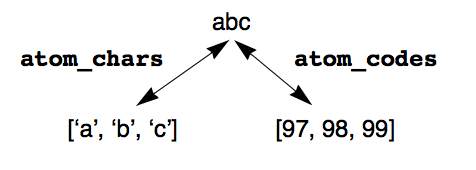

---
---

# 11 Prolog Builtins: Non I/O
{:.no_toc}

* TOC
{:toc}

## 11.1 Term Manipulation

### 11.1.1 Comparison predicates
```
@< /2
@> /2
@=< /2
@>= /2
== /2
\== /2
compare/3
compare(Relation, TermL, TermR)
compare(?, +, +)
```
@< /2, @> /2, @=< /2, @>= /2 perform comparisons on terms according to the
standard order for Prolog terms. ==/2 and \==/2 perform limited identity (isomorphism) checks on their arguments. compare/3 subsumes both these comparison
and identify checks.

### 11.1.2 Term Classification
```
atom/1
atomic/1
float/1
integer/1
number/1
```
These predicates classify terms according to the types expressed by their names.

### 11.1.3 Term Analysis & Synthesis
```
functor/3
functor(Term, Atom, Integer)
functor(?,?,?)
```
If Term is instantiated to a compound term (including an atom, which is viewed as
a compound term of arity 0), then Atom and Integer are unified respectively
with the functor of Term and the number of arguments of Term. Conversely, if
Atom is an atom and Integer is a non-negative integer, then Term is unified
with a compound term with functor Atom, and which has Integer number of arguments, all of which are uninstantiated variables.
```
arg/3
arg(Integer, Structure, Term)
arg(+, +, ?)
```
If Structure is a compound term of arity n, and Integer is an integer ≤ n,
then Term is unified with the nth argument of Structure.
```
=../2
Term =.. List
? =.. ?
```
Term =.. List (pronounced 'univ') translates between terms and lists of their
components. If Term is instantiated, List will be unified with a list of the form [F,
A1,...,An], where F is the functor of Term and A1,...,An are the arguments
of Term. Conversely, if List is of the form [F, A1,...,An] where F is an atom,
then Term will be unified with the term whose functor is F and whose arguments
are A1,...,An.
```
mangle/3
mangle(N, Structure, Term)
mangle(+,+,+)
```
mangle/3, though related to arg/3, destructively updates the Nth argument of Structure to become Term.
```
var/1
var(Term)
var(+)

nonvar/1
nonvar(Term)
nonvar(+)
```
var(Term) succeeds iff Term is an uninstantiated variable, and nonvar/1 behaves exactly opposite.

### 11.1.4 List manipulation predicates

```
append/3
append(LeftList,RightList,ResultList)
append(?,?,?)

dappend/3
dappend(LeftList,RightList,ResultList)
dappend(?,?,?)
```
dappend/3 is a determinate version of append/3.
```
member/2
member(Item, List)
member(?, ?)

dmember/2
dmember(Item, List)
dmember(?, ?)
```
dmember/2 is a determinate version of member/2.
```
reverse/2
reverse(List, RevList)
reverse(?, ?)

dreverse/2,
dreverse(List, RevList)
dreverse(?, ?)
```
dreverse /2 is a determinate version of reverse/2.
```
length/2
length(List, Length)
length(+, -)
```
length(List,Length) causes to be unified with the number elements of List.
```
sort/2
sort(List, SortedList)
sort(+, -)

keysort/2
keysort(List, SortedList)
keysort(+, -)
```
sort/2 sorts List according to the standard order, merging identical elements as
defined by ==/2,and unifying the result with SortedList. keysort/2 expects
List to be a list of terms of the form: Key-Data, sorting each pair by Key alone.
See also the ALS Library.

### 11.1.5 Term Database
```
recorda/3
recorda(Key,Term,Ref)
recorda(Key,Term,Ref)

recordz/3
recordz(Key,Term,Ref)
recordz(Key,Term,Ref)

recorded/3
recorded(Key,Term,Ref)
recorded(Key,Term,Ref)
```

## 11.2 Atom and UIA Manipulation
```
atom_length/2
atom_length(Atom,Length)
atom_length(+, - )
```
Determines the length of an atom.
```
atom_concat/3
atom_concat(Atom1,Atom2,Atom)
atom_concat(?, ?, ?)
```
Concatenates two atoms to form a third..
```
sub_atom/5
sub_atom(Atom,Before,Length,After,SubAtom)
sub_atom(+, ?, ?, ?)
```
Dissects atoms. When instantiated, Before, Length, and After  must be non-negative integers, and SubAtom must be an atom. Only Atom is required to be instantiated. If Atom and SubAtom are both instantiated, 
and if SubAtom is not in fact a subsidiary of Atom, then the call

    sub_atom(Atom,Before,Length,After,SubAtom)

will fail no matter what the values of Before,Length,and After. 

If SubAtom is in fact a subsidiary of Atom, then 

    sub_atom(Atom,Before,Length,After,SubAtom)

succeeds iff the length of SubAtom is Length, there are Before many characters in Atom ahead of the first character of SubAtom, and 
there are After many characters in Atom following the last character of SubAtom.

If SubAtom is an uninstantiated variable, various combinations of Before,Length,After (some uninstantiated) can be used to extract sub-atoms of Atom. For example:
```
?- sub_atom(abcdefg, 2, 3, _, SubAtom).
SubAtom=cde 

?- sub_atom(abcdefg, 3, L, 1, SubAtom).
L=3 
SubAtom=def 
```

```
gensym/2
gensym(Prefix, Symbol)
gensym(+, -)
```
Creates families of unique symbols.

## 11.3 Type Conversion
```
atom_chars/2
atom_chars(Atom,CharList)
atom_chars(?,?)

atom_codes/2
atom_codes(Atom,CodeList)
atom_codes(?,?)
```
These predicates convert between atoms on the one hand, and on the other hand, either lists of (atomic) characters, or lists of ascii character codes (Prolog strings):



```
number_chars/2
number_chars(Number,CharList)
number_chars(Number,CharList)

number_codes/2
number_codes(Number,CodeList)
number_codes(Number,CodeList)
```
In a manner exactly analogous to atom_chars(codes) above, these predicates
convert between numbers, and lists of atomic characters or lists of ascii character
codes.
```
term_chars/2
term_chars(Term,CharList)
term_chars(Term,CharList)

term_codes/2
term_codes(Term,CodeList)
term_codes(Term,CodeList)
```
In a manner exactly analogous to atom_chars(codes) above, these predicates
convert between terms, and lists of atomic characters or lists of ascii character
codes.
```
name/2
name(Constant,PrintName)
name(?,?)
```
name/2 converts between constants and Prolog strings (lists of character codes).
It is included primarily for backwards compatibility with older versions of Prolog;
use of [atom/number]_[chars/codes] above is recommended.

## 11.4 Collectives
```
bagof/3
bagof(Template,Goal,Collection)
bagof(+, +, ?)

setof/3
setof(Template,Goal,Collection)
setof(+, +, ?)

findall/3
findall(Template,Goal,Collection)
findall(+, +, ?)
```
Methods of obtaining all solutions to Goal. Fail when there are no solutions.
```
bagOf/3
bagOf(Template,Goal,Collection)
bagOf(+, +, ?)

setOf/3
setOf(Template,Goal,Collection)
setOf(+, +, ?)
```
Like bagof/3 and setof/3, respectively, but succeed when no solutions to
Goal exist, unifying Collection with the empty list [].
```
b_findall/4
b_findall(Template,Goal,Collection,Bound)
b_findall(+, +, -, +)
```
Like findall/3, except that it locates at most integer Bound > 0 number of solutions.

## 11.5 Prolog Database
```
assert/1
assert(Clause)
assert(+)

asserta/1
asserta(Clause)
asserta(+)

assertz/1
assertz(Clause)
assertz(+)
```
These predicates add a Clause to the Prolog database. If the principal functor and
arity of Clause is P/N, then:
* asserta/1 adds Clause before all previous clauses for P/N;
* assertz/1 adds Clause after all previous clauses for P/N;
* assert/1 adds Clause in some implementation-dependent position relative to all previous clauses for P/N.

```
clause/2
clause(Head, Body)
clause(+, ?)
```
Used to retrieve clauses (A :- B) [or, facts A] from the database where A unifies
with Head and B unifies with Body [true].
```
retract/1
retract(Clause)
retract(+)
```
The current module is searched for a clause that will unify with Clause. The first
such matching clause, if any, is removed from the database.
```
asserta/2
asserta(Clause, Ref)
asserta(+, - )

asserta/2
asserta(Clause, Ref)
asserta(+, - )

assertz/2
assertz(Clause, Ref)
assertz(+, - )

clause/3
clause(Head, Body, Ref)
clause(+, ?,?)

retract/2
retract(Clause, Ref)
retract(+, ? )
```
These predicates. all similar to their counter-parts above, add an extra argument
Ref to the previous arguments, where Ref is an implementation-dependent database reference. A database reference obtained from assert[a/z]/3 can be
passed to clause/3 to retrieve a clause, and to retract/2 to delete a clause.
```
abolish/2
abolish(Name, Arity)
abolish(+, +)
```
All the clauses for the specified procedure Name/Arity in the current module are
removed from the database
```
erase/1
erase(DBRef)
erase(+)
```
If DBRef is a database reference to an existing clause, erase(DBRef) removes
that clause.
```
instance/2
$clauseinfo/3
$firstargkey/2
```

## 11.6 Global Variables
gv_alloc/1, make_gv/1 and relatives provide methods for manipulating global variables. See Chapter 8 (Global Variables, Destructive Update & Hash Tables) for a discussion.

## 11.7 Control
```
cut(!)
comma(,)
arrow (->)
semicolon (;)
```
```
abort/0
abort
```
The current computation is discarded and control returns to the Prolog shell
```
breakhandler/0
breakhandler
```
```
call/1
call(Goal)
call(+)
```
If Goal is instantiated to a structured term or atom which would be acceptable as
the body of a clause, the goal call(Goal) is executed exactly as if that term
appeared textually in place of the expression call(Goal).
```
:/2
Module:Goal
+:+
```
Like call/1, but invokes Goal in the defining module Module. See Chapter 3 (Modules) .
```
catch/2
catch(Goal,Pattern,ExceptionGoal)
catch(+,+,+)
```

```
throw/0
throw(Reason)
throw(+)
```
These predicates provide a controlled abort mechanism, as well as access to the exception mechanism. They are introduced in Chapter 9.2 (Exceptions.)
```
fail/0
true/0
```
```
not/1
not(Goal)
not(+)

\+/1
\+(Goal)
\+(+)
```
not/1 and \+/1 are synonymous and implement negation by failure. If the
Goal fails, then not(Goal) succeeds. If Goal succeeds, then not(Goal)
fails.
```
repeat/0
repeat
```
repeat/0 always succeeds, even during backtracking.
```
$findterm/5
'$findterm'(Functor,Arity,HeapPos,Term,NewHeapPos)
'$findterm'(+, +, +, ?, -)
```
A low-level predicate for searching the heap.
```
forcePrologInterrupt/0
callWithDelayedInterrupt/[1,2]
setPrologInterrupt/1
getPrologInterrupt/1
```
The predicates provide access to the ALS Prolog interrupt mechanism. See Chapter 9.3 (Interrupts).

## 11.8 Arithmetic

See [`is/2`](../ref/is.html) in the Reference Manual.

## 11.9 Program and System Management
```
als_system/1
als_system(InfoList)
als_system(-)

sys_env/2
sys_env(OS, Processor)
sys_env(+, +)
```
Predicates for obtain system environmental information.
```
command_line/1
command_line(Switches)
command_line(+)
```
Provides access to the command line by which an ALS Prolog process was invoked
(including packaged applications).
```
compile_time/0
compile_time
```
Controls compile-time vs load-time execution of :- goals in files.
```
consult/1
consult(File)
consult(+)

reconsult/1
reconsult(File)
reconsult(+)

consultq/1
consultq(File)
consultq(+)

consult_to/1
consult_to(File)
consult_to(+)

consultq_to/1
consultq_to(File)
consultq_to(+)

consuld/1
consultd(File)
consultd(+)

reconsultd/1
reconsultd(File)
reconsultd(+)
```
These are various ways of dynamically loading a File of Prolog clauses into a running ALS
Prolog program. All these versions are defined in the builtins file blt_io.pro.  Note that in the above, File can be a list of files:  [File1, File2, ….].

consult/2 allows one to load files (either singly or a list) under various options:
```
	consult(File, Options)
```
where Options is a list of consult options.  The most useful is to add a folder to override the system search path for the duration of this consult.  For example:
```
	consult(['id.pro', 'hickory.pro'], [search_path('examples/als')]).
```
```
consultmessage/1
consultmessage(OnOff)
consultmessage(+)
```
consultmessage(on/off) controls whether or not messages are printed
when files are consulted.
```
curmod/1
curmod(Module)
curmod( - )

modules/2
modules(Module,Uselist)
modules(+, - )
```
Provides access to information concerning modules.
```
gc/0
gc
```
Manually invokes garbage collection/compaction.
```
halt/0
halt
```
```
hide/1
index_proc/3
```
```
listing/[0,1]
listing
listing(Form)
listing(+)
```
Provides source-codes listings of clauses in the current Prolog database.
```
statistics/[0,2]
statistics
statistics(runtime,X)
statistics(runtime,+)
```
Obtain system statistics at runtime.
```
system/1
system(Command)
system(+)
```
Issue a command to the OS command processor, when supported.
```
module_closure/[2,3]
:- module_closure(Name,Arity,Procedure).
:- module_closure(Name,Arity).
```
```
procedures/4
all_procedures/4
all_ntbl_entries/4
```
Retrieve information concerning all Prolog- or C-defined procedures.
```
'$procinfo'/5
'$nextproc'/3
'$exported_proc'/3
'$resolve_module'/4
```
Retrieve detailed information about a given procedure.

## 11.10 Date and Time

These predicates provide access to the date and time functions of the underlying operating system. They are designed to be portable across operating systems. As
such, they utilize Prolog-oriented, os-independent formats for date and time. Dates
are internally represented by terms of the form

    YY/MM/DD

where YY, MM, DD are integers representing, respectively, the year, the month
(counted from 1 to 12) and the day (counted from 1 to 31, as appropriate to the month).
The format of dates can be controlled by the predicate
set_date_pattern/1. Any permutation of YY, MM, and DD is permitted. The predicates are defined in the builtins file fs_cmn.pro together with the various system specific files fs_unix.pro, fs_dos.pro, fs_mac.pro.
```
date/1.
date(Date)
date(-)
```
date/1 returns the current date in the format set by set_date_pattern/1.
```
date_pattern/4.
date_pattern(YY,MM,DD,DatePattern).
date_pattern(+,+,+,-).
```
This predicate consists of a single fact which provides the mapping between the
three integers representing the date and the pattern expressing the date; this fact is
governed by set_date_pattern/1.
```
set_date_pattern/1.
set_date_pattern(Pattern).
set_date_pattern(+).
```
The acceptable arguments to set_date_pattern/1 are ground terms built up out
of the atoms yy, mm, and dd, separated by the slash '/', such as

    mm/dd/yy or dd/mm/yy.

The action of set_date_pattern/1 is to remove the existing date_pattern/4
fact, and to install a new fact which implements the date pattern corresponding to
the input argument.
```
date_less/2
date_less(Date0, Date1)
date_less(+, +)
```
If Date0 and Date1 are date terms of the form YY/MM/DD, this predicate succeeds if
and only Date0 represents a date earlier than Date1.
```
time/1.
time(Time)
time(-)
```
This predicate returns a term Time representing the current time; Time is of the
form

    HH:MM:SS

where HH, MM, SS are integers in the appropriate ranges.
```
time_less/2.
time_less(Time0, Time1)
time_less(+, +)
```
If Time0 and Time1 are terms of the form HH:MM:SS representing times, this predicate succeeds if and only if Time0 is a time earlier than Time1.
```
datetime/2.
datetime(Date, Time)
datetime(-, -)
```
This predicate combines date/1 and time/1, computing both from the same operating system access call.
```
gm_datetime/2.
gm_datetime(Date, Time)
gm_datetime(-, -)
```
This predicate is similar to datetime/2, returning the Greenwich UTC date and time
from the same call to the operating system clock.

## 11.11 File Names

File names and paths are one of the unpleasant ways in which operating systems differ. The file name and path predicates described in this section provide a substntial
degree of portability across operating systems. They do not claim to handle or support all possible names or path descriptions in each supported operating system.
But they do deal with most normal file and path names encountered in practice.
Consequently they make it possible to write fairly machine-independent code. The
approach is to simply parse incoming path expressions into elementary lists, and to
'pretty-print' outgoing lists into the appropriate path expressions. The internal representations are simply lists consisting of the significant elements of the path and
file name. These predicates are defined in the builtins file filepath.pro. When running on a particular operating system (Unix, Windows, Macintosh), the top-level
predicates determine the running OS, and call the parameterized lower-level predicates. Thus, some calls involving OS-specific path names will succeed under one
OS and fail under another. For Windows path names, it is important to remember
that '\' is the ISO Prolog standard escape character in (quoted) atoms, and hence occurrences of '\' as a directory separator must generally be doubled, as in:

    'C:\\star\\flow\\foo.pro'

The primary predicates described in this Section are the following:
```
file_extension/3.
path_elements/2.
path_directory_tail/3.
is_absolute_path/1.
path_type/2.
path_type/3.
split_path/2.
split_path/3.
join_path/2.
join_path/3.
tilda_expand/2.
directory_self/2.
directory_self/3.
```
```
file_extension/3.
file_extension(Name, File, Ext)
file_extension(?, ?, ?)
```
This predicate is used for splitting or composing file (and path) names around the
dot which separates the extension. Examples:
```
file_extension('foo.bar', F, X) => F = foo, X = bar.
file_extension('/star/flow/foo.bar, F, X) => F = '/star/flow/foo', X = bar.
file_extension(silly, F, X) => F = silly, X = ''.
file_extension(N, foo, bar) => N = 'foo.bar'.
```
```
path_directory_tail/3.
path_directory_tail(Path, Directory, Tail)
path_directory_tail(?, ?, ?)
```
This predicate maps between file system paths and the pair consisting of the entire
path up to the last (right-most) directory separator, and the tail following that final
separator. This is defined by:
```
path_directory_tail(Path, Directory, Tail)
    :- var(Path),
       !,
       join_path([Directory, Tail], Path).

path_directory_tail(Path, Directory, Tail)
    :- split_path(Path, Elements),
       dreverse(Elements, [Tail | RevDirElements]),
       dreverse(RevDirElements, DirElements),
       (DirElements = [] -> 
            directory_self(Directory) 
            ;
            join_path(DirElements, Directory)
       ).
```
**Examples:**
```
path_directory_tail('foo.bar', F, T) => F = '.', X = 'foo.bar.'
path_directory_tail('/star/flow/foo.bar, F, T) => F = '/star/flow', X = 'foo.bar'.
path_directory_tail('/star/flow/sirius, F, T) => F = '/star/flow', X = sirius.
```
```
is_absolute_path/1.
is_absolute_path(Path)
is_absolute_path(+)
```
This predicate holds of its atomic argument Path exactly when Path describes a path
in the file system starting at the root, or at a disk or drive. It is defined by:
```
is_absolute_path(Path)
    :- path_type(Path, PathType),
       PathType \= relative.
```
Examples which succeed when running on the appropriate OS:
```
is_absolute_path('/star/flow/foo.pro').
is_absolute_path('C:\\star\\flow\\foo.pro').
is_absolute_path('mozart:star:flow:foo.pro').
```
Examples which fail:
```
is_absolute_path('foo.pro').
is_absolute_path('../foo.pro').
is_absolute_path('..\\foo.pro').
is_absolute_path(':foo.pro').
```
```
path_type/2.
path_type(Path, Type)
path_type(+, -)
```
This predicate determines the type (absolute, relative) of a file system path. It is defined by:
```
path_type(Path, Type)
    :- sys_env(OS, _, _),
       !,
       path_type(OS, Path, Type).
```
```
path_type/3.
path_type(OS, Path, Type)
path_type(+, +, -)
```
This predicate determines the OS-specific type of a file system path. All paths are
relative unless determined to be absolute. A path is absolute if:
```
Unix:    It begins with the character '/';

MacOS:   Same as unix.

Windows: One of the following character sequences ':/', ':\\' occurs beginning at the second 
         character of the path, or one of the character sequences '//', '\\\\', '/\\', '\\/' 
         occurs at the beginning of the path.
```
```
path_elements/2.
path_elements(Path, Elements)
path_elements(?, ?)
```
This predicate relates paths to lists composed of the elements of the path, split about
the directory separators. It is defined by:
```
path_elements(Path, Elements)
    :- var(Path),
       !,
       join_path(Elements, Path).
path_elements(Path, Elements)
    :- split_path(Path, Elements).
```
```
split_path/2.
split_path(Path, List)
split_path(+, -)
```
This predicate splits an atomic file system Path into a List of its constituent directory components, including any root or drive elements (of an absolute path) at the
beginning, and including the file name (if any) at the end. It is defined by:
```
split_path(Path, List)
    :- sys_env(OS, _, _),
       !,
       split_path(OS, Path, List).
```
```
join_path/2.
join_path(List, Path)
join_path(List, Path)
```
This predicate composes an atomic file system Path from a List of its constituent
directory components, possibly including root or drive elements (of an absolute
path) at the beginning, and including a file name (if any) at the end. It is defined by:
```
join_path(List, Path)
    :- sys_env(OS, _, _),
       join_path(OS, List, Path).
```
```
split_path/3.
split_path(OS, Path, List)
split_path(+, +, -)

join_path/3.
join_path(OS, List, Path)
join_path(+, +, -)
```
These two predicates implement the OS-specific mappings between file system
paths and lists of their components. They function as inverses of each other.
**Examples:**
```
Unix: '/star/flow/foo.pro'
              <=> ['/',star,flow,'foo.pro']

Windows: 'C:\\star\\flow\\foo.pro'
              <=> ['C:\\',star,flow,'foo.pro']

MacOS:  Like Unix

Also:

      join_path(['/star/flow',sirius],X)
           =>   X= '/star/flow/sirius',
etc.
```
```
tilda_expand/2.
tilda_expand(TildaPath, Path)
tilda_expand(+, -)
```
This predicate expands occurrences of '~' in settings where this is meaninful, that
is, when one of the two follow goals succeeds:

    getenv('HOME', Home) ; get_user_home(Name, Home)

```
directory_self/1.
directory_self(Self)
directory_self(-)

directory_self/2.
directory_self(OS, Self)
directory_self(+, -)
```
These predicates return the “current directory” expression for the appropriate OS.
They are defined by:
```
directory_self(Self)
    :- sys_env(OS, _, _),
       !,
       directory_self(OS, Self).
directory_self(unix, '.').
directory_self(macos, ':').
directory_self(mswin32, '.').
```
```
## 11.12 File System
The most important aspects of access to the file system are described in Chapter 11
on Prolog I/O. However, there are a number of further useful operations which are
described in this Section. 
The predicates discussed in this section are defined in
the builtins file fs_cmn.pro together with the various system-specific files
fsunix.pro, fswin32.pro, fsmac.pro. The primary predicates are the following:

#### Manipulating directories and files:
```
get_cwd/1       - returns the current working directory
change_cwd/1    - change the current working directory
make_subdir/1   - creates a subdirectory in the current working directory
remove_subdir/1 - removes a subdirectory from the current working directory
remove_file/1   - removes a file from the current working directory
exists_file/1   - determines whether or not a file exists
file_status/2   - returns status information concerning a file
```
#### Lists of files in subdirectories:
```
files/2       - returns a list of files, matching a pattern, in the current directory
files/3       - returns a list of files, matching a pattern, residing in a directory
subdirs/1     - returns the list of subdirectories of the current directory
subdirs_red/1 - returns the list of subdirectories of the current directory, sans '.' and '..'
directory/3   - returns a list of files of a given type and matching a pattern
```
#### Manipulating Drives:
```
get_current_drive/1    - returns the current drive
change_current_drive/1 - changes the current drive
```

```
change_cwd/1
change_cwd(NewDir)
change_cwd(+)
```
Changes the current working directory being used by the program to become NewDir (which must be an atom). Under DOS, this does not change the drive.
```
get_cwd/1
get_cwd(Path)
get_cwd(-)
```
Returns the current working directory being used by the program as a quoted atom.
Under DOS, the drive is included.
```
make_subdir/1
make_subdir(NewDir)
make_subdir(+)
```
If NewDir is an atom, creates a subdirectory named NewDir in the current working
directory, if possible.
```
remove_subdir/1
remove_subdir(SubDir)
remove_subdir(+)
```
If SubDir is an atom, remove the subdirectory named SubDir from the current
working directory, if it exists.
```
remove_file/1
remove_file(FileName)
remove_file(+)
```
If FileName is an atom (possibly quoted) naming a file in the current working directory, removes that file.
```
files/2
files(Pattern,FileList)
files(+,-)
```
Returns the list (FileList) of all ordinary files in the current directory which
match Pattern, which can include the usual '*' and '?' wildcard characters.
```
files/3
files(Directory, Pattern,FileList)
files(+,+,-)
```
Returns the list (FileList) of all ordinary files in the directory Directory which
match Pattern, which can include the usual '*' and '?' wildcard characters.
```
subdirs/1
subdirs(SubdirList)
subdirs(-)
```
Returns the list of all subdirectories of the current working directory.
```
subdirs_red/1
subdirs_red(SubdirList)
subdirs_red(-)
```
Returns the list of all subdirectories of the current working directory, omitting '.'
and '..'
```
exists_file/1.
exists_file(File)
exists_file(+)
```
Determines whether a file exists in the current directory. Applies to subdirectories
as well as regular files.

#### File Types and Status

Every OS classifies files into different types and provides them with various statuses. ALS Prolog provides abstract types for directories and regular files, together
with the ability to utilize OS-specific types, as described in the following table. On
OSs for which a given type does not exist, requests for files of such types simply
fail, and of course, they are never returned.


Abstract Type       | Unix Type | Wins Typ | Mac Type
:-------------------|:----------|:---------|:---------:|
directory           | 1         | 16       | 65        |
character_special   | 2         |          | 65        |
block_special       | 3         |          | 99        |
regular             | 4         | 32       | 99        |
symbolic_link/alias | 5         |          | 99        |
socket              | 6         |          | 99        |
fifo_pipe           | 7         |          | 99        |
unknown             | 0         | 0        | 99        |
read_only           |           | 2        | 99        |
hidden              |           | 2        | 99        |
system              |           | 2        | 99        |
TEXT                |           |          | 99        |


Where applicable, permissions for files can be queried and manipulated. Permissions are lists of atoms representing the permission details. The listing below presents the possible permission combinations (order is unimportant). On some systems, some subattributes such as 'execute' are meaningless.
```
[]
[execute]
[write]
[write,execute]
[read]
[read,execute]
[read,write]
[read,write,execute]
```
```
file_status/2
file_status(FileName, Status)
file_status(+, -)
```
If FileName is an atom naming a file in the current directory, returns a list Status
of equations of the form

    Tag = Value

which provide information on the status of the file. The four equations included on
the list are:
```
type=FileType
permissions=Permissions
mod_time=ModTime
size=ByteSize
```
where FileType and Permissions are as described above. On systems where
meaningful, ModTime is the time of last modification, or else the creation time,
while ByteSize is the size of the file in bytes.
```
directory/3
directory(Pattern,FileType,List)
directory(+,+,-)
```
If Pattern is a file name pattern, including possibly the '*' and '?' wildcard characters, and if FileType is a numeric (internal) file type or a symbolic (abstract) file
type, directory/3 unifies List with a sorted list of atoms of names of files of type
FileType, matching Pattern, and found in the current directory.
```
get_current_drive/1
get_current_drive(Drive)
get_current_drive(-)
```
Returns the current logical drive. On Unix, returns the ersatz drive ''.
```
change_current_drive/1
change_current_drive(Drive)
change_current_drive(+)
```
If Drive is an atom describing a logical drive which exists, changes the current
drive to become Drive. On Unix, simply succeeds with no side effects.

## 11.13 I-Code Calls

```
$icode/4
$icode(ServiceNumber,Arg1,Arity,Arg2)
```
The builtin $icode is used to call the internal code generation function. The form
of the call is

    $icode(ServiceNumber,Arg1,Arity,Arg2)

When ServiceNumber is non-negative, it represents an abstract machine instruction to put in the instruction buffer. Negative ServiceNumber values are
interpreted as commands. The remaining arguments are service dependent and
should be filled in with zeros when not applicable.
```
init_codebuffer (-1)
    Resets the internal code buffer pointer to point to the beginning of the 
    code buffer.

name_clause (-2)
    Attaches a predicate name and arity to the code currently in the icode 
    buffer.  Arg1 is a symbol (or token number) of the predicate. Arity 
    should be set to the desired arity.

math_start (-3)
    Indicates the start of an inline math computation.  This command should 
    precede the emission of a math_begin instruction and causes the current 
    buffer position to be stored for use in the relative address computation 
    at math_end.

math_rbranch (-4)
    This should precede an rbranch instruction. It is used for the relative 
    address calculation associated with a math_endbranch command.

math_end (-5) 
    Fills in the relative address associated with the math_begin instruction 
    (which was immediately preceded by a math_start command).

math_reset (-6)
    Causes the internal buffer pointer to be reset to the point at which 
    math_start was called. This is used internally to throw away some inline 
    math code after the compiler has decided that it can't compile it 
    (as in 'X is 2.3' for example).

math_endbranch (-7) 
    Fills in the relative branch associated with an rbranch instruction which 
    was immediately preceded by a math_rbranch command.

export (-8)
    Exports the predicate designated by Arg1/Arity in the current module.

new_module (-9) 
    Creates/opens a (new) module whose name is given by Arg1. If the module 
    does not already exist, it is created and use declarations to user and 
    builtins are added to the module. In addition, the current module will 
    become the new module. This means that assert commands will place clauses 
    in this module and predicate references within clauses will be to this 
    module so it is desirable to call new_module before asserting a clause. If 
    the module already exists, the current module is simply set to the module 
    whose name is given by Arg1.

end_module (-10) 
    Closes the current module and sets the current module to user.

change_module (-11)
    Changes the current module to the module whose name is given by Arg1 
    without creating the default use declarations.

add_use (-12)
    Adds a use declaration to the module given by Arg1 to the current module.

asserta (-13) 
    Allocates code space and inserts the code in the icode buffer at the 
    beginning of the predicate. The predicate should first have been named by 
    name_clause. Any first argument indexing that exists for the predicate will 
    be thrown away.

assertz (-14)
    Allocates code space and appends the code in the code buffer to the end of 
    the predicate. The predicate should first have been named with name_clause. 
    Any first argument indexing that exists for the predicate will be thrown away.

exec_query (-15)
    Causes the code in the icode buffer to be executed as a query (Meaning, 
    Answers will be displayed and yes or no will be printed.)

exec_command (-16)
    Causes the code in the icode buffer to be executed as a command. Nothing will 
    be printed regardless of success of failure.

set_cutneeded (-17)
    Sets/resets the internal cut_needed flag. If the clause has any cuts, comma, 
    semicolons or calls, but is not classified as a cut macro, this flag should
    be set. It will be set when 
            Arg1 != -1 && !Arg2
    While this is rather arcane, there are good reasons for it internally. For 
    consistent results, the cutneeded flag should be set for each clause 
    sometime before asserting it. If the cut_needed flag is set for either 
    assertz or asserta, an instruction to move the current choicepoint to the 
    cut point will be inserted prior to creation of the first choicepoint.

reset_obp (-18) 
    Erases the the icode parameters in the .obp file back to the most recent 
    init_codebuffer.

index_all (-19)
    Causes indexing to be generated for all predicates.  This is normally done 
    after a consult or reconsult operation. Assert and retract operations, 
    however, cause the indexing to be discarded, so this service may be called 
    to redo indexing after the database has been changed via assert or retract.

index_single (-20)
    not implemented

addto_autouse (-21)
    Causes a module name to be added to the list of modules to be automatically 
    used.  By default, only the builtins module is automatically used by all 
    other modules.  Argument one should be the name of the module to add to the 
    autouse list.

addto_autoname (-22)
    Causes a procedure name/arity to be added to the autoname list. This is a 
    list of procedures for which “stubs” are created when a module is 
    initialized.  By default, call/1, ','/2, ';'/2, are on this list. These 
    stubs must exist for context-dependent procedures such as call or setof 
    to work properly.  Arg1 should be set to the procedure name and Arity should 
    be set to the arity.

cremodclosure (-23) 
    Creates a module closure . Procedures such as asserta/1 and bagof/3 are 
    defined in builtins and yet need to know which module invoked them. The 
    solution is to create a $n+1$ argument version of these procedures in the 
    builtins.pro file (or elsewhere) and create a module closure. This module 
    closure will link together the three argument version with the four argument 
    version, installing the calling module in the fourth argument. Arg1 should 
    be the name of the $n$ argument procedure. Arity should be $n$. Arg2 should 
    be the name of the $n+1$ argument procedure to execute after installing the 
    module name in the $(n+1)$th argument.

hideuserproc (-24) 
    Used to hide user defined procedures. The first service argument (i.e., the 
    second argument of $icode/4) is the name of the procedure to hide, the second 
    is the arity of the procedure, the last is the name of the module in which 
    the procedure is defined. The following query will hide user:p/0.
           ?- $icode(-24, p, 0, user).

relinkdatabase (-25) 
    Relinks the entire database. Relinking of the program is done automatically 
    by Version 1.1 after each consult or reconsult. However, it may still be 
    desirable to relink the program before certain calls to assert or abolish.
```

#### Icode calls and .obp files

A .obp file simply consists of parameters to icode calls (along with symbol table information). During the execution of a command, it is not always desirable to keep the command in the .obp file. A simple example of this is in
the DCG expander where expand/2 is called from the parser as a command.
expand/2 will transform the DCG rule and assert it into the database. This assert operation will cause the code to be asserted in the database in addition to
being added to the .obp file. If the expand command were retained, the assert
operation would be done twice. Note also that when the .obp version of the
file is loaded, the expand predicate will not be called. Only the assert operations that the expand predicate created will be performed.

#### Icode Instructions

The non-negative icode service numbers cause WAM instructions to be installed in the icode buffer. In the current version, argument/temporary (Ai, Xn)
registers may range from 1 thru 16. Permanent variable numbers (Yn and MaxYn and EnvSize) may range from 1 thru 62. Only arities 0 thru 15 are permitted. Specifying procedure names, functors, and symbols (ProcName, Functor,
Sym) is accomplished by passing in the symbol or token number if known. Integers are signed 16-bit quantities. Because of the restriction on the size of
structures, NVoids should be at most 15
```
% assert the clause p.
assert_p :-
   $icode(-1,0,0,0),         % initialize icode buffer
   $icode(1,0,0,0),          % proceed
   $icode(-17,-1,0,0),       % no need for cut_btoc instruction
   $icode(-2,p,0,0),         % want to assert into p/0.
   $icode(-14,0,0,0).        % assertz

% assert the clause p(x).
assert_px :-
   $icode(-1,0,0,0),         % initialize icode buffer
   $icode(25,x,0,1),         % get_symbol
   $icode(1,0,0,0),          % proceed
   $icode(-17,-1,0,0),       % no need for cut_btoc instruction
   $icode(-2,p,1,0),         % want to assert into p/1.
   $icode(-14,0,0,0).        % assertz

% assert the clause p(f(x),9).
assert_pfx9 :-
   $icode(-1,0,0,0),         % initialize icode buffer
   $icode(28,f,1,1),         % get_structure f/1,A1
   $icode(44,x,0,0),         % unify_symbol x
   $icode(26,9,0,2),         % get_integer 9,A2
   $icode(1,0,0,0),          % proceed
   $icode(-2,p,2,0),         % want to assert into p/2
   $icode(-17,-1,0,0),       % no need for cut_btoc instruction
   $icode(-14,0,0,0).        % assertz

% assertz the clause succ(X,Y) :- Y is X+1.
assert_succ :-
   $icode(-1,0,0,0),         % initialize icode buffer
   $icode(-3,0,0,0),         % save buffer position for AFP
   $icode(54,0,0,0),         % math_begin
   $icode(50,1,0,0),         % push_integerA1
   $icode(52,1,0,0),         % push_integer1
   $icode(56,0,0,0),         % add
   $icode(53,1,0,0),         % pop_integerA1
   $icode(23,1,0,2),         % get_valueX1, A2
   $icode(1,0,0,0),          % proceed
   $icode(-5,0,0,0),         % fill in relative address for math_begin
   $icode(32,1,0,3),         % put_valueA1,A3
   $icode(32,2,0,1),         % put_valueA2,A1
   $icode(37,'+',2,2),       % put_structure'+'/2,A2
   $icode(47,3,0,0),         % unify_local_value A3
   $icode(45,1,0,0),         % unify_integer1
   $icode(3,is,2,0),         % execute is/2
   $icode(-2,succ,2,0),      % succ/2 is the procedure name
   $icode(-17,-1,0,0),       % reset the cut_needed flag
   $icode(-14,0,0,0).        % assert it


