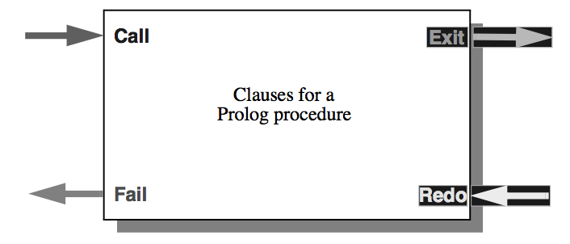
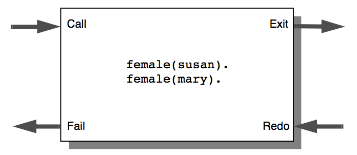
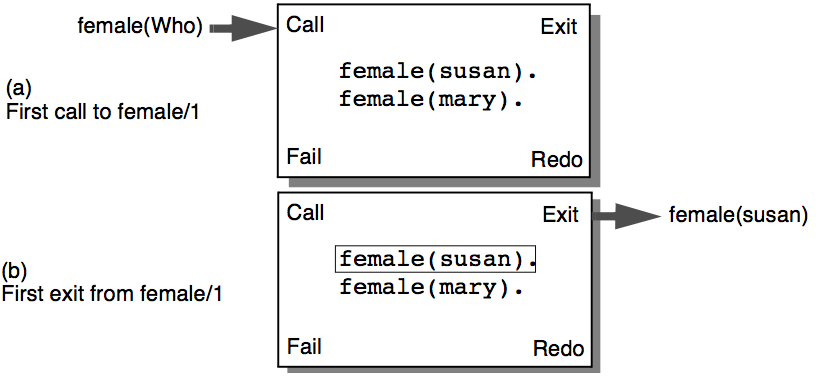
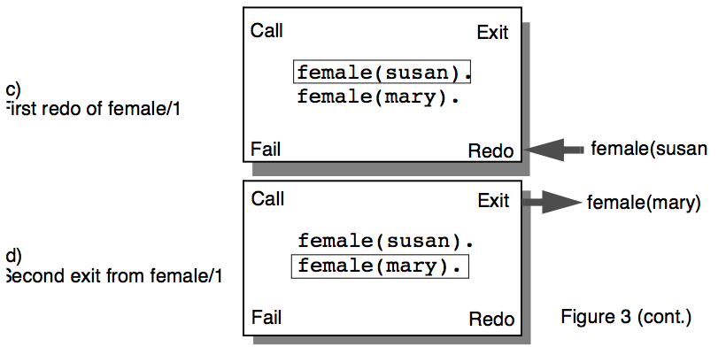
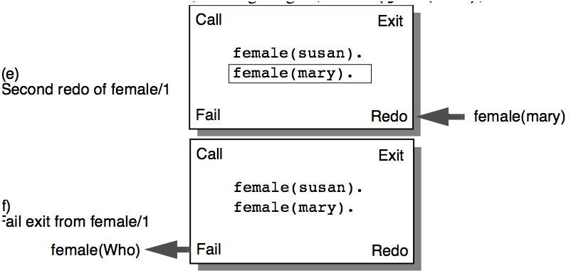

---
---

# 14 Using the Four Port Debugger
{:.no_toc}

* TOC
{:toc}

The ALS Prolog Debugger allows you to debug a faulty program with the standard
four-port model of Prolog execution. You can use the debugger to find where your
program is faulty by looking at how procedures are being called, what values they
are returning, and where they fail.

The debugger is written in Prolog, so it can be consulted like any other program. If
a debugger command is issued and the debugger is currently not loaded, it will be
automatically consulted. The debugger is contained in the file debugger.pro,
which resides in the ALS directory alsdir. (On the Macintosh, the debugger is contained in the file debugger which resides in the folder Interfaces.)
On the Macintosh and the original (real mode) ALS Professional and Student Prologs for the PC, the debugger is an interpretive debugger; i.e., the debugger program implements a complete interpreter for Prolog (in Prolog) which decompiles
and interprets the (compiled) code which has been loaded. On all other versions of
ALS Prolog, the debugger is a much more sophisticated program (written in ALS
Prolog) that utilizes the interrupt facilities of ALS Prolog to directly debug the compiled (native) code produced by the ALS Prolog compiler. It does this without requiring you to set any special flags during compilation (loading).

## 14.1 The Four-Port Model
The four-port model of Prolog execution provides a conceptual point of view for
analyzing the flow of control during execution of a Prolog program. Think of each
procedure in your Prolog program as having a box around it with four ports for getting in and out of the procedure.


Figure. Generic Procedure Box.

The flow of program control can then be viewed as motion through one of the four
ports. The ports are:
* Call is the entry point (in) to a procedure the first time it is called.
* Exit is the port (out) through which execution passes if the procedure succeeds.
* Fail is the port (out) through which execution passes if the procedure fails completely.
* Redo (Retry)is the port (in) through which execution passes when a later
goal has failed and the procedure must try and find another solution, if possible.
Take, for example, the program
```
likes(john,Who) :female(Who),
likes(Who,wine).
likes(mary,wine).
female(susan).
female(mary).
```
The figure below shows a four-port model of the procedure female/1.


Figure. Procedure Box for female/1.

Suppose you make the query:
    ?- likes(john,Who).
The clause for likes/2 is activated, and the debugger is ready to make the call
to female/1. It enters the female/1 procedure through the call port (see
Figure (a) below) and picks up the first solution, binding Who to susan. Because the
procedure succeeds, execution continues through the exit port of the procedure (as
shown in Figure (b) below) and continues with the call likes(susan,wine).  


Figure. First call and exit tracing female/1.

The call likes(susan,wine) fails, because neither clause for likes/2
matches with likes(susan,wine) in the first argument. Because of this failure, another solution to female/1 is sought. The program re-enters the female/1 procedure, this time through the redo port (Figure (c) below).
Entering a procedure through a redo port means that a solution to the procedure was
not accepted in later parts of the program and another solution for the call is required. In the example here, after re-entering the procedure through the redo port,
execution will first unbind Who, and then bind Who to mary, leaving the procedure
by passing through the exit port, as shown in Figure (d) below.


Figure 19. Redo and exit tracing female/1.

The call likes(mary,wine) succeeds, so the original goal succeeds:
```
?- likes(john,Who).
Who = mary
```
If you want Prolog to look for another answer, press ';' (semi-colon) followed by
Return. This will cause failure to occur, forcing the search for another solution.
In this example, execution re-enters the procedure box for female/1 through the
redo port (See Figure (e) below). However, there are no more solutions for female/1, so the procedure must fail. Execution then leaves the female/1 box
through the fail port, as shown in Figure (f) below. The failure of female/1 causes
the second clause of likes/2 to be tried. Because the goal does not match the
second clause of likes/2, the original goal, likes(john,Who), now fails.


Figure. Redo and fail tracing female/1.

## 14.2 Creeping Along With the Debugger

The debugger helps you to find errors in your program by letting you look at the
control flow of the program as well as showing you the variable bindings as the program goes through each of the ports. You can control how much information is
printed by the command you give to the debugger when it stops at a port.
As an example, trace the execution of the goal likes(john,Who). You can do
this by using the debugger builtin trace/1:
    ?- trace likes(john,Who).
The debugger will then answer with
    (1) 1 call: likes(john,_93) ?
This means that the debugger is waiting at the entrance to the call port of the procedure likes/2. The current goal is printed for the call, as well as all the arguments to the call. The program text calls the likes/2 procedure with the arguments john and Who. The debugger is only able to print out the internal names
for variables, rather than the names found in the source code for the procedures in
the program. In this case, the variable Who appears as _93. The number 93 is not
important, since it is merely a place holder. The actual number assigned will vary
depending on the prior state of the Prolog system.

The integer in parentheses is the number of the procedure box the debugger is currently examining. The next number (following the number in parentheses) is the
level of the call. This number tells you the depth of the computation. In this example, the original goal likes(john,Who) runs at level 1, and all the subgoals in
the clause run at level 2. If the call to female had any subgoals, those subgoals
would take place at level 3.

You have a choice of how the debugger is going to continue examining the program. When you want to move slowly through the program, looking at everything
there is to see, you use the creep command. To creep, you should respond with
'c' followed by return at the ? prompt of the debugger. Return alone will also
make the debugger creep. However, for the sake of readability, the 'c' will appear
explicitly in all the examples.
```
(1) 1 call: likes(john,_93) ? c
(2) 2 call: female(_93) ?
```
The debugger is now at the call port for the procedure female/1. You can see by
the last line that the program is calling female/1 with one unbound variable and
that this call is taking place at level 2 of the computation. To continue the computation, you can creep ahead:
```
(2) 2 call: female(_93) ? c
(2) 2 exit: female(susan) ?
```
After entering female/1, the program picks up the first solution and binds the
variable _93 to susan. After this, the program leaves the exit port for female/
1 and returns to the interior of the first clause for likes/2.
```
(2) 2 exit: female(susan) ? c
(3) 2 call: likes(susan,wine) ?
```
The debugger now enters likes/2 through the call port. The number in parentheses has changed from 2 to 3 to show that this is a new procedure call. However,
the call depth is still 2.
```
(3) 2 call: likes(susan,wine) ? c
(3) 2 fail: likes(susan,wine) ?
```
Because there are no clauses in likes/2 that match likes(susan,wine) the
call to likes/2 fails, and the debugger exits likes/2 through the fail port.
```
(3) 2 fail: likes(susan,wine) ? c
(2) 2 redo: female(_93) ?
```
The debugger now re-enters female/1 through the redo port, because the call
to likes/2 has failed, causing the search for another solution to female/1.
Note that the number in parentheses becomes 2 again because procedure box 2 (for
female/1) is being re-entered.
```
(2) 2 redo: female(_93) ? c
(2) 2 exit: female(mary) ?
```
Another solution to female/1 is found, so the debugger exits through the exit
port, and then enters likes/2. Since the call to likes/2 is a new call, the number in parentheses becomes 4.
```
(2) 2 exit: female(mary) ? c
(4) 2 call: likes(mary,wine) ? c
(4) 2 exit: likes(mary,wine) ? c
(1) 1 exit: likes(john,mary) ? c
Who = mary
```
Creeping the rest of the way through the program, you end up with a solution to the
query:
```
?- likes(john,Who).
Who = mary ;
```
If you ask to see another solution to the query (by typing a semicolon), the debugger will pick up where it left off:
```
(4) 2 fail: likes(mary,wine) ?
The call likes(mary,wine) fails, and the computation creeps along.
(4) 2 redo: likes(mary,wine) ? c
(4) 2 fail: likes(mary,wine) ?
```
The debugger re-enters female/1 through the redo port, but because no more solutions can be found, it leaves through the fail port. The rest of the trace looks like
this:
```
(4) 2 fail: likes(mary,wine) ? c
(1) 1 redo: likes(john,_93) ? c
(1) 1 fail: likes(john,_93) ? c
no.
```

## 14.3 Additional Debugger Commands

If your program is large and/or complicated, looking at every port call in the program's execution is often tiresome and unnecessary. Once a procedure is debugged, it is no longer necessary to trace its execution in detail.

However, other procedures may still contain errors. In this case, you want to examine the execution of the questionable procedures without looking at the execution
of the correct portions of the program. This can be done by limiting the amount of
information printed by the debugger..

### 14.3.1 Skipping Portions of Code

The first method of limiting information is the skip command. This causes the debugger to run the current goal, while suppressing the port information for all subgoals in the interior of the call. However, if the traced goal fails because of the failure of a goal submitted after the traced goal, the debugger will print out all subgoals
of the traced goal at their fail port. The following example demonstrates this behavior:
```
?- trace likes(john,Who).
(1) 1 call: likes(john,_93) ? s
(1) 1 exit: likes(john,mary) ? c
Who = mary;
(4) 2 fail: likes(mary,wine) ? c
(2) 2 fail: female(_93) ?
(1) 1 redo: likes(john,_93) ?
```
In this trace, the debugger skips the execution likes(john,Who), and doesn't
stop at any of the ports inside the call to likes/2. However, when the call fails
because of the ;\hveleven return command in the Prolog shell's answer showing
mode, the fail ports from the interior of that call are printed.

### 14.3.2 Ignoring Even More Execution

The big skip command is similar to the skip command above, except that the internal failure ports are not printed when a call fails. You tell the debugger to do a
big skip by typing S (uppercase 'S') followed by \ReturnKey . A big skip is also
much more efficient that a normal skip.
```
?- trace likes(john,Who).
(1) 1 call: likes(john,_93) ? S
(1) 1 exit: likes(john,mary) ? c
Who = mary ;
(1) 1 fail: likes(john,_93) ?
```
In this case, only the original call to likes/2 prints out a failure report. All the
other failures are suppressed by the big skip in call number 1.

### 14.3.3 Getting Back Ignored Execution

Sometimes you might skip over a call only to find that the call failed for some unknown reason. In other cases, the variable instantiations produced by a call are not
what you expected. The retry command gives you another chance to trace the same
call again, presumably in more detail. In the following example, the debugger is
waiting at the exit port of call number 1. You can see exactly why
likes(john,mary)succeeded by retrying the call and creeping through its execution:
```
(1) 1 exit: likes(john,mary) ? r
(1) 1 call: likes(john,_93) ? c
(2) 2 call: female(_93) ? c
(2) 2 exit: female(susan) ?

After a retry command, the state of the program is reset to the way it was just before
the retried goal ran, except for side effects. Side effects not undone by a retry include modifications to the database via assert/1 or retract/1.

## 14.4 Changing the Leashing

After watching all of the ports during a trace, you might find that you want don't
want to stop at every port that passes by. For example, it might not be useful to see
the fail and exit ports in the execution of your program. By changing the leashing
of the debugger via leash/1, you can control which ports are actually printed. The
following goal disables the fail and exit ports, and enables the call and redo ports.
    ?- leash([call,redo]).
If you only want to set leashing on one port, you can omit the square brackets, as in
    leash(call).
leash(all) enables the printing of every port.

## 14.5 Spying on Code

The spy/1 builtin allows you to set spy points in your program. A spy point will
interrupt the normal execution of your program and begin tracing at every call to a
particular procedure. This is useful when most of your program is working correctly, but a few isolated procedures still need attention. The following example uses
a program that takes derivatives of a function and simplifies the result:
```
diff :-
    write('type in: Var,Fn'), nl,
    read((X,F)),
    diff(X,F,Answer),
    write(Answer), nl,
    simplify(Answer,Simple),
    write(Simple), nl.

simplify(A+B,Sum) :-
    number(A),
    number(B), !,
    Sum is A+B.

simplify(Exp,Exp).
```
Suppose that you are confident that diff/3 itself works correctly, but suspect that
there are bugs inside simplify/2. Rather than tracing the entire program, you
can place a spy point on simplify/2:
    ?- spy simplify/2.
When your program attempts to call simplify/2, the debugger will take control
and let you begin tracing.
```
?- diff.
type in Var,Fn
x,x+x.
1+1
(1) 1 call: simplify(1+1,_255) ? c
(2) 2 call: integer(1) ? c
(2) 2 exit: integer(1) ?
```
The debugger only stops at the ports for simplify/2 and its subgoals. When
simplify/2 succeeds or fails, normal program execution resumes until the next
spy point. In this case, there are no more spy points, so the program simply prints
out its answer.
```
(1) 1 exit: simplify(1+1,2) ? c
2
```
If for any reason simplify/2 tries to find another solution, the debugger will
wake up again at the redo port and allow you to continue tracing.

## 14.6 Leaping Ahead

The debugger also lets you to leap from the trace of a call to the next spy point.
Leaping suppresses the normal action of the debugger, allowing the program to
continue uninhibited until it runs into the next spy point.
In the following example, spy points are placed on diff/0 and simplify/2.
As soon as the program starts, the spy point at diff/0 activates the debugger.
Then a leap command suppresses the debugger until the call to simplify/2,
where the debugger picks up again:
```
?- spy simplify/2, spy diff/0.
yes.
?- diff.
(1) 1 call: diff ? l
type in: Var,Fn
x,x+x.
(7) 2 call: simplify(1+1,_255) ? s
(7) 2 exit: simplify(1+1,2) ? c
(8) 11 call: write(2) ?
```
## 14.7 Turning Off Spy Points

The nospy/0 builtin removes all spy points from your program, while nospy/1
removes a specific spy point:
```
?- nospy a/1.
Spy point removed for user:a/1.
yes.
```

## 14.8 Getting Help

Typing 'h' at the ? prompt of the debugger gives a summary of the debugger commands.

## 14.9 Exiting the Debugger

There are two ways to leave the debugger. The abort command (a) abandons the
current computation, and returns control to the Prolog shell. The exit command (e)
leaves the debugger, causing ALS Prolog to exit.
