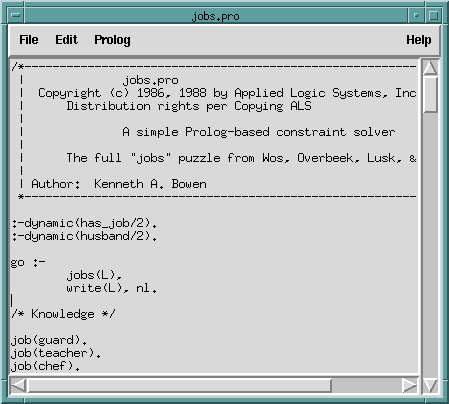
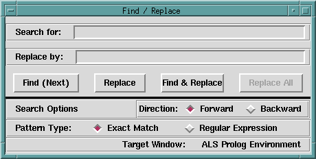
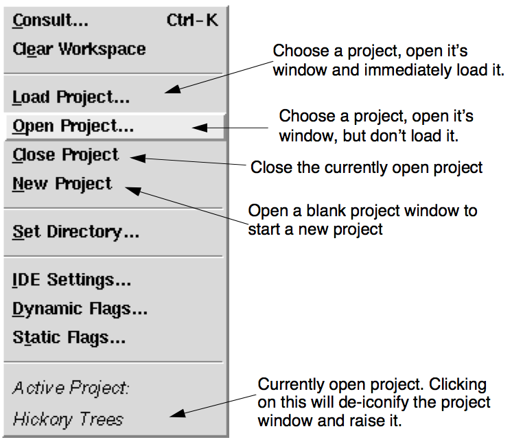
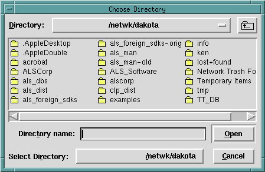
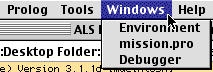

---
---

# 16 ALS IDE
{:.no_toc}

* TOC
{:toc}

The ALS Integrated Development Environment (IDE) provides a GUI-based developer-friendly setting for developing ALS Prolog programs. Start the ALS IDE by issuing alsdev
in an appropriate command window. The IDE displays an initial splash screen

while it loads, and then replaces the splash screen with the main listener window.

## 16.1 Main Environment Window
The details of the appearance of the ALS IDE windows will vary across the platforms. Here is what reduced-size versions of the main window look like on Linux/Unix and on Windows:

On Macintosh, the menu bar is displayed on the system menu bar at the top of the screen:

Throughout the rest of this section and others dealing with aspects of the ALS IDE,
we will not attempt to show all three versions of each and every window or display.
Since they are all quite similar, we will typically show just one, varying the display
among Macintosh, Windows, and Linux/Unix (Motif).

The parts of the main window are:

The individual Menus will be described below. The Location Display shows the current directory or folder. The Interrupt Button is used to interrupt prolog computations,
while the Help Menu will in the future provide access to the help system (which
can also be run separately). The Console Window is used to submit goals to the
system and to view results.

## 16.2 Menus
The options indicated by the accellerator keys on the menus apply when the focus
(insertion cursor) is located over the main listener window, over the debugger window, or over any editor window. [Some items under development will show as grayed-out.]

### 16.2.1 File Menu

New, Open, Close, Save, and SaveAs apply to editor windows, and have their
usual meanings. New opens a fresh editor window with no content, while Open allows one to select an existing file for editing. The open file dialog looks like this : :

Selecting a file to open produces an edit window looking like the following:

The Close, Save and SaveAs entries from the file menu apply to the edit window
having the current focus.  Quit allows you to exit from the ALS Prolog IDE.

### 16.2.2 Edit Menu

Cut, Copy, Paste, and Clear apply as usual to the current selection in an editor
window. Copy also applies in the main listener window. Paste in the main window always pastes into the last line of the window. Select All only applies to editor
windows.

The Find button brings up the following dialog:

This dialog allows one to search in whatever window is top-most, and to carry out
replacements in editor windows. If the text which has been typed into the Search
for: box is located, the window containing it is adjusted so that the sought-for text
is approximately centered vertically, and the text is highlighted.

The Preferences choice produces the following popup window: Selections made

using any of the buttons on this window immediately apply to the window (listenter,
debugger, or editor window) from which the Preferences button was pressed. For example:

Selecting Cancel simply removes the Fonts & Colors window without undoing
any changes. Selecting Save records the selected preferences in the initialization
file (alsdev.ini) which is read at start-up time, and also records the selections globally for the current session. Although no existing editor windows are changed, all
new editor windows created will use the newly recorded preferences. Preferences
for the main listener window and the debugger window are saved separately from
the editor window preferences.

### 16.2.3 Prolog Menu

Choosing Consult produces two different behaviors, depending on whether the
Prolog menu was pulled down from the main listener or debugger windows, or from
an editor window. Using the accelerator key sequence (Ctrl-K on Unix and Windows, and <AppleKey>K on Macintosh) produces equivalent behaviors in the different settings. If Consult is chosen from the main listener or debugger windows,
a file selection dialog appears, and the selected file is (re)consulted into the current Prolog database:

In contrast, if Consult is selected from an edit window (or the Ctrl/<apple>-K accellerator key is hit over that window), the file associated with that window is
(re)consulted into the Prolog database; if unsaved changes have been made in the
editor window, the file/window is first Saved before consulting.

If a file containing syntax errors is consulted, these errors are collected, an editor
window into the file is opened, and the errors are displayed, as indicated below:

Line numbers are added on the left, and the lines on which errors occur are marked
in red. Lines in which an error occurs at a specified point are marked in a combination of red and green, with the change in color indicating the point at which the
error occurs. Erroneous lines without such a specific error point, such as attempts
to redefine comma, are marked all in red. A scrollable pane is opened below the
edit window, and all the errors that occurred are listed in that pane. Double clicking
on one the listed errors in the lower pane will cause the upper window to scroll until
the corresponding error line appears in the upper pane. The upper pane is an ordinary error window, and the errors can be corrected and the file saved. Choosing
Prolog> Consult, or typing ^K will cause the file to be reconsulted, and the error
panes to be closed.

Clear Workspace causes all procedures which have been consulted to be abolished, including clauses which have been dynamically asserted. In addition, future
releases, all user-defined Tc/Tk interpreters will also be destroyed.

The four Project-related buttons as well as the bottom entry on this menu are described in the next section.

Set Directory ... allows you to change the current working directory, as shown here:

Selecting IDE Settings raises the following dialog:

The Heartbeat is the time interval between moments when a Prolog program temporarily yields control to the Tcl/Tk interface to allow for processing of GUI events,
including clicks on the Interrupt button.
The Print depth setting controls how deep printing of nested terms will proceed;
when the depth limit is reached, some representation (normally '*' or '...') is printed
instead of continuing with the nested term.
The Printing depth type setting determines whether traversing a list or the top-level arguments of a term increases the print depth counter. The Flat setting indicates
that the counter will not increase as one traverses a list or the top level of a term,
while Non-flat specifies that the counter will increase.

Selecting Dynamic Flags produces a popup window which displays the current values of all of the changeable Prolog flags in the system, and allows one to reset any of those values:

Selecting Static Flags produces a popup window displaying the values of all of the
unchangeable Prolog flags for the system:

### 16.2.4 Tools Menu

Selecting Debugger provides access to the GUI Debugger; this will be described
in detail in Chapter 15 (Using the ALS IDE Debugger) .

Source Tcl allows one to “source” a Tcl/Tk file into a user/program-defined Tcl
interpreter; the dialog prompts you for the name of the interpreter.

Kill Tcl Interps destroys all user-defined Tcl/Tk interpreters.

### 16.2.5 Windows Menu

This menu lists windows which have been opened. Double-clicking on an entry in
this list will raise that window to the top of the desktop. Here is a typical situation:

