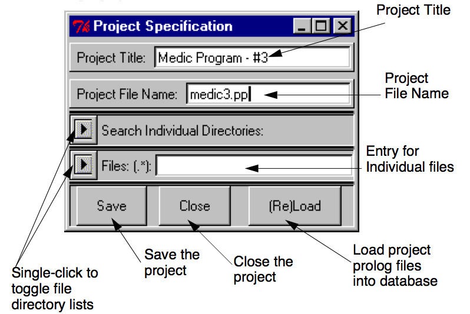
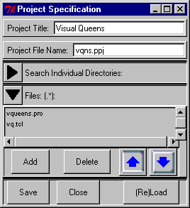
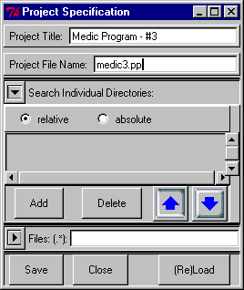

---
---

# 17 Prolog Development Projects
{:.no_toc}

* TOC
{:toc}

The ALS Prolog Development Environment (alsdev) supports a simple concept of
development project which nonetheless, is quite useful. At it's most elementary, a
project is just a named collection of files. Projects are accessed through the Prolog
menu introduced in the preceding section: 

Figure. Prolog Project Menu

Here is a sample project window:

Figure. Sample Prolog Project Window

Clicking on the triangular arrow button to the left of 'Files:' causes the list of files
incorporated in the project to open, as shown below:

Files in the list can be deleted by selecting them, and the clicking the Delete button.
New files may be added by clicking the Add button. This will raise a file selection
dialog which allows you to select one or several files at the same time, from either
the current directory, or other directories.

When the project is loaded, by clicking the (Re)Load button, the prolog files in the
list (those with *.pro or *.pl extensions) are loaded in the order they appear. One
can change the order of the files by single-clicking one to select it, and the using the
blue up/down arrows to move it in the list.
Finally, double-clicking a file in the list will cause an editor window to be opened
for that file.

Complex projects may incorporate files from several different directories. These
can be specified using the Search Directories list, which is opened by toggling the
other arrow button on the left:

As with files, one can single-click an entry in this list to select it, and remove it with
the Delete button, or change its position using the blue up/down arrows. New directories are added by clicking Add, which raises a directory selection dialog. If
the 'relative' radio button is checked, the new added path will be represented relative to the current working directory if this is possible. Otherwise, the path is represented in absolute form.

