---
---

# 18 Using the ALS IDE Debugger
{:.no_toc}

* TOC
{:toc}

Selecting the Debugger entry from the Tools menu causes the primary debugger
window to appear::

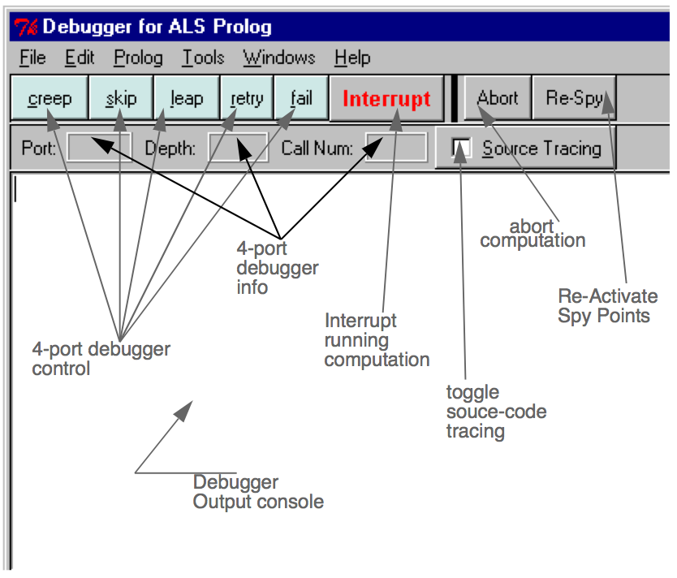
Figure. Four Port Debugger Window

The debugger combines a traditional prolog four-port debugger (as described in
Chapter 14 (Using the Four-Port Debugger) ) with a source-code trace debugger.
The details of the debugger action and the source trace will be described below.
First we will examine the menus and buttons on the debugger window.

## 18.1 Debugger Window Menus
The first two debugger menus, File and Edit, provide the same facilities as discussed for all other windows in Chapter 13 (ALS Integrated Development Environment) .
### 18.1.1 Prolog Menu
The top two items of the Prolog menu are also the same as earlier:

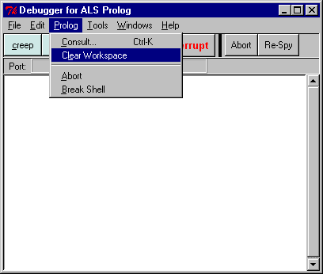
Figure. Debugger Prolog Menu

However, the lower portion has been replaced with two debugger-related items:
Abort -- choosing this causes the computation currently being traced to be aborted
(effectively, abort/0 is invoked).
Break Shell -- choosing this causes a secondary break shell to be started without
disturbing the current computation being traced.
If no computation is being traced, the Abort and Break choices have no effect.

### 18.1.2 Tools Menu
The Tools Menu

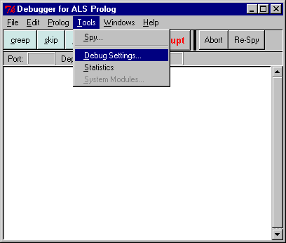
Figure. Debugger Tools Menu

is completely specific to the debugger.
Choosing Spy allows one to selectively set and remove spy points. This will be discussed in detail below.
Choosing Debug Settings raise the following popup window:

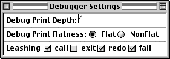
Figure. Debug Settings Control

These settings control which debugger ports are shown, and also control the appearance of the lines printed for the ports which are show.

## 18.2 Tracing with the IDE Debugger
Suppose we have raised the debugger, consulted the mission.pro example from
the supplied example programs. Then begin tracing by typing
trace plan in the main listener window, as show below:

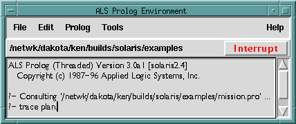
Figure. Initiating a trace in the IDE debugger

The debugger will immediately open an editor window containing the mission.pro
file, 

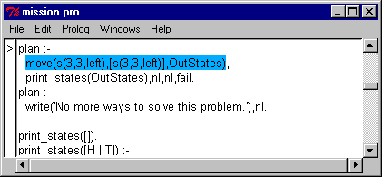
Figure. Editor window opened on the source file

while at the same time starting the four-port trace in the debugger window:

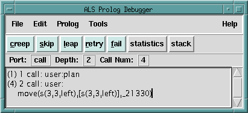
Figure. Four port trace in the debugger window

The call move(...) in the source code window which corresponds to the current
call in the 4-port debugger window is highlighted in blue. Note that the window
also automatically scrolled so that this code is now visible.
The coloring used in the source code window corresponds to the port colors shown
in the four-port model diagram Figure 16 (Generic Procedure Box.), repeated here:

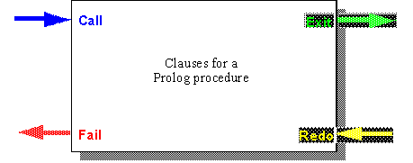
Figure. Four port model

Click on creep four more times, and the situation is now:

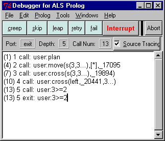
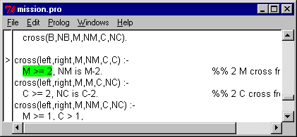
Figure. Four steps into the trace

Seven more clicks on creep produces the following:

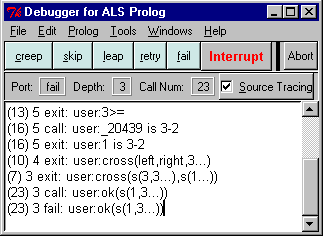
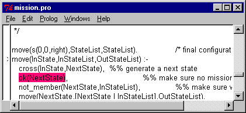
Figure. Seven steps into the trace

One more click on creep produces:

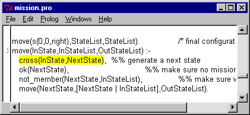
Figure. Another step into the trace

And so forth.

## 18.3 Spying with the ALS IDE
Choosing Spy... from the Debugger Tools menu raises the following dialog:

Figure. Spying Configuration

All modules currently known are shown in the listbox in the lower left corner. One
selects a focus module by double-clicking on one of the elements of this list. All of
the predicates defined in the focus module are shown initially in the left-hand large
listbox headed Predicates. Occasionally, when files have been reconsulted, one
must use the Refresh Mods and Refresh Preds buttons to update these lists.
Selecting one or more predicates in the Predicates listbox, and then clicking on the
Spy (or the right-pointing blue arrow) button will cause spy points to be placed on
each of the selected predicates. Each of the selected predicates will also be moved
from the left listbox to the right listbox labelled Spying On. Double-clicking on a
single predicate from the left column will also cause it to be spied upon and moved
to the right column. Similarly, spy points can be removed by selecting one or more
predicates from the right column and clicking on the No Spy (or the left-pointing
blue arrow) button. Double-clicking a single predicate in the right column also removes its spy-point.
If one or more predicates have been selected, clicking on Listing will cause their
definitions to be printed in the main listener window.
Various actions, such as consulting, can cause spy-points to be disabled. The Reset
All Spypoints causes all current spy-points to be re-activated. The Remove All
Spypoints
