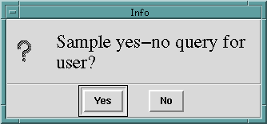

---
---

# 19 Using the GUI Library
{:.no_toc}

* TOC
{:toc}

The ALS library includes a growing collection of routines designed to make it easy
to utilize various GUI constructs easily from ALS Prolog.

## 19.1 Initializing the GUI library
In order to make use of these routines, one must first initialize the library. This is
accomplished with the predicate init_tk_alslib/0. This initializes a Tcl/
Tk interpreter named tcli (see the next Chapter), and sources (loads) the associated Tcl/Tk code into that interpreter. This call is really defined as
    init_tk_alslib :- init_tk_alslib(tcli, _).
If Interp is an atom intended to name a Tcl/Tk interpreter, then
    init_tk_alslib(Interp, Path)
creates a Tcl/Tk interpreter named Interp, locates the adjunct TclTk code, returns
the path to the directory containing that code in Path, and sources that code into
Interp.
All of the calls in the library are organized in a similar style: there is a default version which references the default interpreter tcli, and there is a general version
allowing one to use the same functionality with any other interpreter.

## 19.2 Dialogs
### 19.2.1 Information dialogs
```
info_dialog(Msg) :info_dialog(Msg, 'Info').
info_dialog(Msg, Title) :info_dialog(tcli, Msg, Title).

```
#### info_dialog(Interp, Msg, Title)
The call
    ?-info_dialog('Message for the User', 'Dialog Box Title').
produces the following information dialog:


### 19.2.2 Yes-no dialogs
#### yes_no_dialog(Interp, Msg, Title, YesLabel, NoLabel, Answer)
```
yes_no_dialog(Msg, Answer)
:yes_no_dialog(Msg, 'Info', Answer).
yes_no_dialog(Msg, Title, Answer)
:yes_no_dialog(tcli, Msg, Title, Answer).
yes_no_dialog(Interp, Msg, Title, Answer)
:yes_no_dialog(Interp, Msg, Title, 'Yes', 'No', Answer).
```
The call
    ?- yes_no_dialog('Sample yes-no query for user?', Answer).
produces the following popup dialog:



If the user clicks “Yes”, the result is
    Answer = Yes
while clicking “No” yields
    Answer = No.
The call
    yes_no_dialog(tcli, 'Sample yes-no query for user?',
            'Dialog Box Title', 'OK', 'Cancel', Answer).
produces the popup dialog


Clicking “OK” yields
    Answer = OK
while clicking “Cancel” yields
    Answer = Cancel.

## 19.3 Choices from lists
```
popup_select_items(SourceList, ChoiceList)
popup_select_items(SourceList, Options, ChoiceList)
popup_select_items(Interp, SourceList, Options, ChoiceList)
```
The call
```
?- popup_select_items(['The first item','Item #2',
            'Item three', the_final_item], Selection).
```
produces the popup shown below:


In this case, the user is allowed to select a single item; if the user selected “Item
three” and clicked OK, the result would be:
    Selection = [Item three].
Even though in this case the user was restricted to selection of one item, the
popup_select_items/_ predicate returns a list of the selected items.

The Options argument for popup_select_items/[3,4] allows the programmer to place the popup list box in any of the other standard Tk listbox selection modes. For example, the call
```
?- popup_select_items(['The first item', 'Item #2', 'Item three',
        the_final_item], [mode=extended, title= 'Extended Mode Selection' ], 
        Selection).
```
will popup a list box whose appearance is identical (apart from the different title requested) to the previous listbox. However, it will permit selection of ranges of elements, as seen below:


The result of clicking OK will be:
    Selection = [Item #2, Item three]
The standard Tk listbox modes are described (on the Tcl/Tk man/help pages as follows)::

* If the selection mode is _single_ or
_browse_, at most one element can be
selected in the listbox at once. In both
modes, clicking button 1 on an element
selects it and deselects any other
selected item. In browse mode it is
also possible to drag the selection with
button 1.
*If the selection mode is _multiple_ or
_extended_, any number of elements
may be selected at once, including
discontiguous ranges. In multiple
mode, clicking button 1 on an element
toggles its selection state without
affecting any other elements. In
extended mode, pressing button 1 on
an element selects it, deselects everything else, and sets the anchor to the
element under the mouse; dragging
the mouse with button 1 down
extends the selection to include all the
ele ments between the anchor and the
element under the mouse, inclusive.

## 19.4 Inputting atoms (answering questions)

#### atomic_input_dialog(Interp, Msg, Title, Atom)
```
atomic_input_dialog(Msg, Atom)
    :- atomic_input_dialog(Msg, 'Input', Atom).
atomic_input_dialog(Msg, Title, Atom)
    :- atomic_input_dialog(tcli, Msg, Title, Atom).
```
This is a useful method of obtaining input from users. For example, the call
    ?- atomic_input_dialog('Please input something:', Atom).
will popup the following window:


If the user types: Logic is wonderful


then the output result would be
    Atom = Logic is wonderful

## 19.5 File selection dialogs
#### file_select_dialog(Interp, Options, FileName)
```
file_select_dialog(FileName)
    :- file_select_dialog(tcli, [title='Select File'], FileName).
file_select_dialog(Options, FileName)
    :- file_select_dialog(tcli, Options, FileName).
```
The call
    ?- file_select_dialog(File).
would produce this popup:


The call
```
?- file_select_dialog([title='Testing File Selection for Open',
                       filetypes= [[zip,[zip]],
                                   ['Prolog',['pro']],
                                   ['All Files',['*']] ] ],
                      File).
```
would produce


## 19.6 Displaying Images

These routines provide simple access from ALS Prolog to the image routines of Tk.
They will be extended. The current versions support gif images, but the routines
can be extended to any of the types Tk supports. 

#### create_image(Interp, ImagePath, ImageName)
#### display_image(Interp, ImageName, Options)
To display images, one must specify a path to the image file, and must first produce an internal Tk form of the image.
This is done with:
```
create_image(ImagePath, ImageName)
    :- 
    create_image(tcli, ImagePath, ImageName).
```
Assume that pow_wow_dance.gif is a file in the current directory. Then the call
    ?- create_image('pow_wow_dance.gif', pow_wow).
will create the internal form of this image and associate the name pow_wow with
it.  Display of images which have been created is accomplished with:
```
display_image(ImageName)
    :- display_image(tcli, ImageName, []).
```
Thus, the call
    ?-display_image(pow_wow).
produces


## 19.7 Adding to the ALS IDE main menubar

Simple additions to the main menubar are often useful. The general call to accomplish this is:
    extend_main_menubar(Label, MenuEntriesList)
Label should be the label which will appear on the menu bar, and MenuEntriesList is a Prolog list describing the menu entries. The simplest list consists
only of labels which will occur on the pull-down menu. Thus, after executing the
call
    ?- extend_main_menubar('Test Extend', ['Test Entry #1', 'Test Entry #2']).
the main listener window would look like this when clicking on the newly added
menubar entry:


This is somewhat uninteresting, however, since these menu items won't do anything. To add simple behaviors to the menu entry, one uses expressions of the form
Label + Behnavior,
where Label is the menu label which will appear, and Behavior is either a ground
Prolog term, or is a prolog term of the form
    tcl(Expr)
where Expr is a quoted atom describing a Tcl/Tk function call. Thus, if we replace
the call considered above by the following,
```
?- extend_main_menubar('Test Extend',
            ['Test Entry #1' + tcl('bell'), 
             'Test Entry #2' + test_write ]),
            ]).
```
where
```
test_write
    :-  printf(user_output, 'This is a test ...\n', []),
        flush_input(user_input).
```
then the appearance of the main menu and the new pulldown will be the same, but
chooseing Test Entry #1 will cause the bell to ring, and choosing Test Entry #2 will
cause
    This is a test ...
to be written on the listener console.

To summarize thus far, the main menu bar can be extended by calling:
    extend_main_menubar(Label, MenuEntriesList)
where:
* Label is an atom (suitable for extending a Tk window path);
* MenuEntriesList is a list of menu entry descriptors;

And _menu entry descriptors_ are either an Atom alone, or an expression of the form
Atom + Expr
where Atom is a prolog atom which will serve as the new menu entry, and Expr is
a _menu entry action expression_, which can be one of the following:
* tcl(TclExpr)
* cascade(SubLabel, SubList)
* PrologCall

Here, TclExpr can be any Tcl/Tk expression for evaulation, and PrologCall
is any ground Prolog goal. The new entry
    cascade(SubLabel, SubList)
allows one to create menu entries which are themselves cascades. In this case, SubLabel must be an atom which will serve as the entry's label, and SubList is
(recursively) a list of menu entry descriptors.

Here are several useful predicates for working with menus and menu entries:
#### menu_entries_list(Interp, MenuPath, EntriesList)
```
menu_entries_list(MenuPath, EntriesList)
    :- menu_entries_list(tcli, MenuPath, EntriesList).
```
If MenuPath is a Tk path to a menu (top level or subsidiary), then EntriesList
will be the list of labels for the entries on that menu, in order. For example,
```
?- menu_entries_list(shl_tcli,
        '.topals.mmenb', EntriesList).
EntriesList = [File, Edit, Prolog, Tools, Help].
```

#### path_to_menu_entry(Interp, MenuPath, Index, SubMenuPath)
When one indexes menu entries, the indicies are integers beginning at 0.
```
path_to_main_menu_entry(Index, SubMenuPath)
    :- 
    path_to_menu_entry(shl_tcli, '.topals.mmenb', Index, SubMenuPath).

path_to_menu_entry(MenuPath, Index, SubMenuPath)
    :-
    path_to_menu_entry(tcli, MenuPath, Index, SubMenuPath).
```
If MenuPath is a Tk path to a menu (top level or subsidiary), and if Index is an
integer >= 0, and if the Index'th entry of MenuPath is a cascade, so that it has
an associated menu, then SubMenuPath is a path to that associated menu. Thus,
```
?- path_to_main_menu_entry(4, SubMenuPath).
SubMenuPath = .topals.mmenb.help
```

extend_cascade(Entry, MenuPath, Interp)
Finally, one can add new entries at the ends (bottoms) of existing menu cascades,
as follows:
```
add_to_main_menu_entry(Index, Entry)
    :-path_to_main_menu_entry(Index, MenuPath),
      extend_cascade(Entry, MenuPath, shl_tcli).
```

For example,

    ?- add_to_main_menu_entry(3,, 'My Entry' + test_write).

will add an entry at the end of the Tools cascade. The predicate

    extend_cascade(Entry, MenuPath, Interp)

accomplishes adding the Entry to the end of menu MenuPath under interpreter
Interp.


