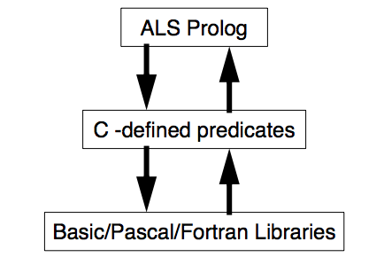
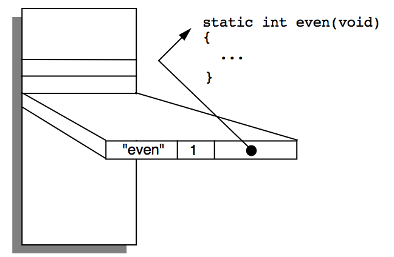
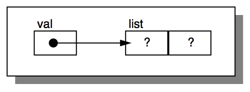
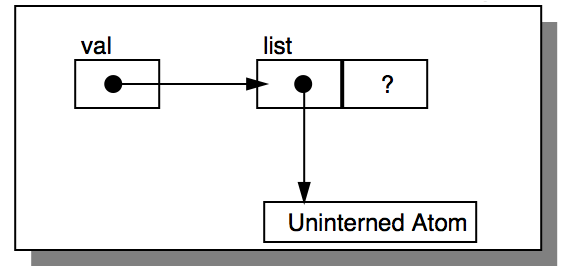
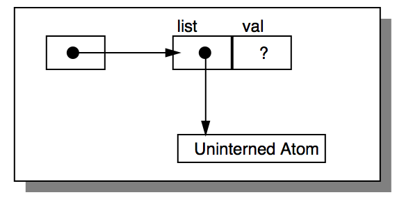
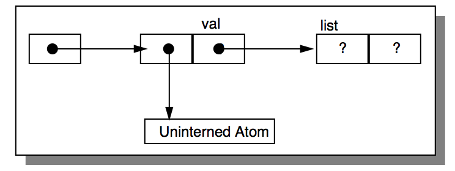
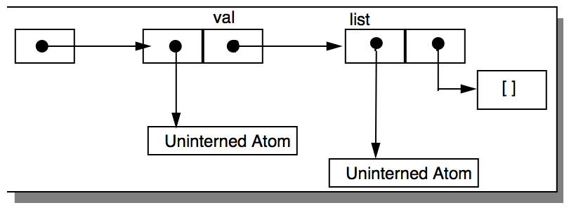

---
---

# 21 Using the ALS Foreign Interface
{:.no_toc}

* TOC
{:toc}

The ALS Foreign Interface provides programmers with the ability to interface Prolog programs with programs written in other languages such as C. The immediate
aspects of the interface are provided by a collection of C functions and constants
which provide the basis for communication between Prolog programs and C programs. The communication method allows several styles of organization, ranging
from that of coding a few simple additional 'built-in' predicates using C, to an organization in which the C program is in control and occasionally calls on the Prolog
program for various services, as suggest in the figure below.

  
Figure. Other Languages can be used from Prolog.

The Foreign Interface is useful for three reasons.

* Although Prolog is an excellent symbolic processing language, there are
some types of computation which are more easily or efficiently done in other languages. For these types of computation, writing Prolog predicates in
C is often a better solution.
* A great deal of code written in non-Prolog languages already exists for performing many useful functions. Rather than rewriting all of this code, it
makes sense to use the Foreign Interface to allow Prolog programs to use
the non-Prolog code, or on the other hand, to allow non-Prolog programs to
make use of embedded Prolog programs.
* Many useful and important packages (such as OS interfaces) are available
as C libraries. Often source code for these packages is not available even if
one were inclined to attempt a rewrite of the package in Prolog.

Broadly, two different methods are available for linking and loading such C-coded
predicates, depending on the operating system involved:

* Dynamically at run time, allowing one to link and load the C-coded predicate library into a running version of ALS Prolog by issuing a command
from within Prolog;
* Statically at link time, allowing one to create a new executable program by
linking together ALS Prolog and the C programs. In this case, when the new
executable program is run, all of the standard Prolog builtins, together with
the new C-defined predicates, are available.

Dynamic loading is very flexible and makes the process of debugging C-coded
predicates proceed reasonably well. However, static loading is often preferred for
delivery. When a delivery environment is desired, the set of foreign procedures can
be statically linked with the ALS Prolog library object file to form the delivery environment.
This chapter introduces and discusses the foreign interface. The Foreign Interface
Section of the ALS Prolog Reference Manual provides detailed information on specific functions and macros. Information which is specific to particular operating
systems such as Unix, MacOS, or Win32 is provided in the Foreign Interface Section of the System-Specific Guides to ALS Prolog. See [kern] The C Programming
Language. Brian W. Kernighan and Dennis M. Ritchie, Prentice-Hall, 1978. for
more information on the C programming language.

## 21.1 A Simple Prolog Predicate in C

Before going into detail about the components of the interface, let's look at a simple
example. Let's consider a simple predicate for testing the evenness of an integer. The
pure C code for this function is:

```c
static int even(void)
{
PWord arg;
int arg_type;
PI_getan(&arg, &arg_type, 1);
if (arg_type == PI_INT && arg % 2 == 0) PI_SUCCEED;
else PI_FAIL;
}
```

This function can be dynamically linked into ALS Prolog according to the following steps (details to be discussed later).

1. First create the file even.c containing the following code:

    ```c
#include "alspi.h"
static int even(void)
{
PWord arg;
int arg_type;
PI_getan(&arg, &arg_type, 1);
if (arg_type == PI_INT && arg % 2 == 0) PI_SUCCEED;
else PI_FAIL;
}
PI_BEGIN
PI_DEFINE("even",1,even)
PI_END
void pi_init(void)
{
PI_INIT;
}
```

2. Next, compile and link even.c and alspi_slib.c along with any necessary libraries to create a shared or dynamically-linked library called hello.psl (.psl stands
for Prolog Shared Library). The file alspi_slib.c contains glue code which allows ALS Prolog to connect to the shared/dynamic library. Example makefiles
and projects for common Unix, MacOS and Win32 C development environments can be found in the ALS Foreign Interface SDK Examples directory.

3. Now run ALS Prolog and consult the library. In this example the library is assumed to be in the current directory. The Prolog shell automatically adds the .psl
extension.
	?- [even].
When ALS Prolog loads the library, it calls the pi_init() function to initialize the
C defined predicates. In this example, there is only one C-defined predicate,
even/1.

4. Now you can invoke the even predicate:

    ```
?- even(2).
yes.
?- even(1).
no.
```

Now we'll consider some of the details of the even.c source code to see what they do.

* The line

    ```c
#include "alspi.h"
```

  The file alspi.h contains declarations that define the Prolog data types and
functions, together with macros which help with initialization.

* Next in the even.c program comes the definition of C function even(),
which performs the evenness test. All C-coded predicates are functions which
take no arguments and return an integer result.

* The first statement in the even() function fetches the argument to the Prolog
predicate even/1.
	PI_getan(&arg, &arg_type, 1);
PI_getan() retrieves the nth predicate argument based on its last argument,
in this case the 1st argument. PI_getan() stores the argument in the two local
variables arg and arg_type. The variable arg is a PWord which holds the value of the prolog object and arg_type is a integer which holds the Prolog type
of the argument.

* The second statement of the even() function does the actual work of the
predicate.

    ```c
if (arg_type == PI_INT && arg % 2 == 0) PI_SUCCEED;
else PI_FAIL;
```

  The test checks if the argument is a Prolog integer and whether it is even.
When arg_type is PI_INT, the PWord arg can be interpreted as a long integer. If the test evaluates to true, the macro PI_SUCCEED is called which
returns control to Prolog with an indication of success. Otherwise PI_FAIL
is called, which indicates that the predicate failed.

* After the definition of the even() function, we see the following macros:

    ```c
PI_BEGIN
    PI_DEFINE("even",1,even)
PI_END
```

  These macros actually construct an internal table which is used by ALS Prolog to call the Prolog predicates defined in C. The figure below (The PI Table
Structure.)illustrates this table. PI_BEGIN and PI_END bracket the table,
while the PI_DEFINE macro defines an entry in the table.

  
Figure. The PI Table Structure.

* The arguments of the macro PI_DEFINE are as follows:
    - The first argument is a string specifying the name of the function when
called from Prolog. This argument may be different than the C name of
the function.
    - The second argument is an integer specifying the number of arguments
that will be passed to the function from Prolog (the arity of the predicate).
    - The third argument is the address of the C function implementing the
predicate, normally supplied by placing the C name of the function in
this argument.

* pi_init() carries out any necessary initializations when the library is
loaded. In this simple example, the only expression in its body is a call on
the macro PI_INIT which causes the table defined by
PI_BEGIN...PI_END above to become known to the Prolog system. However, other initializations for the C functions can be placed here.

## 21.2 Writing Prolog Predicates in C

There are two steps to writing Prolog predicates in C.

* The first step is to write the desired C functions and macros which follow
the ALS Foreign Interface conventions.
* The second step is to compile the C file and either load the foreign object
file into ALS Prolog, or link the resulting object file together with ALS Prolog to form a new executable image.

This section discusses the details of how to create C functions which implement
Prolog predicates.

### 21.2.1 The ALS Foreign Interface Conventions

In order to be able to use subroutines written in C from within the ALS Prolog system, it is necessary to have available some C code to help Prolog communicate with
the C subroutines.

### 21.2.2 Declaring the Predicate

The first operation normally performed when a foreign object file is loaded is the
declaration operation. When consult/1 is executed, or when a statically linked
image is loaded, the predicates written in C are tied to (or connected with) specified
predicate names in ALS Prolog. This operation is performed by the macro

```c
PI_INIT
```

This macro is normally placed in the initialization function pi_init(). When the initialization function is called, the PI_INIT macro is run, and the predicates written
in C become available for use from ALS Prolog. The PI_INIT macro uses a table,
called the PI Table, of the following form:

```c
PI_BEGIN
PI_MODULE(module)
PI_DEFINE(name,arity,function_name)
.
.
PI_END
```

Note that this construct, PI_BEGIN, ..., PI_END must occur outside any function
definition. The PI_DEFINE macro puts the address of the C function implementing
the Prolog predicate, along with the predicate's arity and the name used from Prolog, in a table which Prolog searches during program execution. The PI_MODULE
argument is used to indicate into which module subsequent PI_DEFINEs should
place their definitions. If no PI_MODULE macro is used, the definitions are placed
into the default module user. Multiple PI_MODULE macros may be used to put definitions into different modules.

### 21.2.3 Succeeding and Failing

All Prolog predicates defined in C must indicate to Prolog whether they have succeeded or failed. To make a predicate succeed, use the PI_SUCCEED macro. To
make a predicate fail, use the PI_FAIL macro. Use of either of these macros will
return control to Prolog. PI_SUCCEED and PI_FAIL are only to be used from top
level C-defined functions, not in subroutines. A function f in a collection of functions (e.g., those defined by some C code) is called top level if f is not called by any
other function in the collection.

### 21.2.4 Getting Arguments from Prolog

The first action taken by most C-defined predicates is to get the arguments passed
in by the Prolog program. Currently, C-defined predicates are C functions with no
arguments and which return an integer. They retrieve their arguments from ALS
Prolog's argument registers. These registers are numbered from 1 to 255, and are
accessed using the

```c
void PI_getan(PWord *, int *, int)
```

function. This function takes the following three arguments:

* The first argument is the address of a PWord variable which will hold the
value of the Prolog argument. If the type is a Prolog integer, then this variable will contain the signed long integer. Other types of Prolog objects will
require further processing, in which case the variable will contain the address of a data structure used by the Prolog system.

* The second argument is an address of an integer variable which will hold
the type of the Prolog argument. There are seven Prolog types:

    ```c
PI_DOUBLE
PI_INT
PI_LIST
PI_STRUCT
PI_SYM
PI_UIA
PI_VAR
```

* The third argument is an integer specifying the number of the argument you
are retrieving. This number must be greater than or equal to one, and less
than or equal to the arity of the predicate, as defined in the PI table.

The following is an example of a simple C-defined predicate which retrieves one
argument from ALS Prolog's (first) argument register:

```c
static int speeding(void)
{
PWord val;
int type;
PI_getan(&val,&type,1); /* argument retrieval */

if (type != PI_INT)     /* type checking */
    PI_FAIL;

if (val <= 55)          /* computation */
PI_FAIL;

PI_SUCCEED;
}
```

The speeding/1 predicate checks to see if an integer is less than or equal to 55.
If it is, then the predicate fails, otherwise it succeeds. Note that it fails if the type of
the argument is not an integer. Note that from C's point of view, speeding() has
0 arguments, but because it retrieves one input from ALS Prolog's argument registers, from Prolog's point of view, speeding is a one-argument predicate. Thus,
speeding() is a 0-ary C function used to define a unary Prolog predicate
speeding/1.

### 21.2.5 Taking Apart Prolog Data Objects

As mentioned previously, PI_INT is the only Prolog type that needs no further processing after PI_getan() is called. In order to handle the other types, ALS provides a set of functions for taking apart lists, structures, and symbols.

#### Decomposing Symbols

In ALS Prolog there are two types of symbols. Normally, symbols are placed in the
ALS Prolog symbol table, and an index into that table is passed around as the symbol value. This approach to symbols works fine until the symbol table fills up, in
which case you're in trouble. In order to keep the symbol table from filling up, symbols in Prolog with quotes around them are turned into a special type of symbol
called an uninterned atom (UIA). UIA names are placed on the heap. See [Section 7
(Working with Uninterned Atoms)](7-Working-with-Uninterned-Atoms.html). The function PI_getsymname() is used to
get the C string associated with a symbol. The symbol must be of type PI_SYM. The
function PI_getuianame() is used to get the C string associated with an uninterned atom. The symbol must be of type PI_UIA. The forms for these two functions are:

```c
char *PI_getsymname(char *buf,PWord symval, int BUFSIZE);
char *PI_getuianame(char *buf,PWord uiaval, int BUFSIZE);
```

where buf is a character array, and BUFSIZE is an integer specifying the size of
buf in bytes. The nature of the arguments to PI_getuianame() are the same as
the arguments to PI_getsymname(). More precisely, these two functions take
the following three arguments:

* The first argument is the address of a character array which will be used to
store the name of the symbol.
* The second argument is the symbol value received from a decomposing
function, or from a PI_getan() call.
* The third argument is an integer specifying the size of the character array
which will hold the symbol's name.

The following is an example of the use of PI_symname() and PI_getuianame().

```c
#define BUFSIZE 256

static int printsym(void)
{
    PWord val;
    int type;
    char buf[BUFSIZE];
    PI_getan(&val,&type,1); /* retrieve argument */

    switch(type) {
    case PI_SYM:
        PI_getsymname(buf,val,BUFSIZE);
        PI_printf("Symbol in Buffer: %s\n",buf);
        break;
    case PI_UIA:
        PI_getuianame(buf,val,BUFSIZE);
        PI_printf( "Uninterned Atom in Buffer: %s\n",buf);
        break;
    default:
        PI_FAIL; /* fail if not symbol */
        break;
  }
  PI_SUCCEED;
}
```

The predicate printsym/1 takes one argument. If the argument is a symbol, the
predicate prints a message indicating whether the symbol is of type PI_SYM or
PI_UIA, and displays the name of the symbol. The function PI_printf() is used to
send output to Prolog's standard output. Here is a conversation with the Prolog shell
demonstrating the effects of running printsym/1.

```
?- [examples].
yes.
?- printsym(hello).
Symbol in Buffer: hello
yes.
?- printsym('Funky string thing').
Uninterned Atom in Buffer: Funky string thing
yes.
```

The reason why 'Funky string thing' is an uninterned atom is that the symbol was input using quotes.

#### Decomposing Structures

There are two functions for taking apart structures. These functions are:

```c
void PI_getstruct(PWord *, int *, PWord);
void PI_getargn(PWord *, int *, PWord, int);
```

PI_getstruct() returns the specified structure's functor and arity. This function takes the following three arguments:

* The first argument is the address of a variable which will be used to hold the structure's functor. The returned functor will be of type PI_SYM.
* The second argument is the address of a variable which will be used to hold
the arity of the structure. The arity will be of type PI_INT.
* The third argument is the value of the structure which you want information
about.

The second function, PI_getargn(), retrieves the value of the specified argument from the specified structure. This function takes the following four arguments:

* The first argument is the address of a variable which will be used to hold the
value of the specified argument.
* The second argument is the address of a variable which will be used to hold
the type of the structure argument.
* The third argument is the value of the structure about which you are inquiring.
* The fourth argument is an integer specifying which argument in the structure you want to retrieve.

The forms for these functions are:

```c
PI_getstruct(&funcval,&arityval,structval);
PI_getargn(&val,&type,structval,argnum);
```

where structval is obtained from a call to PI_getan, from a call to another decomposing function, or from a call to a structure creation function. The following
example illustrates the use of PI_getstruct() and PI_getargn(). The function printstruct() prints out the functor name and arity of the structure passed
in from Prolog. If the object passed in from Prolog is not a structure, the predicate
will fail. In addition to printing the functor and arity, printstruct() cycles
through all the arguments of the structure, printing out the type of each argument.

```c
#define BUFSIZE 256

static int printstruct(void)
{
    PWord val, functor, arg;
    int type, arity, argtype, i;
    char buf[BUFSIZE];
    PI_getan(&val,&type,1);

    if (type != PI_STRUCT)    /* retrieve argument */
        PI_FAIL;

    PI_getstruct(&functor,&arity,val);
    PI_getsymname(buf,functor,BUFSIZE);
    PI_printf("Structure: %s/%d:\n",buf,arity);
    for (i=1; i <= arity; i++) {
        PI_getargn(&arg,&argtype,val,i);
        PI_printf( "Argument %d is a %s\n",i,typename(argtype));
    }
    PI_SUCCEED;
}
```

The supporting function typename(), shown below, takes a Prolog type as an argument, and returns a character string associated with the type. This functionality
is implemented using a table lookup scheme. The table is implemented below as
struct table typetable[].

```c
#define TABLESIZE 7
struct table {
    int type;
    const char *buf;
};
struct table typetable[] = {
    {PI_VAR, "unbound variable"},
    {PI_LIST, "list"},
    {PI_STRUCT, "structure"},
    {PI_SYM, "regular symbol"},
    {PI_INT, "integer"},
    {PI_UIA, "uninterned atom"},
    {PI_DOUBLE, "double precision real"}
};

static const char *typename(int type)
{
    int i;
    for (i=0; i < TABLESIZE; i++)
        if (type == typetable[i].type)
            return(typetable[i].buf);
    return(0);     /* shouldn't get here */
}
```

Note that the above code, although introduced here after the printstruct() function (for expository reasons), should actually appear at the top of
the file. Here is a conversation with the Prolog shell showing the use of printstruct/1:

```
?- [examples].
yes.
?- printstruct(hello).
no.

?- printstruct(a(1)).
Structure: a/1:
Argument 1 is a integer
yes.

?- printstruct(hello(a,b,c)).
Structure: hello/3:
Argument 1 is a regular symbol
Argument 2 is a regular symbol
Argument 3 is a regular symbol
yes.

?- printstruct([a,b,c]).
no.
```

Notice that the last goal, with a list as the argument, didn't succeed. This is because
a list has the type PI_LIST, not PI_STRUCT. In fact, it is generally a bad idea to
treat lists as structures from within C. You should use the functions that are specifically meant for manipulating lists.

#### Decomposing Lists

There are two functions for taking apart lists. These functions are:

```c
void PI_gethead (PWord *, int *, PWord);
void PI_gettail (PWord *, int *, PWord);
```

The first is a function for getting the head of a list. PI_gethead() takes three arguments:

* The first argument is the address of a variable which will hold the head's
value.
* The second argument is the address of a variable which will hold the head's
type.
* The third argument is the value of the list.

The second function, PI_gettail(), gets the tail of a list. This function also
takes three arguments:

* The first argument is the address of a variable which will hold the tail's value.
* The second argument is the address of a variable which will hold the tail's
type.
* The third argument is the value of the list.

The forms for these functions are:

```c
PI_gethead(&headval,&headtype,listval);
PI_gettail(&tailval,&tailtype,listval);
```

where listval comes from another decomposing function, PI_getan(), or a
list constructing function. The printlist() example below illustrates the use
of PI_gethead() and PI_gettail().

```c
static int printlist(void)
{
    PWord val, head, tail;
    int type, headtype, tailtype;
    int i;
    PI_getan(&val,&type,1);
    if (type != PI_LIST)    /* retrieve argument */
        PI_FAIL;
    PI_printf("List:\n");

    for (i=1; type == PI_LIST; i++) {
        PI_gethead(&head,&headtype,val);
        PI_gettail(&tail,&tailtype,val);
        PI_printf("List element %d is a %s\n", 
			i,typename(headtype));   /* move down the list */
        val = tail;
        type = tailtype;
    };
    PI_SUCCEED;
}
```

Notice that we reassign the variables val, head, tail and their associated type
variables during the for loop. This does not cause modification to the Prolog data
structure. The following sample run illustrates the use of the printlist/1 predicate:

```
?- [examples].
yes.

?- printlist(hello(a,b,c)).
no.

?- printlist([a,1,X,hello(a,b,c)]).
List:
List element 1 is a regular symbol
List element 2 is a integer
List element 3 is a unbound variable
List element 4 is a structure
X = X
yes.

?- printlist([]).
no.

?- printlist(a.b.c).
List:
List element 1 is a regular symbol
List element 2 is a regular symbol
yes.

?- display(a.b.c).
.(a,.(b,c))
yes.
```

The third goal above, ?- printlist([]), didn't succeed because [] is not a
list, it is a symbol of type PI_SYM. We could have written the predicate printlist/1 so that it accepted [] as a list, but we haven't discussed all the tools for
doing so yet. See [Section 21.2.7 (Creating Prolog Data Objects)](21-Using-the-ALS-Foreign-Interface.html#2127-creating-prolog-data-objects) for an example of
checking for []. The fourth try didn't print the type of c. As the goal, display(a.b.c) shows, this list is not a normal list because it doesn't end with [].
The predicate was written so that it always ignores the last thing in a list. This works
out fine when the list is terminated with []. As remarked above, we could have specifically checked for [], but we haven't discussed the tools for doing so yet.

### 21.2.6 Unifying Prolog Data Objects

In order to return results to Prolog, C functions must be able to force bindings to be
installed in Prolog variables. Since variable instatiation in Prolog is effected by unification, the PI_unify()function must be used.

```c
int PI_unify(PWord, int, PWord, int);
```

PI_unify() implements Prolog unification, including the binding operation of
Prolog. So if one of the objects passed to PI_unify()is an unbound Prolog variable, or contains an unbound Prolog variable, then if the unification succeeds, the
variable will be bound to a value. If there are no unbound variables in the structures
passed to PI_unify, then the operation serves as a simple pattern match.
PI_unify() takes four arguments in the following form:

```c
PI_unify(val1,type1,val2,type2);
```

Note that none of these arguments are addresses, as has been the case in some of the
functions, such as PI_getan(). This is because (in ALS Prolog) the value of an
unbound variable is itself an address. Consequently, the contents of all the C variables passed in to PI_unify will be the same after the PI_unify()call as they
were before the call. An example predicate illustrating this functionality follows:

```c
static int unifytest(void)
{
    PWord val;
    int type;
    PI_getan(&val,&type,1);
    if (!PI_unify(val,type,42,PI_INT))
        PI_FAIL;
    PI_printf("integer value: %d, type: %s\n", val,
                    type == PI_INT ? "integer" : "other");
    PI_SUCCEED;
}
```

The predicate defined above gets the argument, attempts to unify it with the number
42, and then prints the contents of val. It also prints the string "integer" if the
variable type is equal to PI_INT. The following is a sample run of the unifytest/1 predicate:

```
?- [examples].
yes.

?- unifytest(42).
integer value: 42, type: integer
yes.

?- unifytest(X).
integer value: 251133144, type: other
X = 42
yes.

?- unifytest(3).
no.
```

Notice that things worked fine when the number 42 was passed in. This is because
the variable val was already set to 42 before the call to PI_unify() was made.
The second example call passed in an (Prolog) uninstantiated (unbound) variable;
since the (internal) value of uninstantiated variables is the address of that same vari-
able, the value printed out (251133144) was the actual address of the variable
passed in. But since the variable passed in was uninstantiated from Prolog's point
of view, the unification succeeded, as you can see by the binding of X in the sample
run above (X = 42).

### 21.2.7 Creating Prolog Data Objects

Corresponding to the functions for decomposing Prolog objects and for unifying
Prolog objects, the foreign interface includes functions for creating Prolog objects.
In the examples presented so far, the Prolog objects appearing were created in Prolog and passed to the C routines via the Prolog argument registers. The functions to
be described here allow the C routines to directly build up Prolog objects.

NOTE: These functions do not check whether there is sufficient heap to create the
requested objects. Consequently, they may overwrite the area beyond the heap
with unpredictable results. Before calling any of these functions, the amount of
heap available can be determined by issuing the call

```
Avail is heapused,
```

and then subtracting this value from the total heap (which is either the default or determined from the command line).

#### Creating Symbols

It is very common in writing C-defined predicates to check whether a symbol
passed in by Prolog is equal to a particular (given) symbol. For example, you might
want to see if the last item in a list is equal to the symbol []. This is accomplished
by creating the symbol [], and checking whether the end of the given list is identical with this symbol. The phrase 'create the symbol ...' is shorthand for the following process:

* Check whether a given character string is identical with an already existing
Prolog symbol.
* If it is, return the existing symbol.
* If it is not, create a new Prolog symbol whose print name is the given character string.

Like most other symbolic languages, proper Prolog symbols are unique (in contrast
to UIAs). Thus, any attempt to 'create' an already existing symbol such as
[]doesn't really create anything, but instead simply returns the previously created
symbol. There are two functions for creating Prolog symbols: PI_makesym() and
PI_makeuia(). The first function, PI_makesym(), puts the specified symbol
in the symbol table if it's not there, and returns the symbol table index as the symbol
value in either case. The second function, PI_makeuia(), works in the same
manner as PI_makesym(), except that an uninterned atom is created if the symbol
is not in the symbol table. The forms for these are functions are:

```c
PI_makesym(&sym,&symtype,buf)
PI_makeuia(&uia,&uiatype,buf)
```

where buf is a character string specifying the name of the symbol. The two functions, PI_makesym() and PI_makeuia() take three arguments:

* The first argument is the address of a variable which will hold the symbol
or uia value.
* The second argument is the address of a variable which will hold the type
of the symbol or uia, which will be, correspondingly, either PI_SYM or
PI_UIA.
* The third argument is a character string specifying the name of the symbol
you want to make.

Notice that the type argument (the second argument) of PI_makeuia can be used
to determine whether or not a proper symbol corresponding to the given character
string already existed. The returned object is of type PI_SYM if the symbol is in the
symbol table. Otherwise, the type is PI_UIA. Also, note that PI_makeuia()
does not check if the specified symbol has been created as a UIA before, so multiple
UIAs with the same characters can be created. That is, UIA's are not stored uniquely. The following code checks whether a symbol is equal to []. Note that the global
variable nil_sym is uninitialized, so we will initialize it ourselves in pi_init()
below.

```c
static PWord nil_sym;
static int checknil(void)
{
    PWord val;
    int type;
    PI_getan(&val,&type,1);
    if (type == PI_SYM && val == nil_sym)
        PI_printf("The object was the nil symbol.\n");
    else
        PI_FAIL;
    PI_SUCCEED;
}
```

The initialization of nil_sym is carried out by pi_init() which calls
PI_makesym() to get the symbol table index of []. It then assigns that index to
the global variable nil_sym. Forever after that, we can compare symbols to the
variable nil_sym to see if they are the [] symbol. The code for initialization follows:

```c
/*
* This is more efficient than calling PI_makesym()
* every-time you want to check for the nil symbol.
*/
void pi_init(void)
{
    int niltype; /* we don't use this anywhere else */
    PI_makesym(&nil_sym,&niltype,"[]");
    PI_INIT;
}
```

Here is a conversation with the Prolog shell which illustrates the use of the checknil/1 predicate:

```
?- [examples].
yes.
?- checknil(hello).
no.
?- checknil([]).
The object was the nil symbol.
yes.
?- checknil('[]').
The object was the nil symbol.
yes.
```

Notice that '[]' is not a UIA because it is already in the symbol table.

#### Creating Lists

To make a list, you can use the PI_makelist() function. This function takes
two arguments:

* The first argument is the address of a variable to hold the value of the created list.
* The second argument is the address of a variable to hold the type of the list,
which will be PI_LIST.

The form of this function is:

```c
PI_makelist(&val,&type);
```

Both the head and the tail of the created list are initially unbound variables. What
PI_makelist really creates is what is often called a single cons cell, with both
entries in the cell containing unbound (Prolog) variables. The following is an example which illustrates the use of PI_makelist(). The first few statements define
a table of strings. Here is a description of the identifiers:

* STRLEN is the maximum length in bytes that a string can be.
* MAX is the maximum number of strings there can be.
* current is the next place an entry will be placed in the table.

Notice that there are already two entries in the table, so current is initialized to 2.

```c
#define STRLEN 20
#define MAX 50
static int current = 2;
static char table[MAX][STRLEN] = {"molsons","coors"};
```

The following is the function implementing the predicate enter/1. This predicate
enters the given symbol into the table defined above. The predicate enter/1 first
checks if the table has run out of space. If so, it prints an error message and fails. If
the type of the argument is PI_SYM or PI_UIA, the name of the symbol is copied
into the string table, and the variable current is set to the next space in the table.
The predicate fails if the type is not PI_SYM or PI_UIA.

```c
static int enter(void)
{
    PWord val;
    int type;
    if (current >= MAX) {
        PI_printf("Error: table full\n");
        PI_FAIL;
    }
    PI_getan(&val,&type,1);
    switch(type) {
        case PI_SYM:
            if
            (!PI_getsymname(table[current],val,STRLEN))
                PI_FAIL;
            current++;
            break;
        case PI_UIA:
            if
            (!PI_getuianame(table[current],val,STRLEN))
                PI_FAIL;
            current++;
            break;
        default:
            PI_FAIL;
            break;
    }
    PI_SUCCEED;
}
```

The second predicate in this table manipulating package is collect/1. This predicate retrieves the entries from the table defined above, and builds a list of uninterned atoms. This list is then unified with the incoming argument, which is usually
an unbound variable. The reason UIAs are used instead of symbol table entries
(type PI_SYM), is that UIAs are garbage collected when they are no longer useful.
If the table we defined was very large and we used symbols of type PI_SYM instead of type PI_UIA, then we might fill up the symbol table, thus rendering the
Prolog system unusable during the current execution. The list-creating loop will be
discussed in detail after the code:

```c
static int collect(void)
{
    PWord val, /* original variable */
        list,  /* temporary list */
        head,  /* head of list */
        sym;   /* uia matched with head */
    int index; /* index into table */
    int type, listtype, headtype, symtype;
    PI_getan(&val,&type,1);
        /*
         * Loop through all the strings in the table,
         * creating a Prolog list with elements unified
         * with the strings in the table.
         */
    for (index=0; index < current; index++) {
        PI_makelist(&list,&listtype);
        if (!PI_unify(val,type,list,listtype))
            PI_FAIL;
        PI_gethead(&head,&headtype,list);
        PI_makeuia(&sym,&symtype,table[index]);
        if (!PI_unify(head,headtype,sym,symtype))
            PI_FAIL;
        PI_gettail(&val,&type,list);
    }
    if (!PI_unify(val,type,nil_sym,PI_SYM))
        PI_FAIL;
    PI_SUCCEED;
}
```

Creating a list in a foreign language can be a tough task to perform if you haven't
had experience doing it before. The first thing to do is to make it work for the simplest case. For this example, the simplest case is when current is equal to 0. Having current = 0 implies that the table is empty, so we should unify the incoming
argument with the '[]' symbol. In the collect() code above, the following
statements are executed when current is equal to 0:

```c
PI_getan(&val,&type,1);
if (!PI_unify(val,type,nil_sym,PI_SYM))
PI_FAIL;
```

So we can see that this works for the simplest case. If current > 0, control will
fall into the for loop. The statement

```c
PI_makelist(&list,&listtype);
```

makes a list with both the head and tail initialized to unbound variables. The next
statement

```c
if (!PI_unify(val,type,list,listtype)
PI_FAIL;
```

attempts to unify the argument passed in from Prolog with the newly created list. If
they don't unify, (perhaps the argument was a number or something) collect/1
fails. In the most common case, the argument is an unbound variable, and it is bound
to the newly created list.

For the rest of the discussion we will assume that the argument was an unbound
variable. The data structure pictures that follow obey the following conventions.
val and list are C variables. In both cases the value of the variable is the box
immediately below it. We denote unbound variables in the pictures by the '?' symbol.

At this point, we have a data structure that looks like:



The next three statements

```c
PI_gethead(&head,&headtype,list);
PI_makeuia(&sym,&symtype,table[index]);
if (!PI_unify(head,headtype,sym,symtype))
PI_FAIL;
```

cause the head of the new list to be unified with the next string in table.



Note that we must use unification to bind unbound variables to Prolog data objects.
It is not correct to do the following:

```c
PI_gethead(&head,&headtype,list);
PI_makeuia(&head,&headtype,table[index]);
```

If this was used, the head of the list would not be bound to the UIA. The next statement starts the whole process over again:

```c
PI_gettail(&val,&type,list);
```

Originally, val was a handle to the argument passed in by Prolog, and list was
a handle to the new list that the argument was bound to. But now we're ready to
build the next part of the list. We already have the code to do it, we just have to be
tricky enough so that the same variables can be used in a slightly different way. The
new picture is:



So val moved over from naming the argument to naming the tail of the list. The
tail of the list is still an unbound variable. When we go around to the top of the loop,
and execute the first two statements again, we'll get:



You can see how this could go on forever. Fortunately, it stops when index becomes equal to current, in which case control falls out of the for loop. As with
the simple case, val is unified with the '[]' symbol, but this time it terminates a
list:



In the above discussion, we assumed that we were dealing with an unbound variable
as the incoming argument from Prolog. The magic thing about using the
PI_unify() function is that it works for all cases of instantiation without the
programmer having to explicitly handle each case.
Here is a conversation with the Prolog shell which shows the use of the predicates,
collect/1 and enter/1.

```
?- [examples].
yes.
?- collect(X).
X = [molsons,coors].
yes.
?- enter(corona), enter(miller).
yes.
?- collect(X).
X = [molsons,coors,corona,miller]

G -257-

yes.
?- collect([M,coors,C,miller]).
M = molsons
C = corona
yes.
```

Unification of UIAs with symbol table entries works fine as illustrated in the last
example. Both coors and miller are symbol table entries, but they are matched
with the created UIAs in the collect/1 predicate.

#### Creating Structures

To make a structure, use the PI_makestruct() function. This function takes
four arguments:

* The first argument is the address of a variable which will receive the value
of the created structure.
* The second argument is the address of a variable which will receive the type
of the created structure. The type will be PI_STRUCT.
* The third argument is a symbol value which will be used as the functor of
the structure. The symbol must be of type PI_SYM.
* The fourth argument is an integer specifying the arity of the structure.

The form of this function is:

```c
PI_makestruct(&structval,&type,functor,arity)
```

Note that a structure created by PI_makestruct() with the '.' character as the
functor and 2 as the arity will not unify with a list. If you want to create and manipulate lists, use the functions designed for them, otherwise there could be trouble.
The following example illustrates the use of PI_makestruct() when creating
structure.

```c
static int getinfo(void)
{
    PWord val, info, struc, arg;
    int type, infotype, structype, argtype, i;

    PI_getan(&val,&type,1);
    PI_makesym(&info,&infotype,"info");
    PI_makestruct(&struc,&structype,info,3);
    if(!PI_unify(val,type,struc,structype))
        PI_FAIL;
    for (i=1; i <= 3; i++) {
        PI_getargn(&arg,&argtype,struc,i);
        if (!PI_unify(arg,argtype,i,PI_INT))
            PI_FAIL;
        }
    PI_SUCCEED;
}
```

Here are some sample runs of the getinfo/1 predicate:

```
?- [examples].
yes.
?- getinfo(X).
X = info(1,2,3)
yes.
?- getinfo(1).
no.
?- getinfo(info(X,2,3)).
X = 1
yes.
```

#### Creating Integers and Reals

There are further facilities available in the ALS foreign interface. They are discussed in the Foreign Interface Reference.

### 21.2.8 Using Prolog's Output Streams

When programming on the C side of the interface, using the standard output facilities of C is often problematic. Some operating systems may not support C's standard output. Even when standard output is supported, it is unlikely to be aligned
with Prolog output which is separately buffered, nor will the output be redirected
by Prolog's set_output/1 predicate.

#### Prolog Output Functions

To solve this problem, ALS provides two output functions:

```c
void PI_printf(const char *format, ...)
void PI_aprintf(const char *alias, const char *format, ...)
```

These functions work the same as their C counterpart printf(). PI_printf() always
prints to Prolog's current output stream. PI_aprintf() prints to the Prolog stream
named by the alias argument. Unless you want the output to always go to C's standard output for some special reason, you should use the PI_printf and
PI_aprintf functions for all output.

## 21.3 Further Considerations on Interfacing Foreign Predicates

### 21.3.1 Predicates that Maintain State

As an example of a set of predicates that maintain state, let's build a little counter
package. When you consult this package, there will be a counter and a set of functions for manipulating that counter. Although this package is not very useful or
efficient, it serves as a good example. There are four things you can do with a counter:

* initialize the counter by setting it to an integer
* increment the counter
* decrement the counter
* ask for the value of the counter

In C, we declare a static variable, counter, to hold the current value of the
counter.

```c
static int counter;
```

Then we implement the four predicates that will perform the operations listed
above:

```c
static int init(void)
{
    PWord val;
    int type;

    PI_getan(&val,&type,1);
    if (type != PI_INT)
        PI_FAIL;
    counter = val;
    PI_SUCCEED;
}

static int inc(void)
{
    counter++;
    PI_SUCCEED;
}

static int decr(void)
{
    counter--;
    PI_SUCCEED;
}

static int value(void)
{
    PWord val;
    int type;

    PI_getan(&val,&type,1);
    if (!PI_unify(val,type,counter,PI_INT))
        PI_FAIL;
    PI_SUCCEED;
}
```

The code below declares the predicates, and puts them in Prolog's procedure table:

```c
PI_BEGIN
    PI_MODULE("pizza")
    PI_DEFINE("init",1,init)
    PI_DEFINE("inc",0,inc)
    PI_DEFINE("decr",0,decr)
    PI_DEFINE("value",1,value)
PI_END

void pi_init(void)
{
    PI_INIT;
}
```

Now that we're done building the counter package, we compile it, load it into Prolog, and run some tests:

```
?- [examples].
yes.
?- value(X).
X = 0
yes.
?- init(5).
yes.
?- value(X).
X = 5
yes.
?- inc, inc, inc, value(X).
X = 8
yes.
```

Notice that we don't have to prefix the predicates with the module name pizza.
This is because all C-defined predicates are automatically exported from the module in which they are defined.

### 21.3.2 Redefining Builtins

An important issue to consider is what happens when you redefine symbols or builtins that are already used in the Prolog system. This will happen when you add C
code defining a function myfunc and you issue a PI_DEFINE of the form

```c
PI_DEFINE("prolog_builtin",nn,myfunc)
```

where prolog_builtin is the name used by ALS Prolog for one of its builtin predicates. The following source file contains redefinitions illustrating this issue.

```c
#include "alspi.h"
static int readme(void)
{
    PI_printf("gooblygook\n");
    PI_SUCCEED;
}

static int mylisting(void)
{
    PI_printf("I've stolen listing away!\n");
    PI_SUCCEED;
}

PI_BEGIN
    PI_MODULE("builtins")
    PI_DEFINE("read",1,readme)
    PI_DEFINE("listing",0,mylisting)
PI_END

void pi_init(void)
{
    PI_INIT;
}
```

Here is a conversation with the Prolog shell which illustrates the effects of loading
and running the predicates in the above file.

```
?- [testme].
yes.
?- read(X).
gooblygook
X = X
yes.
?- listing, fail.
I've stolen listing away!
no.
```

Note that it's not the C function names that are being redefined, but the names that
Prolog uses to reference the predicates. You should be careful when redefining
names of builtin predicates because it's almost impossible to use the original predicates again. Also, redefining a builtin overwrites the procedure entry, so you can't
backtrack into the previous definition. This is illustrated in the second example
above by showing that listing/0 does not print out the clauses in the database
even after failure occurs.

### 21.3.3 Statically Linking Prolog Predicates in C

C defined prolog predicates can be statically linked with ALS Prolog to create extended version of the ALS Prolog development system. The even predicate example can be statically linked to ALS Prolog according to the following steps.

1. Starting with the even.c example from above, add the following main() function:

   ```c
int main(int argc, char **argv)
{
    return PI_main(argc, argv, pi_init);
}
```

2. Next, compile and statically link even.c and the ALS Prolog Library along with
any necessary libraries to create an executable program. Example makefiles and
projects for common Unix, MacOS and Win32 C development environments
can be found in the ALS Foreign Interface SDK Examples directory.

3. Move the new executable to the same directory as ALS Prolog. Because the new
executable is an extended version of ALS Prolog, it requires the alsdir directory
to function.

4. Run the new executable. Because the even/1 predicate is statically linked it is
automatically loaded. Invoke the even predicate as before:

    ```
?- even(2).
yes.
```

The main function added to even.c simply invokes the ALS Prolog's main function
and return the result. The third argument to PI_main() is a function pointer for passing C predicate initilization functions. ALS Prolog calls this function to initilize
any statically linked C predicates.

## 21.4 Embedding ALS Prolog Programs in C

ALS Prolog programs can be embedded as subprogram in larger controlling C programs. Typically this feature is used to enhance an existing C program with ruledriven intelligence provided by the embedded ALS Prolog code. This section discusses the manner in which such embedding is carried out, and provides a basic example.

### 21.4.1 Overview of Embedding

ALS Prolog is shipped with an executable image, a dynamically linkable library and
a statically linkable library. Broadly speaking, any linking of ALS Prolog and C
programs together requires the following overall steps:

1. Create or obtain the basic C programs and/or libraries into which the ALS Prolog
program is to be embedded, as well as create or obtain the Prolog program
which is to be embedded.
2. Create the interface or glue C code to link between the C program functions and
ALS Prolog predicates.
3. Compile all files needing compilation, and link them together with on of the ALS
Prolog libraries.

ALS Prolog is implemented using C as the primary underlying language, and this
simplifies the process of embedding an ALS Prolog program into a C program. The
main function for a very simple Prolog shell is show below:

```c
void main(int argc, char **argv)
{
    PI_prolog_init(argc, argv);

    ... possible call to PI_INIT...

    PI_top_level();

    PI_shutdown();
}
```

Figure. The outline main program for ALS Prolog.

The PI_prolog_init function performs the initialization of ALS Prolog.
PI_top_level() starts a prolog shell. Finally, when shell terminates and PI_top_level
returns, PI_shutdown cleans up in preparation for exit. Once the Prolog system is
initialized C defined Prolog predicates can be initialized using the PI_INIT macro.

When this main is compiled it creates a simple Prolog shell program. This shell
used standard input and output for communication.

### 21.4.2 Embedding: Building the combined programs

So now suppose that we wish to embed a Prolog program know/2 into a C program
named QA (Question and Answer). As a C program, QA will also have the main
function shown below.

```c
int main(int argc, char *argv[])
{
    int status;
    printf("Welcome to Q&A.\n");

    /* Initialize the ALS Prolog library */
    status = PI_prolog_init(argc, argv);

    if (status != 0) error("Prolog initilization failed.");

    /* Load the Prolog code. */
    load_know();

    /* Interact with user. */
    qa_dialog();

    /* Shut down the ALS Prolog library */
    PI_shutdown();
    printf("Goodbye.\n");
    return EXIT_SUCCESS;
}
```

QA's main first prints a welcome message, and then initializes the ALS Prolog libry
with the PI_prolog_init function. Next it calls load_know (described in the next section) which loads the Prolog know/2 program. The function qa_dialog performs a
simple question and answer dialog with the user. Finally PI_shutdown is called to
allow the ALS Prolog library to clean up.

### 21.4.3 Calling into ALS Prolog

Next we will see how the QA program can call on a Prolog predicate for information. The machinery and methods used are described in general form in {ADD LINKS}Section
(Creating Symbols) , Section (Creating Structures) , and Section (Decomposing
Symbols) . Here, we will specialize that discussion to the task at hand. Consider a
simple knowledge base in the form of a binary predicate know/2:

```
know(lemon, tart).
know(candy, sweet).
know(quinine, bitter).
know(pretzels, salty).
know(sky, blue).
know(taxes, inevitable).
know(politicians, scoundrels).
know(_, unknown).
```

Figure. A simple Prolog knowledge base to be accessed from C.

Of course most embedded programs would be more complicated. However, their
interfaces are likely to be quite similar to that illustrated here.

The “glue” between ALS Prolog predicates and C functions is a collection of C
functions which defines the interface. These are functions (operating on the 'Cside' of the interface) for:

* Obtaining arguments from the Prolog stack (normally used at the beginning
of C function being called from the Prolog side of the interface);
* Decomposing Prolog data structures into components;
* Creating Prolog data structures from components;
* Unifying Prolog data structures.;
* Running Prolog goals from the C-side of the interface.

The names of all of these functions have the general format: PI_<name>.

For our example, the C program QA needs to invoke Prolog goals of the form

```
know(Item, What)
```

where Item is instantiated, submit them to Prolog to be run, and then examine the
values obtained in the variable What. In order to do this, the C program QA must
use the interface functions to build Prolog goals of the appropriate form, to submit
them to Prolog, and to extract the values from What. First, let's sketch out the function qa_dialog in which the goals are submitted:

```c
static void
qa_dialog(void)
{
    while (1) {
        /* Prompt for and get an item to look up */
        printf("Enter item >\n");
        if (scanf("%s", item) != 1 ||
            strcmp(item, "quit") == 0)
            break;

        << Query "know" knowledge base in Prolog:>>

        << Extract result of query and print >>
    }
}
```

Figure. Skeleton of qa_dialog().

In order to execute a call from C into ALS Prolog, the C program must use the interface predicates described in Section (Creating Structures) to construct the Prolog term representing the goal to be run, and then pass this goal to the interface predicate PI_rungoal. Below is a C function which will carry out these steps for a unary
Prolog goal:

```c
static int
run_unary_predicate(PWord module, char *predstr, char *argstr)
{
    PWord gfv, gv, Av, av;    /* Vals for functor,goal,args */
    int gt, At, at;           /* Goal and types */
    PI_makesym(&gfv, 0, predstr);     /* build goal functor */
    PI_makestruct(&gv, &gt, gfv, 1);  /* build goal structure */
    PI_makesym(&av, &at, argstr);     /* build argument to goal*/
    PI_getargn(&Av, &At, gv, 1);      /* install argument... */
    PI_unify(Av, At, av, at);         /* ...in the goal */

    /* run goal & return status: */
    return PI_rungoal(module, gv, gt);
}
```

The predicate runs a unary Prolog goal in a given module, and returns a status
(TRUE/FALSE) corresponding to the success/failure of the invoked goal. The argument module indicates the module in which the goal is to be invoked, predstr
is a pointer to a (C) string naming the goal's predicate, and argstr is a pointer to
a (C) string naming the goal's (sole) argument (here assumed to be instantiated and
to be an atom).

The run_unary_predicate function can be reused whenever one needs to call
into an ALS Prolog program to run a unary predicate with an instantiated argument.
Here we will use it to make a call on consult/1 to load the file know.pro containing the know/2 knowledge base, as shown below:

```c
static void
load_know(void)
{
    PWord sym_builtins;
    PI_makesym(&sym_builtins, 0, "builtins");
    if (!run_unary_predicate(sym_builtins, "consult", "know"))
        error("Unable to load knowledge base.");
}
```

Figure. Using run_unary_predicate to load know.pro.

Similarly, below is the code for a predicate which runs binary Prolog goals, where
the first argument is instantiated to an atom, and the second argument is a variable.

```c
static int
run_binary_predicate(PWord module, char *predstr,
                     char *arg1str, PWord *a2v, int *a2t)
{
    PWord gfv,gv, fctr, A1v,a1v; /* Vals for functor,goal,args*/
    int gt, fctrt,A1t,a1t;       /* Goal and types */
    int stat;
    PI_makesym(&fctr, &fctrt, predstr); /* build goal functor */
    PI_makestruct(&gv, &gt, fctr, 2);   /* build goal struct */
    PI_makesym(&a1v, &a1t, arg1str);    /* build arg #1 to goal */
    PI_getargn(&A1v, &A1t, gv, 1);      /* install arg 1 */
    PI_unify(A1v, A1t, a1v, a1t);       /* ...in the goal */

    stat = PI_rungoal(module, gv, gt);  /* Run goal, get status */
    PI_getargn(a2v, a2t, gv, 2);        /* Extract arg 2 */
    return stat;
}
```

Note that pointers to variables for the second argument of the goal, and its type, are
passed into run_binary_predicate. Consequently, the values contained in these
variables can be examined after the execution of run_binary_predicate. Here is
some code which runs the goal, extracts the value (if the goal was successful), and
prints the result on the terminal:

```c
/* Query "know" knowledge base in Prolog: */
status = run_binary_predicate(sym_user,
                              "know", item, &arg, &argt);
    /* Output value if found, failure message if not. */
    if (status) {
        /* switch on the type argt of the returned term */
        switch (argt) {
        case PI_SYM:
            PI_getsymname(sval, arg, BUFSIZE);
            printf("C: The value of %s is %s\n", item, sval);
            break;
        case PI_INT:
            printf("C: The value of %s is %d\n", item, arg);
            break;
        case PI_DOUBLE:
            PI_getdouble(&dval, arg);
            printf("C: The value of %s is %g\n", item, dval);
            break;
        default:
            printf("C: Cannot understand value\n");
            break;
        }
    } else
        printf("Unable to find %s in knowledge base.\n", item);
```

Figure. Using info from a call into Prolog.

Now we can put this all together into the program qa.c:

```c
#include <stdio.h>
#include <stdlib.h>
#include <string.h>
#include "alspi.h"
static void
error(const char *message)
{
    printf("Error: %s\n", message);
    exit(EXIT_FAILURE);
}

static int
run_unary_predicate(PWord module, char *predstr, char *argstr)
{
    PWord gfv, gv, Av, av;  /* Vals for functor,goal,args */
    int gt, At, at;         /* Goal and types */
    PI_makesym(&gfv, 0, predstr);    /* build goal functor */
    PI_makestruct(&gv, &gt, gfv, 1); /* build goal structure */
    PI_makesym(&av, &at, argstr);    /* build argument to goal*/
    PI_getargn(&Av, &At, gv, 1);     /* install argument... */
    PI_unify(Av, At, av, at);        /* ...in the goal */

    /* run goal & return status: */
    return PI_rungoal(module, gv, gt);
}

static int
run_binary_predicate(PWord module, char *predstr,
                     char *arg1str, PWord *a2v, int *a2t)
{
    PWord gfv,gv, fctr, A1v,a1v; /* Vals for functor,goal,args*/
    int gt, fctrt,A1t,a1t;       /* Goal and types */
    int stat;

    PI_makesym(&fctr, &fctrt, predstr); /* build goal functor */
    PI_makestruct(&gv, &gt, fctr, 2);   /* build goal struct */
    PI_makesym(&a1v, &a1t, arg1str);    /* build arg #1 to goal */
    PI_getargn(&A1v, &A1t, gv, 1);      /* install arg 1 */
    PI_unify(A1v, A1t, a1v, a1t);       /* ...in the goal */
    stat = PI_rungoal(module, gv, gt);  /* Run goal, get status */
    PI_getargn(a2v, a2t, gv, 2);        /* Extract arg 2 */
    return stat;
}

static void
load_know(void)
{
    PWord sym_builtins;
    PI_makesym(&sym_builtins, 0, "builtins");
    if (!run_unary_predicate(sym_builtins, "consult", "know"))
        error("Unable to load knowledge base.");
}

#define BUFSIZE 256

static void
qa_dialog(void)
{
    char item[BUFSIZE];
    char sval[BUFSIZE];
    double dval;
    PWord sym_user;

    PI_makesym(&sym_user, 0, "user");
    while (1) {
        PWord arg;
        int argt, status;

        /* Prompt for and get an item to look up */
        printf("Enter item >\n");
        if (scanf("%s", item) != 1 || strcmp(item, "quit") == 0)
            break;

        /* Query "know" knowledge base in Prolog: */
        status = run_binary_predicate(sym_user,
                                "know", item, &arg, &argt);

        /* Output value if found, failure message if not. */
        if (status) {
            /* switch on the type argt of the returned term */
            switch (argt) {
            case PI_SYM:
                PI_getsymname(sval, arg, BUFSIZE);
                printf("C: The value of %s is %s\n", item, sval);
                break;
            case PI_INT:
                printf("C: The value of %s is %d\n", item, arg);
                break;
            case PI_DOUBLE:
                PI_getdouble(&dval, arg);
                printf("C: The value of %s is %g\n", item, dval);
                break;
            default:
                printf("C: Cannot understand value\n");
                break;
         }
    } else
        printf("Unable to find %s in knowledge base.\n", item);
    }
}

int main(int argc, char *argv[])
{
    int status;
    printf("Welcome to Q&A.\n");

    /* Initialize the ALS Prolog library */
    status = PI_prolog_init(argc, argv);
    if (status != 0) error("Prolog initilization failed.");

    /* Load the Prolog code. */
    load_know();

    /* Interact with user. */
    qa_dialog();

    /* Shut down the ALS Prolog library */
    PI_shutdown();
    printf("Goodbye.\n");
    return EXIT_SUCCESS;
}
```

Figure. The program qa.c.

Below is a trace of the execution of the program QA (user input is in boldface):

```none
Welcome to Q&A.
Consulting know ... know.obp consulted
Enter item > lemon
C: The value of lemon is tart
Enter item > candy
C: The value of candy is sweet
Enter item > politicians
C: The value of politicians is scoundrels
Enter item > 3
C: The value of 3 is unknown
Enter item > 4.4
C: The value of 4.4 is unknown
Enter item > quit
Goodbye.
```

Figure. Trace of the execution of Q&A

## 21.5 Manipulating C Data Structures from Prolog

When linking with complex C libraries such as a Graphical User Interface system,
it is useful to be able to dynamically allocate and manipulate C data structures using
Prolog. Since C data structures are not Prolog data structures, the Prolog program
manipulates numbers which are in reality pointers to the C data structures. This section describes a collection of routines for performing such manipulations. These
routines depend on the interface to the library having been generated by Ctrans, C
interface generator. This provides the information, such as type declarations and
values of run-time constants. These routines are defined in the builtins file
cutils.pro over a small collection of primitives.

Two memory areas can be used for these dynamically allocated C data structures:

* C “malloc” space obtained from calls to malloc();
* ALS Prolog UIAs residing on the Prolog heap.

Note that the UIA manipulation routines allow one to view a UIA as a stretch of raw
memory residing on the heap.
These two areas have advantages and disadvantages as follows:

**C malloc space:**

Advantage: Any pointer to a data structure obtained here is static (i.e., the actual address of the data structure will not change in time), and can
safely be repeatedly passed from Prolog to C.

Disadvantage: Storage management for the C malloc area must be explicitly performed by hand in the combined Prolog and C programs, with all
the well-known difficulties that entails to stop memory leaks.

**Prolog UIAs on the heap:**

Advantage: Physical storage management of the UIAs is performed automatically by the ALS Prolog garbage collector.

Disadvantage: Because storage management of the heap is automatically performed by the Prolog garbage collector, UIAs are potentially mobile, with pointers (in)to them possibly becoming invalid after a
garbage collection. [Note that garbage collection in ALS Prolog
is actually garbage compaction, wherein marked data structures
still in use slide downward toward the low end of the heap.]

Most of the routines described in this section occur in pairs: one for dealing with
structures in C malloc space and one for dealing structures in UIAs on the heap.

To make manipulation of C data structures reasonably flexible at runtime, the system must have available information about the type declarations of the C data structures. This information is usually generated for a library by the C interface generator. In the following, 'Type' is a name of one of these types for which information
has been generated and stored.

#### Allocation and Deallocation

c_alloc/2  
c_alloc(+Type,-UIA)  
Allocate a UIA that can hold data of type Type.  
  
c_alloc_abs/2  
c_alloc_abs(+Type,-Ptr)  
Malloc area that can hold data of type Type; Ptr is a pointer (Prolog integer) to the malloc'd area.  
  
c_allocn/3  
c_allocn(+Type,+Num,-UIA)  
Allocate UIA to hold Num items of type Type.  
  
c_allocn_abs/3  
c_allocn_abs(+Type,+Num,-Ptr)  
Malloc an area to hold Num items of type Type; Ptr is a pointer (Prolog integer to the malloc'd area.  
  
c_free/1  
c_free(+UIA)  
Does nothing (freeing taken care of by gc)  
  
c_free_abs/1  
c_free_abs(+Ptr)  
mfree() the area pointed by Ptr.  
  
c_create/3  
c_create(+Type,+Val,-UIA)  
c_create(+SType,[+FieldName,+Val,...],-UIA)  
Equivalent to c_alloc/2 plus c_set/3. Type can be an integral type or 'str'.  SType must be a structure type.  
  
c_create_abs/3  
c_create_abs(+Type,+Val,-Ptr)  
c_create_abs(+SType,[+FieldName,+Val,...],-Ptr)  
Equivalent to c_alloc_abs/2 plus c_set/3. Type can be an integral type or 'str'.  SType must be a structure type.  
  
c_createn/4  
c_createn(+Type,+Num,[+Val,...],-UIA)  
c_createn(+SType,+Num,[[+FieldName,+Val,...], ...], -UIA)  
Allocate and initialize an array of data valuesin a UIA.equivalent to c_allocn/3 plus several c_setn/4.    
  
c_createn_abs/4  
c_createn_abs(+Type,+Num,[+Val,...],-Ptr)  
c_createn_abs(+SType,+Num,[[+FieldName,+Val,...], ...], -Ptr)  
Same as c_createn/4, except that the data is created in a C malloced area. Ptr is a pointer (Prolog integer) to the malloc'd area.  
  
c_create_arglist/2  
c_create_arglist([+Name,+Val,...],-Ptr)  
c_create_arglist([+Name,+Val,...],-Ptr,-PtrList)  
Create an initialized ARGLIST structure for the Xt Toolkit and return a pointer to the arg structure in Ptr together with a list of (component) pointers that can (must) be freed using c_free_arglist  
  
c_free_arglist/1  
c_free_arglist(+PtrList)  
Performs c_free_abs on each item of PtrList.  
  
#### Examining C data structures  
  
c_examine/3  
c_examine(+Obj,+Type,-Val)  
c_examine(+Obj,+SType,[+FieldName,-Val,...])  
Examine a UIA or C ptr Obj, assuming its type to be Type. In the first form, Type is either an intergral type or 'str'. In the second form, SType must be a structure type.  
  
c_examine_str/4  
c_examine_str(+Obj,+Off,+Len,-Val)  
Examine a segment of Obj starting at offset Off until first null character or Len characters whichever comes first and return the value as as a UIA in Val.  
  
c_examine_raw/4  
c_examine_raw(+Obj,+Off,+Len,-Val)  
Reads Len characters starting at offset Off into Obj and returns the result as a UIA in Val. Note that the resulting UIA can contain null and other funny characters.  
  
c_examinen/4  
c_examinen(+Obj,+Type,+I,-Val)  
c_examinen(+Obj,+SType,+I,[+FieldName,-Val,...])  
Examine the I the component of array of type Type/SType.  
  
c_const/2  
c_const(+Name,-Val)  
Obtain the value of a static C-defined constant, that is, a C constant whose value is known at compile time.  
  
c_rconst/2  
c_rconst(+Name,-Val)  
Obtain the value of a C-defined runtime constant, that is, a C constant whose value cannot be determined until runtime.  

#### Modifying C data structures

c_set/4  
c_set(+Obj,+Type1,+Val)  
c_set(+Obj,+Type2,[+FieldName,+Val,...])  
Destructively modify a UIA or C data area with Val of type Type. In the first form Type1 can be a integral type or 'str'. In the second form Type2 must be a
structure type, and FieldName is the name of a field to be modified with value
Val. Subfields are identified by their (C-style) dot-separated pathname, except when the sub-structure is a type-reference, in which case FieldName is the name of the field, and Val is (recursively) a list of FieldName - Value pairs.  
  
c_set_str/4  
c_set_str(+Obj,+Off,+Len,+SymOrUIA)  
Destructively modify a segment of data in the UIA or C data Obj at an offset Off by no more than Len bytes taken from SymOrUIA.  
  
c_set_raw/4  
c_set_raw(+Obj,+Off,+Len,+UIA)  
Writes Len characters from UIA into Obj starting at offset Off.  
  
c_setn/4  
c_setn(+Obj,+Type,+I,+Val)  
c_setn(+Obj,+SType,+I,[+FieldName,+Val,...])  
Perform c_set/3 on the I-th component of an array, where I=0 refers to the first element and so on. In the first form, Type must be a base type. In the second form SType must be a structure type (substructures are handled in the same manner as in c_set/3).  

#### Miscellaneous

c_call/3  
c_call(CFuncPtr,Arglist,RetVal)  
Calls the C function whose address is CFuncPtr with arguments from Arglist that are assumed to be longs and binds RetVal with the return value of function.  
