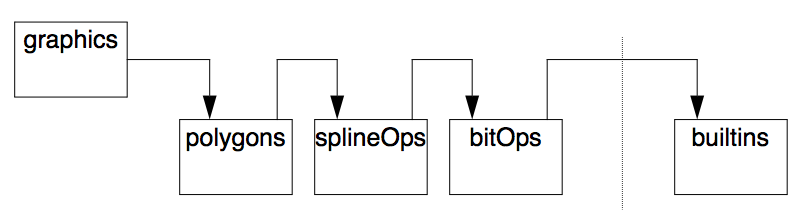

---
---

# 3 Modules
{:.no_toc}

* TOC
{:toc}

ALS Prolog provides a module system to facilitate the creation and maintenance of
large programs. The main purpose of the module system is to partition procedures
into separate groups to avoid naming conflicts between those groups. The module
system provides controlled access to procedures within those groups.
The ALS module system only partitions procedures, not constants. This means that
the procedure foo/2 may have different meanings in different modules, but that
the constant bar is the same in every module.

## 3.1 Declaring a Module

New modules are created when the compiler sees a module declaration in a source
file for the first time during a consult or reconsult. Every module has a name which must be a
non-numeric constant. Here are a few valid module declarations:
```
module dingbat.
module parser.
module compiler.
```
Following a module declaration, all clauses will be asserted into that module using
assertz until the end of the module or until another module declaration is encountered. In addition, any commands that appear within the scope of the module will be executed from inside that module. The end of a module is signified by an endmod. The following example defines the predicate test/0 in two different modules. The definitions don't conflict with each other because they appear in different modules.
```
module mod1.
test :- write('Module #1'), nl.
endmod.
module mod2.
test :- write('Module #2'), nl.
endmod.
```
Clauses which are not contained inside an explicit module declaration are added to
the default module user.

If a module declaration is encountered for a module that already exists, the clauses
appearing within that declaration are simply added to the existing contents of that module, following the clauses which have already been inserted in that module. In this way, the code for a single module can be spread across multiple files ---- as long as each file has the appropriate module declaration and ends with a corresponding end mod.

The end of a file does not signal the end of the module as shown in the following
conversation with the Prolog shell:
```
?- [user].
Consulting user ...
module hello.
a.
b.
c.
user consulted
yes.
?- [user].
Consulting user ...
module hello.
d.
endmod.
user consulted
yes.
?- listing(hello:_).
% hello:a/0
a.
% hello:b/0
b.
% hello:c/0
c.
% hello:d/0
d.
```
If module hello had been closed by the EOF of the user file, then the d/0 fact would have appeared in the user module instead of the hello module. Consequently, it is important to always terminate a module with endmod. That is, module and end mod should always be used in matched pairs.

## 3.2 Sharing Procedures Between Modules
By default, all the procedures defined in a given module are visible only within that
module. This is how name conflicts are avoided. However, the point of the module
system is to allow controlled access to procedures defined in other modules. This
task is accomplished by using export declarations and use lists . Export declarations render a given procedure visible outside the module in which it is defined,
while use lists specify visibility relationships between modules. Each module has
a use list.

## 3.3 Finding Procedures in Another Module

Whenever the Prolog system tries to call a procedure, it first looks for that procedure in the module where the call occurred. This is done automatically, and independently of use list and inheritance declarations.

If the called procedure p/n is not defined in a module, M, from which it is called, then the system will search the use list of M (see 3.3.2 below) for a module M1 that exports
the procedure (p/n) in question. If such a module M1 is found, then all occurrences
of the procedure p/n in the calling module M will be 'forwarded' to the procedure
p/n defined in the module M1. After the procedure p/n has been forwarded from
module M to another module M1, all future calls to procedure p/n from within M
will be automatically routed to the proper place in M1 without further intervention
of the module system.

The forwarding process is determinate. That is, once a call on procedure p/n has
been forwarded to p/n in module M1, even if backtracking occurs, ALS Prolog
will not attempt to locate another module M2 containing a procedure to which p/n
can be forwarded.  

Finally, if no module on the use list for M exports the procedure in question (p/n),
then the procedure p/n is undefined in M, and the call fails.

### 3.3.1 Export Declarations

An _export declaration_ tells the module system that a particular predicate defined in one module may be
called from other modules. Here are some export declarations:
```
export translate/3.
export reduce/2, compose/3.
export a/0, b/0, c/0.
```
Export declarations can occur anywhere within a module. However, one good programming style dictates that procedures are exported just before they're defined.
Another stylistic alternative is to group all the export declarations for a module together in the beginning of the module. The only restriction is that visible procedures must be exported before they can be called from another module. This can happen during the execution of a command or query inside a consult.

### 3.3.2 Use Lists

Associated with each module M is a _use list_ of other modules where procedures not
defined in the given module M may be found. Use lists are built by use declarations which take the forms
```
use mod
use mod1, mod2, ...
```
where mod, mod1, mod2 are the names of the modules to be used. Here are some examples:
```
use bitOps, splineOps.
use polygons.
```
Each use declaration adds the referenced module to the front of the existing use list
for the module M in which the use declaration occurs. If there is more than one
module in a given use declaration (as in the first example above), then the listed
modules are added to the front of the existing use list in reverse order from their
original order in the use declaration. During the forwarding process, use lists are
always searched from left to right. This means that the most recently 'used' modules (i.e., those whose use declaration was made most recently) will be searched first. Here's an example of a module with use declarations building a use list:
```
module graphics.
use bitOps, splineOps.
use polygons.
test :- drawPoly(5, 0, 0).
endmod.
```
In this example, the resulting use list for module graphics would be:

    polygons, splineOps, bitOps

and this is the order in which the modules will be searched, as shown in
the figure below:



Figure. Use List Searching

## 3.4 Default Modules

Two modules, builtins and user, are automatically created when the ALS Prolog system starts up. The builtins module contains code that defines the standard builtin predicates of the system. All modules automatically use the builtins module, as suggested in Figure 1 (Use List Searching), so therefore the following declaration is implicit:

    use builtins.

user is the default module. Any source code that is not contained within an explicit module
declaration is automatically placed in the user module. In addition, the user
module automatically uses every other module (in the order the modules are actually created), so it inherits all exported procedures.

## 3.5 References to Specific Modules

In addition to the export and use list conventions, the module system allows access to specific modules via the operator :/2, whose left hand argument is interpreted as the name of a module, and whose right hand argument is the goal to be called. The access is independent of export declarations. In the following example, the procedure zip in module1 specifically references the procedure bar in module2, even though bar isn't exported from module2:
```
module module1.
zip :- module2:bar.
endmod.

module module2.
bar :- true.
endmod.
```
As this example demonstrates, the export declarations of a module aren't sacred
and the lack of an export declaration can be overridden by :/2. However, good software engineering practice suggests that explicit references be used only when there are compelling reasons for
avoiding the use list and export declaration mechanism.

## 3.6 Nested Modules

ALS Prolog does not currently support the nesting of modules in the way Pascal
does for procedures. Instead, ALS Prolog allows modules to be nested, but processes each nested module independently. Consequently, the visibility of a nested module is not limited to the module in which it is declared. The following example illustrates the effect of placing code for one module inside of another module declaration. The Prolog code below shows a declaration for a module rhyme, containing
a three clause Prolog procedure called animal/1. The module is closed off by the
last endmod declaration. In between the last two clauses of the animal/1 procedure is the module reason. The module reason has a two clause procedure named mineral/1.
```
module rhyme.
export animal/1.

animal(frog).
animal(monkey).

          % The following module declaration
          % (temporarily) closes off the rhyme module
          % in addition to starting the reason module:

module reason.
export mineral/1.

mineral(glass).
mineral(silver).
endmod. % reason

animal(tiger).
endmod. % rhyme
```
Here is a conversation with the Prolog shell illustrating the effects of loading the
above code:
```
?-listing.
% reason:mineral/1.
mineral(glass).
mineral(silver).
% rhyme:animal/1.
animal(frog).
animal(monkey).
animal(tiger).
```
As you can see, even though the module reason was nested in the module rhyme,
the two modules are processed independently.

## 3.7 Facilities for Manipulating Modules

When Prolog starts up, the current module is user. This means that any queries you submit will make use of the procedures defined within user and the modules which are accessible from user's use list. The current module can always be determined using curmod/1.   It is called with an uninstantiated variable which is then bound to the current module. The predicate modules/2 can be used to determine all of the modules currently in the system, together with their use lists. Assume that the following code has been consulted:
```
module m1.
use m2.
p(a).
p(b).
endmod.

module m2.
q(c).
q(d).
endmod.
```
Then the following illustrates the action of modules/2:
```
?- modules(X,Y).
X = user
Y = [m2,m1,builtins];
X = builtins
Y = [user];
X = m1
Y = [m2,builtins,user];
X = m2
Y = [builtins,user];
no.
```
