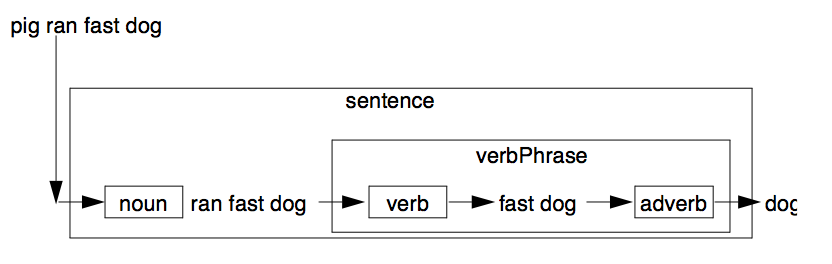
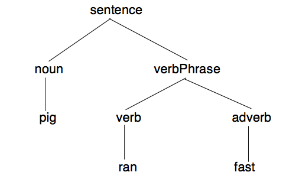

---
---

# 4 Using Definite Clause Grammars
{:.no_toc}

* TOC
{:toc}

Prolog is a very powerful tool for implementing parsers and compilers. The Definite Clause Grammar (DCG) notation provides a convenient means of exploiting
this power by automatically translating grammar rules into Prolog clauses. ALS
Prolog translates DCG rules occurring in source files into their equivalent Prolog
clauses, which are then asserted into the database. The translator itself is a Prolog
program contained in the file dcgs.pro which resides in the alsdir/builtins directory together
with the other builtins files. The sections below provide a simple sketch of the use
and operation of DCGs. A more detailed presentation of the use of DCGs and the
development of translators for them can be found in [bowen]. Advanced treatment
of logic-based grammars is provided by [abramson], [dahl85], [dahl88], and [pereira]. 

DCGs have the general form

    non-terminal --> dform1, ..., dformN.

where dform1 through dformN are either non-terminals, terminals, or Prolog goals. Non-terminals are similar in spirit to nouns and verb phrases in natural language, while terminals resemble actual words.
Consider:

    sentence --> noun, verbPhrase.

The example above uses the non-terminals noun and verbPhrase to define another non-terminal called sentence. The intended reading of the rule is that a sentence can be formed by appending a verb phrase after a noun.

## 4.1 How Grammar Rules are Translated Into Clauses

The DCG expander works by adding two extra arguments (which are in fact variables) to each non-terminal. These two variables are used to pass the list of tokens
to be parsed. The example rule above that defines a sentence would be translated into the following
Prolog clause:

    sentence(S,E) :- noun(S,I0), verbPhrase(I0,E).

This rule means that if S is a list of tokens, and if some initial sequence of S can be
parsed as a sentence, then E is the list of tokens which remain after one sentence
has been parsed. The first part of the sentence, the noun, is constructed from the
tokens beginning with S up to I0. The verb phrase picks up where the noun left
off, and consumes tokens up to E. For example, if 'cat' is a noun, and 'ran' is a
verb phrase, then the following queries will succeed:
```
?- sentence([cat,ran],[]).
?- sentence([cat,ran,away],[away]).
```
In the same manner, if noun/2 is given the list [cat,ran], it will consume cat
and return the list [ran]. Similarly, verbPhrase/2 consumes ran and hands
back the rest of the input token list.

## 4.2 Writing a Grammar

Because DCG rules are translated into Prolog clauses, it is possible to have many
rules that define what it means to be a sentence or a noun or a verb. If one rule can't
parse the list of tokens, Prolog will fail that rule and try the next rule. The following set of
rules says that cat, dog, and pig are all nouns. In addition, two compound verb
phrases are defined.
```
noun --> [cat].
noun --> [dog].
noun --> [pig].

verbPhrase --> verb.
verbPhrase --> verb, adverb.
verb --> [ran].
verb --> [chased].
adverb --> [away].
adverb --> [fast].
```
Here are some examples that make use of these rules; all of the queries succeed:
```
?-noun([dog,chased,cat],[chased,cat]).
?-noun([pig,ate,slop],[ate,slop]).
?-sentence([cat,ran,away],[]).
?-sentence([pig,ran,fast,dog,chased,cat],[dog,chased,cat]).
```
The following picture illustrates the consumption of the sentence:
[pig,ran,fast,dog].


Figure. DCG Parsing as Filtering.

The way to read this diagram is to regard each box as a filter. The filter consumes
some of the input, and allows the remaining part to pass through to the next filter.
The following diagram is a tree which illustrates the structure of the parsed list:



Figure. A Parse Tree.

DCG rules can have variables in the non-terminals which can be used to pass and
return information. For instance, consider the following collection of DCG rules:
```
noun(animal(pig)) --> [pig].
noun(food(slop)) --> [slop].
nounPhrase(noun(Det,Noun)) --> 
      determiner(Det),noun(Noun).
determiner(the) --> [the].
determiner(a) --> [a].
```
Here, noun has been defined to return a structure which would be used to differentiate between the different types of nouns parsed by the DCG rule. These DCGs would be translated into the following Prolog rules:
```
noun(animal(pig),[pig|E],E).
noun(food(slop),[slop|E],E).
nounPhrase(noun(Det,Noun),S,E) :- 
      determiner(Det,S,I0),noun(Noun,I0,E).
determiner(the,[the|E],E).
determiner(a,[a|E],E).
```
Prolog goals can also appear within DCGs if placed between curly braces ({ and }).
Goals thus protected by braces are passed through untouched by the DCG expander
and do not have the extra arguments added to them. For example, the following rule
could be used to recognize numbers:
```
quantity(quantity(Value,Unit)) -->
      [Number],
      {convertnumber(Number,Value),number(Value),!},
      unit(Unit).
```
This rule is translated into:
```
quantity(quantity(Value,Unit),[Number|I0],E) :- 
      convertnumber(Number,Value),
      number(Value),!,
      unit(Unit,I0,E).
```
Many of the builtin predicates are also left untouched whether enclosed by the curly
braces or not. These are shown in the table below:

|       |           |
|:-----:|:---------:|
| ;/2   | atom/1    |
| </2   | atomic/1  |
| =/2   | fail/0    |
| =:=/2 | integer/1 |
| =</2  | is/2      |
| =\=/2 | nonvar/1  |
| >/2   | true/0    |
| >=/2  | var/1     |
