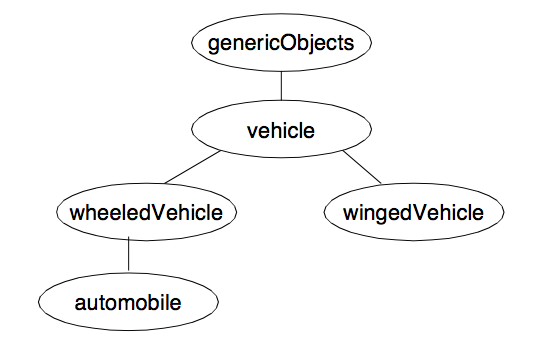

---
---

# 6 ObjectPro: Object Oriented Programming
{:.no_toc}

* TOC
{:toc}

ALS ObjectPro is an object-oriented programming toolkit fully integrated with
ALS Prolog. Unlike some other approaches to object-oriented programming in
Prolog, it is not implemented as a system on top of Prolog. Instead, it is seamlessly
integrated with Prolog: object-oriented facilities can be smoothly accessed from ordinary Prolog programs, and the full power of Prolog can be used in the definition
of object methods.

## 6.1 Overview of ObjectPro

The objects of ObjectPro are frame-like entities possessing state which survives
backtracking. Each object belongs to a class from which it obtains its methods.
Classes are arranged in a hierarchy, with lower classes inheriting methods from parent classes. The behavior of an object is determined by two aspects:

* The object's state, and
* The object's methods.

An object's state is a frame-like entity consisting of named slots which can hold
values. The table below illustrates the state of a simple object:

| slot name      | slot value |
|:---------------|:-----------|
| myName         |            |
| locomotionType |            |
| powerSource    |            |
| numWheels      |            |
| engine         |            |
| autoClass      |            |
| manufacturer   |            |

Changes to the object's state amount to changes in the values of one or more slots.
Such changes are permanent and survive backtracking. The values which appear in
slots can be any Prolog entity, including (the state of) other objects. Messages are
sent to objects by calls of the form
send(Object, Message).
In general, objects are created, held in variables, passed around among routines, and
sent messages in the style above. When necessary, an object can be assigned a global name when it is created which can be used for sending messages to the object.

An object's methods are determined by the class to which it belongs.
A class is determined by three things:
* A local state-schema which describes the structure of part of the state of any
object belonging to the class;
* The methods directly associated with the class;
* The classes from which this class inherits.
Classes are also required to have names -- these are principally used in defining objects. 

The complete _state-schema_ for a class C is a structure whose collection of
slots is the union of all of the slots appearing in the local state-schemata of classes
from which C inherits, together with the slots from the local state-schemata of C.
Slots in child classes must be distinct from slots in all ancestor classes. 

The methods associated with a class are defined by Prolog clauses which can utilize various
primitive predicates for manipulating objects, as well as any ordinary Prolog predicates.

Objects are activated by sending them message . The methods of the class to which
the object belongs (or from which its class inherits) determine the object's reaction
to the message. A message can be an arbitrary Prolog term which may include uninstantiated variables, thus implementing the partially-instantiated message paradigm of Concurrent Prolog [Ref]
The ALS ObjectPro system is integrated with the module system of ALS Prolog, in
that class definitions in ALS ObjectPro may be exported from their defining modules so as to be visible in other modules, or may be left unexported, rendering them
local to the defining module. However, each object 'knows' the module of its defining class, so that if one has hold of the object in a variable Object, then the call

    send(Object, Message)

can be made from the context of any module.

## 6.2 Defining Objects and Sending Messages

An object is defined by an expression of the form

    create_object(Eqns, Obj)

where Obj is an uninstantiated variable which will be bound to the new object, and
Eqns is a list of equations of the form

    Keyword = Value

The acceptable keywords, together with their associated Value types, are the following:
```
instanceOf - atom (name of a class)
values     - list of equations
```
The instanceOf keyword equation is the only required equation; the value on
the right side of this equation must be an atom which is the name of a class which is
visible from the module in which the create_object call is made. Here is an
example of a simple object definition, where iC_Engine must be the name of
class:

    create_object([instanceOf=iC_Engine ], Obj)

The equations appearing on a list which is the right side of a

    values = ValuesList

equation are expressions of the form

    SlotName = SlotValue

where SlotName is one of the named slots in the structure defining the object's
state. These slots are determined by the class to which the object belongs, and may
be slots from the state-schema of the immediate class parent, or may also be slots
from any of the state-schemata of ancestor classes. The intent of the values equation is to enable the programmer to specify local slots, as well as to prescribe initial values for some of the object's
slots (both local and/or inherited) when it is created.

When a global atomic name for the object is needed, one includes an equation of
the form

    name = <atom> .

A message is sent to an object with a call of the form

    send(Object, Message)

where Object is the target object (or an atom naming the object), and Message
is an arbitrary Prolog term. The Message may include uninstantiated variables
which might be instantiated by the object's method for dealing with Message.
Such calls to send/2 can occur both in ordinary Prolog code, and in the code defining methods of classes (and hence objects). For convenience, or conceptual emphasis, a call

    send_self(Object, Message)

is provided. This is merely syntactic sugar for

    send(Object, Message)

That is, the implementation makes no attempt to verify that a send_self message
is being truly sent from an object to itself.

## 6.3 Defining Classes

A class is defined by a directive of the form

    :- defineClass(Eqns).

Here Eqns is a list of equations of the form

    Keyword = Value

The acceptable keywords, together with their associated Value types, are the following:
```
name       - atom
subClassOf - atom (name of a (parent) class)
addl_slots - list of atoms (names of local slots)
defaults   - list of default values for slots
constrs    - list of constraint expressions for slots
export     - yes or no
action     - atom
```
The name equation and the subClassOf equation are both required.

The ObjectPro system pre-defines one top-level class named genericObjects;
all classes are ultimately subclasses of the genericObjects class. genericObjects provides one visible slot, myName, which is always instantiated to the
object's name. Several other slots, normally non-visible, are also provided.

A class is said to be an immediate subclass of the (parent) class named in the subClassOf equation. The relation subclass is the transitive closure of the immediate subclass relation.

The atoms on the addl_slots list specify slots in the structure defining the state
of objects which are instances of this class. These new slot names must not be slot
names in any of the ancestor classes from which the new class inherits; hence the
nomenclature “addl_slots”. The state-schema of a class is the union of the
addl_slots of the class with the addl_slots of all classes of which the class
is a subclass. Reiterating, it is required that the slot names occurring on all these
addl_slot lists be distinct.

Here are several examples of simple class definitions:
```
:- defineClass([name=vehicle,
                subClassOf=genericObjects,
                addl_slots=[locomotionType, powerSource] ]).

:- defineClass([name=wheeledVehicle,
                subClassOf=vehicle,
                addl_slots=[numWheels] ]).

:- defineClass([name=automobile,
                subClassOf=wheeledVehicle,
                addl_slots=[engine,autoClass,manufacturer] ]).

:- defineClass([name=wingedVehicle,
                subClassOf=vehicle,
                addl_slots=[numWings] ]).
```
The inheritance relations among these classes is shown in the Figure below.


Figure. Example Class Inheritance Relations.

The state-schemata (not including the slots provided by genericObjects) for
each of these classes are shown below:
```
vehicle        - [locomotionType, powerSource]
wheeledVehicle - ]locomotionType, powerSource, numWheels]
automobile     - [locomotionType, powerSource, numWheels,
                  engine,autoClass,manufacturer]
wingedVehicle  - [locomotionType, powerSource, numWings]
```
An object which is instance of a class has a slot in its state structure corresponding
to each entry in the state-schema for the class.  A class definition can supply default values for slots using the equation:

    defaults = list of default values for slots

More specifically, the expression on the right should be a (possibly empty) list of
equation pairs

    <SlotName> = <Value>,

where <SlotName> is any one of the slot names from the complete state schema of
the class, and <Value> is any appropriate value for that slot. Omitting this keyword
in a class definition is equivalent to including

    defaults = []

If an export = yes equation appears on the Eqns list of a class definition, the
class methods and other information concerning the class are exported from the
module in which the definition takes place.

Of course, a call send(Object, Message), where Obj is in class C, could fail if C's method code for Message fails. The action=Name equation in an Object definition is used to override the default name for the methods predicate of the class C. If such an equation is present in Object's definition, the methods predicate for Object will be Name/2 instead of the default method of C indicated above.

The constraints equation allows the programmer to impose constraints on the
values of particular slots in the states of objects which are instances of the class. The
general form of a constraint specification is

    constrs = list of constraint expressions

Three types of constraint expressions are supported:
* slotName = value
* slotName < valueList
* slotName - Var^Condition

The first two cases are special cases of the third, and are provided for convenience.
In all three cases, the left side of the expression is the name of a slot occurring in
the complete state-schema of the class being defined (i.e., it is either the name of a
slot on the addl_slots list of the class, or is a slot in the schema of a superclass
from which the class being defined inherits). In the case of slotName = value,
value is any Prolog term. This constraint expression indicates that any instance
of the class being defined must have the value of slot slotName set equal to
value. The generated code ensures that when instances of the class are initialized
(such as via the call send(Object, initialize), or via a create_object call), the value of slotName is set
to value. 

The constraint expression slotName < valueList requires that
the values of slotName be among the Prolog terms appearing on the list valueList. Here '<' is a short hand for 'is an element of'. The generated code for the class methods applies a test to any attempted update of the value of slotName to ensure that the new value is on the list valueList.

As indicated, the third constraint expression subsumes the first two. Var is a Prolog variable, and Condition is an arbitrary Prolog call in which Var occurs.
Condition expresses a condition which any potential value for slotName in an
instance of the class must meet in order to be installed. The generated code imposes
this test on all attempts to update the value of slotName. The test is imposed by
binding the incoming candidate value to the variable Var , and then calling the test
Condition. Here is a class specification including a constraint of the second type:
```
defineClass([name=engine,
     subClassOf=genericObjects,
     addl_slots= [powerType,fuel,engineClass, cur_rpm,running,temp],
     constrs=
       [engineClass < [internalCombustion,steam,electric]]
])
```
The same condition can be expressed by a constraint of the third type as follows:
```
defineClass([name=engine,
     subClassOf=genericObjects,
     addl_slots= [powerType,fuel,engineClass, cur_rpm,running,temp],
     constrs=
       [engineClass - member(X, [internalCombustion,steam,electric])]
])
```
If a constraint fails either during defineClass or setObjStruct/3, the ObjectPro machinery throws an exception of the form
```
constraint_error(<Message>).
```
This can be caught with a surrounding catch/3 call and handled as needed by the program.

## 6.4 Specifying Class Methods

To specify the methods of a class, the programmer must define a two argument
predicate which will specify the reactions of instances of the class to various messages. The default name of this action predicate is

    <class name>Action

However, the name of the predicate can be specified by using a line

    action = <atom>

in the class definition. Thus, using the default, the head of the clauses for the action
predicate will be of the form:

    <ClassName>Action(Message,State) 

The clauses for this predicate specify the methods which the class objects will use
for responding to the various messages they are prepared to accept. The Message
argument can be any Prolog term, and may include uninstantiated variables. The
State argument will be instantiated at execution time to the state of the object
which is using this method to respond to Message. The programmer has no
knowledge of the detailed structure of State. However, access to the slots of State
is provided by two predicates:
```
setObjStruct(SlotDescrip, State, Value)
accessObjStruct(SlotDescrip, State, VarOrValue)
```
The first call

    setObjStruct(SlotName, State, Value)

destructively updates the slot SlotName of State to contain Value, which cannot be an uninstantiated variable. However, Value can be a term containing uninstantiated variables. Any constraints imposed on this slot by the class must be satisfied by the incoming Value. The second call

    accessObjStruct(SlotName, State, VarOrValue)

accesses the slot SlotName of State and unifies the value obtained with VarOrValue.

The value of SlotDescrip above is a slot description, which is either a slot
name, or an expression of the form

    SlotName^SlotDescrip

The latter is used in cases of compound objects in which the value installed in a slot
may be the state of another object. Thus if the contents of SlotName in State is another object O2, then
accessObjStruct(SlotName^SlotDescrip, State, V) effectively performs

    accessObjStruct(SlotDescrip, O2, V).

Two convenient alternatives for these predicates are supplied as “syntactic sugar”:
```
State^SlotDescrip := Value
    for
setObjStruct(SlotDescrip, State, Value)
    and
VarOrValue := State^SlotDescrip
    for
accessObjStruct(SlotDescrip, State, VarOrValue)
```
Besides these two constructs, calls on send/2 can be used in the clauses defining
methods. The code for the action predicate should be defined in the same module
as the definition of the class. (But it can reside in separate files.)
Consider the class engine specified in the preceding section. Simple start and
stop methods can be implemented for this class by the following clauses:
```
engineAction(start,State) :- State^running := yes.
engineAction(stop, State) :- State^running := no.
```
A method to query the status of an engine is given by:

    engineAction(status(What),State) :- What := State^running.

The genericObjects class provides two pre-defined methods, effectively defined as follows:
```
genericObjectsAction(get_value(SlotDesc,Value),State)
    :-  accessObjStruct(SlotDesc,State,Value).

genericObjectsAction(set_value(SlotDesc,Value),State)
    :-  setObjStruct(SlotDesc,State,Value).
```

## 6.5 Examples
(Example code files can be found in the examples/objectpro section of the distribution.)

The first simple example implements an elementary stack object:
```
:- defineClass([name=stacker,
                subclassOf=genericObjects,
                addl_slots=[theStack, depth]
   ]).
```
The call
```
    create_object([name=stack, instanceOf=stacker, 
                   values=[theStack=[], depth=0] ], Obj),
```
will create a stacker-type object; this call is included in the run_stacker driver code below.
Here are the action clauses:
```
stackerAction(push(Item),State)
    :-  accessObjStruct(theStack, State, CurStack),
        setObjStruct(theStack, State, [Item | CurStack]),
        accessObjStruct(depth, State, CurDepth),
        NewDepth is CurDepth + 1,
        setObjStruct(depth, State, NewDepth).

stackerAction(pop(Item),State)
    :-  accessObjStruct(theStack, State, [Item |RestStack]),
        setObjStruct(theStack, State, RestStack),
        accessObjStruct(depth, State, CurDepth),
        NewDepth is CurDepth - 1,
        setObjStruct(depth, State, NewDepth).

stackerAction(cur_stack(Stack),State)
    :-  accessObjStruct(theStack, State, Stack).

stackerAction(cur_depth(Depth),State)
    :-  accessObjStruct(depth, State, Depth).
```
We can create a small loop to exercise an object of this class as follows:
```
run_stack :- 
    create_object([instanceOf=stacker], Obj),
    rs(Obj).

rs(Obj)
    :- write('4stack:>'),flush_output,read(Msg),
       rs(Msg, Obj).

rs(quit, _).

rs(M, Obj)
    :- send(Obj, M),
       printf('Msg=%t\n', [M]),
       flush_output,
       rs(Obj).
```
Here is a sample session using this code:
```
?- [stacker].
Attempting to consult stacker...
... consulted /apache/als_dev/tools/objects/new2/stacker.pro
yes.
?- run_stack.
4stack:>push(2).
Msg=push(2)
4stack:>push(rr(tut)).
Msg=push(rr(tut))
4stack:>cur_stack(X).
Msg=cur_stack([rr(tut),2])
4stack:>pop(X).
Msg=pop(rr(tut))
4stack:>quit.
yes.
```
Our second example, using the vehicles sketched earlier, illustrates the construction of
compound objects. First, here are the class definitions:
```
:- defineClass([name=vehicle,
                subClassOf=genericObjects,
                addl_slots=[locomotionType, powerSource] ]).

:- defineClass([name=wheeledVehicle,
                subClassOf=vehicle,
                addl_slots=[numWheels] ]).

:- defineClass([name=automobile,
                subClassOf=wheeledVehicle,
                addl_slots=[engine,autoClass,manufacturer]  ]).

:- defineClass([name=engine,
                subClassOf=genericObjects,
                addl_slots=[powerType,fuel,engineClass, cur_rpm,running,temp],
                constrs=[ engineClass< [internalCombustion,steam,electric]] ]).

:- defineClass([name=iC_Engine,
                subClassOf=engine,
                addl_slots=[manuf],
                constrs = [engineClass = internalCombustion] ]).
```
Now here are the methods:
```
engineAction(start,State)
    :- State^running := yes.

engineAction(stop, State)
    :- State^running := no.

automobileAction(start,State)
    :- send((State^engine),start).

automobileAction(stop,State)
    :- send(State^engine,stop).

automobileAction(status(Status),State)
    :- send(State^engine, get_value(running,EngineStatus)),
       (EngineStatus = yes ->
             Status = running;
             Status = off
       ).
```
As in the stack example, we can create a simple loop to exercise this code.
Here we make four calls to create_object/2 in order to build two automobiles:
```
run_vehicles
    :- set_prolog_flag(unknown, fail),
       create_object([instanceOf=iC_Engine ], Engine1),
       create_object([instanceOf=automobile,
                      values=[engine=Engine1] ], Auto1),
       create_object([instanceOf=iC_Engine ], Engine2),
       create_object([instanceOf=automobile,
                      values=[engine=Engine2] ], Auto2),
       run_vehicles(a(Auto1, Auto2)).

run_vehicles(Autos)
    :- printf('::>', []), flush_output,
       read(Cmd),
       disp_run_vehicles(Cmd, Autos).

disp_run_vehicles(quit, Autos) :-!.

disp_run_vehicles(Cmd, Autos)
    :- exec_vehicles_cmd(Cmd, Autos),
       run_vehicles(Autos).

exec_vehicles_cmd(Msg > N, Autos)
    :- arg(N, Autos, AN),
       send(AN, Msg),
       !,
       printf('%t-|| %t\n', [N,Msg]).

exec_vehicles_cmd(Cmd, Autos)
    :- printf('Can\'t understand: %t\n', [Cmd]).
```
And here is a trace of an execution of this code:
```
?- run_vehicles.
::>start > 1.
1-|| start
::>status(A1) > 1.
1-|| status(running)
::>start > 2.
2-|| start
::>status(A2) > 2.
2-|| status(running)
::>stop > 2.
2-|| stop
::>status(X) > 2.
2-|| status(off)
::>quit.
yes.
```

## 6.6 Combining ObjectPro with Global Variables

It is often convenient to combine the use of global variables (see [Chapter 8](8-Global-Variables,-Destructive-Update-&-Hash-Tables.html)) with ObjectPro objects. In fact, the ALS Prolog shells for alspro and alsdev use this extensively.  Unlike using assertions to the prolog database, placing an object (e.g., the state of a shell) in a global variable preserves any uninstantiated variables contained in the object.

Below is a modified version of the simple 'stack' example, changed to make use of a global variable which holds the stack object (the code is in the distribution in  examples/objectpro/oopex_stack_global.pro):
```
:- defineClass([name=stacker,
                         subClassOf=genericObjects,
                         addl_slots=[theStack, depth]
                        ]).

:- make_gv('_example_stack'),
        create_object([name=stack, instanceOf=stacker,
                values=[theStack=[], depth=0] ], Obj),
        set_example_stack(Obj).

stackerAction(push(Item), State)
        :-
        accessObjStruct(theStack, State, CurStack),
        setObjStruct(theStack, State, [Item | CurStack]),
        accessObjStruct(depth, State, CurDepth),
        NewDepth is CurDepth + 1,
        setObjStruct(depth, State, NewDepth).

stackerAction(pop(Item), State)
        :-
        accessObjStruct(theStack, State, [Item | RestStack]),
        setObjStruct(theStack, State, RestStack),
        accessObjStruct(depth, State, CurDepth),
        NewDepth is CurDepth - 1,
        setObjStruct(depth, State, NewDepth).

stackerAction(cur_stack(Stack), State)
        :-
        accessObjStruct(theStack, State, Stack).

stackerAction(cur_depth(Depth), State)
        :-
        accessObjStruct(depth, State, Depth).

run_stack :- rs.

rs :-
        write('4stack:>'),
        flush_output,
        read(Msg),
        rs(Msg).

rs(quit).

rs(M) :-
        get_example_stack(Obj),
        send(Obj, M),
        !,
        printf('Msg=%t\n', [M]),
        flush_output,
        rs.

```
