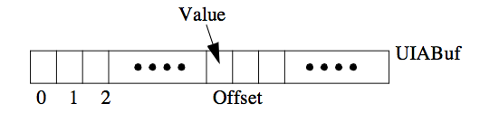
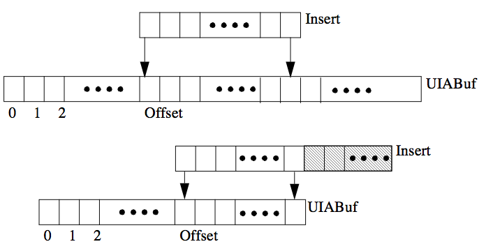

---
---

# 7 Working with Uninterned Atoms
{:.no_toc}

* TOC
{:toc}

Like most symbolic programming languages, ALS Prolog implements atoms in
two different ways:
* Atoms can be interned which means that they have been installed in the Prolog symbol table. Atoms which have been interned are called symbols.
* Atoms can also be uninterned which means that they have not been installed
in the symbol table. These atoms are called UIAs (UnInterned Atoms).
Because UIAs are stored on the heap, they are efficiently garbage collectable. Ordinary Prolog programs cannot distinguish between interned and uninterned atoms,
except for possible differences in efficiency. However, programs which must interface to other external programs can sometimes find UIAs very useful.

## 7.1 The Efficiency of UIAs

Symbols are entered in the symbol table only once, so comparison between atoms
which are symbols is very fast. This is because only the symbol table indices need
to be compared. In contrast, UIAs are stored on the heap as the sequence of characters in the atom's print name (together with header/footer information). Comparison of a symbol with a UIA, or a UIA with a UIA, is somewhat slower because
the two atoms must be compared by comparing the characters in their print names.
Thus, it is desirable to store atoms as symbols if they are likely to often be compared with other atoms. This includes the functors of structures and the distinguished program constants such as ':-' or '+', etc. On the other hand, many programs contain atoms which are seldom or never compared with other atoms. Prompt messages and other output strings are good examples, as are atoms read when
searching a file. These objects should usually be stored as UIAs to avoid clogging
up the symbol table.

### 7.1.1 When is a UIA created?

ALS Prolog uses the following rules to decide whether a given occurrence of an
atom should be a symbol or a UIA.

1. All functors, operators, and predicate names are put into the symbol table.
2. Atoms appearing in the text without single quotes are put in the symbol table.
3. Atoms appearing in the text enclosed in single quotes are stored as UIAs unless
the string which forms the atom is already in the symbol table, or unless the first
rule applies.
4. Atoms created by name/2 are UIAs unless the string which forms the atom is
already in the symbol table.

Consider the following clauses:
```
p('x',y) :- q('f','x').
p(f(y),'wombat').
p(x,'wombat').
```
Let us assume that none of p, q, x, y, f, or wombat are initially in the symbol table
when these clauses are first read. Both p and q will be put into the symbol table
because they are predicate names. y will also be put into the symbol table because
it does not appear between single quotes. On the other hand, wombat will be
stored as a UIA because it is surrounded by single quotes. Similarly, x and f will
initially start out as UIAs because they appear in single quotes. But both of them
will eventually be entered into the symbol table because f appears as a functor in
the second clause and x appears unquoted in the third clause.

The rationale behind making atoms which are enclosed in single quotes into UIAs
is that these sort of atoms most often appear as filenames or messages to write out.
As such, they are rarely compared with other atoms.

## 7.2 Interning UIAs

It is sometimes desirable, under direct program control, to intern an atom which
was originally stored as a UIA. This will cause all future occurrences of the atom,
whether read by the parser or processed by name/2, to be turned into symbols.
This is accomplished by using functor/3. Suppose that the constant 'ProgramConstant' should be interned. This atom cannot be written in a program text without enclosing it in single quotes, because otherwise it would be read as a
variable. The way to turn this into a constant is to issue the goal:

    functor(_,'ProgramConstant',0).

If a large number of constants need to be interned, it may be desirable to write an
intern predicate which might take the following form.
```
intern(X) :- atom(X), !, functor(_,X,0).
intern([H|T]) :- intern(H), intern(T).
```
This could then be called in the following manner:

    intern([ 'ProgramConstant', 'AnotherConstant', 'YetAnotherConstant' ]).

All three quoted strings will be interned so that later occurrences will be stored as
symbols. The PI_forceuia() function can also be used to intern UIAs. See
PI_forceui in the Foreign Interface Reference.

## 7.3 Manipulating UIAs

### 7.3.1 Creating UIAs

There are several additional predicates which can be used to manipulate UIAs. A
UIA of specific length can be created with a call to $uia_alloc/2 with the following
arguments:

    '$uia_alloc'(BufLen,UIABuf)

BufLen should be instantiated to a positive integer which represents the size (in
bytes) of the UIA to allocate. The actual size of the buffer allocated will be a multiple of four greater than or equal to BufLen. UIABuf should be a variable. UIAs
created with $uia_alloc are initially filled with zeros, and will unify with the null
atom ('').

### 7.3.2 Modifying UIAs

Values can be inserted into a UIA buffer using a number of different routines. We
will discuss two of them here: $uia_pokeb/3 and $uia_pokes/3. The modifications
are destructive, and persist across backtracking.  (Note that these procedures can be used to modify system atoms (file names and strings that are represented as UIAs). However, this use is strongly discouraged.)  $uia_pokeb/3 is called as follows:

    '$uia_pokeb'(UIABuf,Offset,Value)

UIABuf should be a buffer obtained from $uia_alloc/2. The buffer is viewed
as a vector of bytes with the first byte having offset zero. Offset is the offset
within the buffer to the place where Value is to be inserted. Both Offset and
Value are integers,  and the byte at position Offset from the beginning of the
buffer is changed to Value. The figure below illustrates this action.


Figure. Action of $uia_pokeb/2.

$uia_pokes/3 is called in the following form:

'$uia_pokes'(UIABuf,Offset,Insert)

UIA Buf and Offset are as above. Insert is an atom or another UIA. Like
$uia_pokeb/3, $uia_pokes/3 views the buffer as a vector of bytes with offset zero specifying the first byte. But instead of replacing just a single byte,
$uia_pokes/3 replaces the portion of the buffer beginning at Offset and having length equal to the length of Insert, using the characters of Insert for the
replacement. If Insert would extend beyond the end of the buffer, Insert is
truncated at the end of the buffer. This is illustrated in the Figure below.


Figure. Action of $uia_pokes/3.

### 7.3.3 Accessing UIA Components

$uia_peekb/3, $uia_peeks/3, and $uia_peeks/4 are used to obtain specific
bytes and symbols (UIAs) from a buffer created by $uia_alloc/2. The parameters for these procedures are specified as follows:
```
'$uia_peekb'(UIABuf,Offset,Value)
'$uia_peeks'(UIABuf,Offset,Extract)
'$uia_peeks'(UIABuf,Offset,Size,Extract)
```
These parameters are interpreted in the same manner as the parameters for
$uia_pokeb/3 and $uia_pokes/3, where Size must also be an integer.
$uia_peekb/3 binds Value to the byte at position Offset. $uia_peeks/3 binds Extract to a UIA consisting of the characters beginning at position
Offset and extending to the end of the buffer. $uia_peeks/4 binds Extract to a UIA consisting of the characters beginning at position Offset and extending to position End where End = Offset + Size. If End would occur
beyond the end of the buffer, Extract simply extends to the end of the buffer.

### 7.3.4 An Example

The following example procedure illustrates how to create a buffer and fill it with
the name of a given atom with using $uia_pokes/3.
```
copy_atom_to_uia(Atom, UIABuf) 
    :- name(Atom,ExplodedAtom),
       copy_list_to_uia(ExplodedAtom,UIABuf).

copy_list_to_uia(Ints,UIABuf) 
    :- length([_|Ints], BufLen),
       '$uia_alloc'(BufLen, UIABuf),
       copy_list_to_uia(Ints, 0, UIABuf).

copy_list_to_uia([],_,_) :- !.
copy_list_to_uia([H | T], N, Buf) 
    :- '$uia_pokeb'(Buf,N,H),
       NN is N+1,
       copy_list_to_uia(T, NN, Buf).
```

### 7.3.5 List of Routines for Working with UIAs
Below is a full list of the routines which may be used to modify and access component values of a UIA. {Details can be found in the ALS Prolog Reference Manual.}
```
$uia_clip/2 - clip the given UIA
$uia_pokeb/3 - modifies the specified byte of a UIA
$uia_peekb/3 - returns the specified byte of a UIA
$uia_pokew/3 - modifies the specified word of a UIA
$uia_peekw/3 - returns the specified word of a UIA
$uia_pokel/3 - modifies the specified long word of a UIA
$uia_peekl/3 - returns the specified long word of a UIA
$uia_poked/3 - modifies the specified double of a UIA
$uia_peekd/3 - returns the specified double of a UIA
$uia_pokes/3 - modifies the specified substring of a UIA
$uia_peeks/3 - returns the specified substring of a UIA
$uia_peeks/4 - returns the specified substring of a UIA
$uia_peek/4  - returns the specified region of a UIA
$uia_poke/4  - modifies the specified region of a UIA
```
In addition, there are three useful routines for dealing with the sizes of UIAs. The call

    '$uia_size'(UIABuf, Size)

returns the actual size (in bytes) of the given UIA. 

If Size is less than or equal to the actual size of the given UIABuf, the call

    '$uia_clip'(UIABuf,Size)

reduces the size of UIABuf by removing all but one of the trailing zeros (null
bytes). 

## 7.4 Observations on Using UIAs

As indicated by the rules presented in Section 7.2 (Interning UIAs), ALS Prolog
automatically handles much of the use of UIAs. The preceeding Section presented
predicates for explicitly creating and manipulating UIAs. The routines for explicit
manipulation of UIAs allow one to treat the bytes making up the UIA as raw memory to be manipulated at a low level. Two areas where explicit manipulation of UIAs can be useful are:

* Creating and manipulating data structures not supported by ALS Prolog.
* Communicating with external programs.

One example which in essence combines both uses is communication with external
C programs, such as X Windows and Motif, which require both C strings and C
structs as function arguments. An analysis of any such situation usually leads to
the following observations:

* Strings and structs which are created on the C side of the interface should
usually stay there, and pointers to them be passed to the Prolog side.

* Strings and structs which are created on the Prolog side and which are
ephemeral in the sense that the C side will consume them when they are initially passed, and no further reference will be made to them from the C side,
can be created as UIAs. Note that if after control returns to Prolog, a garbage collection will sooner or later take place. In all likelihood, the UIA object will either pass out of existence, or at least move its location on the
heap, so that if C 'holds on' to the pointer it was passed, this pointer will no
longer be valid. Thus, one only wants to pass UIAs to C when they are
ephemeral in the sense above: C will not hold on to a pointer to the UIA
after control returns to Prolog.

* When non-ephemeral objects are to be created under Prolog control, it is
best to create these in 'C space' by calling malloc. This can be done either
by creating a specific C-defined Prolog predicate which carries out the
work, or by using the C interface utilities which allow Prolog to call malloc
and manipulate the allocated C memory.
