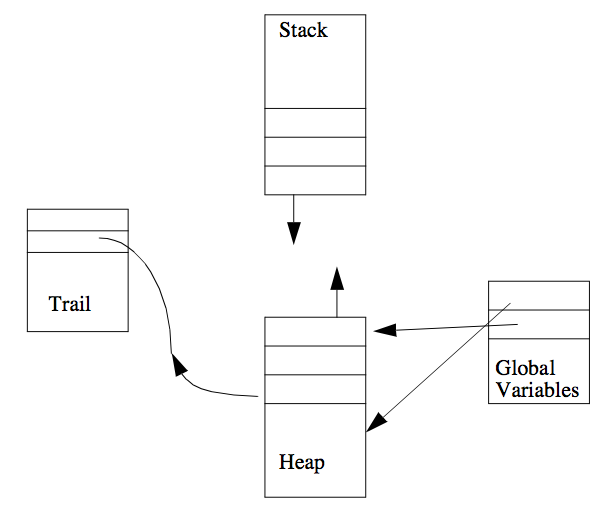

---
---

# 8 Global Variables, Destructive Update & Hash Tables
{:.no_toc}

* TOC
{:toc}

ALS Prolog provides a method of globally associating values with arbitrary terms
(which occur on the heap).  The associations are immune to backtracking. That is,
once an association is installed, backtracking to a point prior to creation of the association does not undo the association. (However, see the discussion below for fine
points concerning this.) Because both the associated term and value may occur on
the heap, both a term and its associated value can contain uninstantiated variables.

## 8.1 'Named' Global Variables

The underlying primitive predicates set_global/2 and get_global/2 defined in the
next section maintain a uniform global association list. This has the disadvantage
that as the number of distint associations to be maintained grows, the performance of
both set_global/2 and get_global/2 will degrade. The facility described in this section avoids this problem by providing individual global variables which are accessed by programmer-specified unary predicates; hence this mechanism is said to provide 'named global variables.'
```
make_gv/1
make_gv(Name)
make_gv(+)
```
This predicate creates a single (primitive) global variable (see the next section), together with predicates for setting and retrieving its value. If Name is either an
atom or a Prolog string (list of ASCII codes), the call

    make_gv(Name)

allocates a primitive global variable and dynamically defines (asserts clauses for)
two predicates, setNAME/1 and getNAME/1, where NAME is the atom Name or the
atom corresponding to the string Name. The definitions are installed in the module
in which make_gv/1 is called. These two predicates are used, respectively, to set
or get the values of the global variable which was allocated. Here are some examples:
```
?-make_gv('_flag').
yes.
?-set_flag(hithere).
yes.
?-get_flag(X).
X = hithere.
?-make_gv('CommonCenter').
yes.
?-setCommonCenter(travel_now).
yes.
?-getCommonCenter(X).
X = travel_now.
```

## 8.2 The Primitive Global Variable Mechanism

The underlying or primitive global variable mechanism is best described in terms
of a simple implementation point of view. Global variables are value cells with the
following properties:
* They can contain pointers into the heap (but not into the stack)
* These value cells do not lie on either the heap or the stack.
* The pointers contained in these value cells are not affected by either the
backtracking process or the garbage collection process.
The figure below suggests the global variable mechanism.


Figure. The Global Variables Area and the Heap.

The underlying mechanism is implemented by the following routines:
```
gv_alloc/1
gv_alloc(Num) - allocates a global variable
gv_alloc(+)
gv_free/1
gv_free(Num) - frees a global variable
gv_free(+)
gv_get/2
gv_get(Num, Value) - gets the value of a global variable
gv_get(+, -)
gv_set/2
gv_set(Num, Value) - sets the value of a global variable
gv_set(+, +)
```
These four predicates implement the primitive global variable mechanism. They
achieve an effect often implemented using assertions in the database. The value of
the present mechanism is its greater speed, its separation from the database, and its
ability to deal with terms from the heap which may incorporate uninstatioated variables. Global variables are referred to by unique identifying integers sequentially
starting from 1. The number of available global variables is implementation dependent. Note that the system itself allocates a number of global variables.

gv_alloc(Num) allocates a free global variable and unifies the number of this variable with Num. Since several global variables are used by the system itself, the first call to gv_alloc(Num) normally returns an integer greater than 1. 

gv_free(Num) deallocates global variable number Num, after which Num can be reused by subsequent calls to gv_alloc/1. 

gv_set(Num,Value) sets the value of global variable number Num to be Value, which can be any Prolog term, including partially instantiated terms. Correspondingly, gv_get(Num, Value) unifies Value with the current value of global variable number Num. A call to gv_get(Num, Value) before a call
to gv_set(Num, Value) returns the default value for global variables, which is 0.

Attempts to use gv_set(Num,Value) or gv_get(Num,Value) without a preceding call to gv_alloc(Num) returning a value for the variable Num is an error which will generally cause unpredictable behavior, including system crashes.

The immediate values of global variables survive backtracking and persist across
top level queries. However, if a global variable is set to a structure containing an
unbound variable, say X, which is later bound during a computation, the binding of
X is an ordinary Prolog binding which will not survive either backtracking or return
to the top level of the Prolog shell. Thus variables in a structure which is bound to a global variable do not inherit the globalness of the outermost binding.

Here are some examples:
```
?- gv_alloc(N), gv_set(N,hi), write(hi).
hi
N = 2
yes.
?- gv_get(2,V),write(V).
hi
V = hi
yes.
?- gv_set(2,bye).
yes.
?- gv_get(2,V1),write(V1),nl,fail;
gv_get(2,V2),write(V2).
bye
bye
V1 = _4
V2 = bye
yes.
?- gv_get(2,V).
V = bye
```
Note that gv_set/2 is a constant time operation so long as the second argument
is an atom or integer. Otherwise, it requires time linearly proportional to the current
depth of the choicepoint stack.

## 8.3 Destructive Modification/Update of Compound Terms

ALS Prolog provides a predicate which allows programs to destructively modify arguments of compound terms (or structures). This predicate is mangle/3. The
effects of mangle/3 are destructive in the sense that they survive backtracking. The
calling pattern for this predicate is similar to arg/3:

    mangle(Nth, Structure, NewArg)

This call destructively modifies an argument of the compound term Structure
in a spirit similar to Lisp's rplaca and rplacd. Structure must be instantiated to a compound term with at least N arguments. The Nth argument of Structure will become NewArg. Lists are considered to be structures of arity two.
NewArg must satisfy the restriction that NewArg is not itself an uninstatiated variable
(though it can be a compound term containing uninstatiated variables). Modifications made to a structure by mangle/3 will survive failure and backtracking.

Even though mangle/3 implements destructive assignment in Prolog, it is not
necessarily more efficient than copying a term. This is due to the extensive cleanup
operation which ensures that the effects of a mangle/3 persist across failure.
Here are some examples:
```
?- Victim = doNot(fold,staple,mutilate),
mangle(2,Victim,spindle).
Victim = doNot(fold,spindle,mutilate)
yes.
```

## 8.4 'Named' Hash Tables

The allocation and use of hash tables is supported by exploiting the fact that the
implementation of terms is such that a term is an array of (pointers to) its arguments. So hash tables are created by combining a term (created on the heap) together with access routines implemented using basic hashing techniques. The destructive update feature mangle/3 is used in an essential manner. As was the case with global variables, at bottom lies a primitive collection of mechanisms, over
which is a more easily usable layer providing 'named' hash tables.

The predicate for creating named hash tables is
```
make_hash_table/1
make_hash_table(Name) - creates a hash table with access predicates
make_hash_table(+)
```
If Name is any atom, including a quoted atom, the goal make_hash_table(Name)
will create a hash table together a set of access methods for that table. The atom
Name will be used as the suffix to the names of all the hash table access methods.
Suppose for the sake of the following discussion that Name is bound to the atom
'_xamp_tbl'. Then the goal

    make_hash_table('_xamp_tbl')

will create the following access predicates:
```
reset_xamp_tbl  - throw away old hash table associated with the '_xamp_tbl'
hash table and create a brand new one.

set_xamp_tbl(Key,Value – associate Key with Value in the hash table; Key should
be bound to a ground term. Any former associations that Key had in the hash table are replaced.

get_xamp_tbl(Key,Value) – get the value associated with the ground term bound to Key and unify it with Value.

del_xamp_tbl(Key,Value) – delete the Key/Value association from the hash table. Key must be bound to a ground term. Value will be unified against the associated value in the table. If the unification is
not successful, the table will not be modified.

pget_xamp_tbl(KeyPattern,ValPattern) – The "p" in pget and pdel (below) stands for pattern.
pget_xamp_tbl permits KeyPattern and ValPattern to have any desired instantiation. It will backtrack
through the table and locate associations matching the "pattern" as specified by KeyPattern and ValPattern.

pdel_xamp_tbl(KeyPattern,ValPattern) – This functions the same as pget_xamp_tbl except that
the association is deleted from the table once it is retrieved.
```
Consider the following example (where we have omitted all of the 'yes' replies, but
retained the 'no' replies):
```
?- make_hash_table('_assoc').
?- set_assoc(a, f(1)).
?- set_assoc(b, f(2)).
?- set_assoc(c, f(3)).
?- get_assoc(X, Y).
no.
?- get_assoc(c, Y).
Y = f(3)
?- pget_assoc(X, Y).
X = c
Y = f(3);
X = b
Y = f(2);
X = a
Y = f(1);
no.
?- del_assoc(b, Y).
Y = f(2)
?- pdel_assoc(X, f(3)).
X = c
?- pget_assoc(X, Y).
X = a
Y = f(1);
no.

Guide-75-

?- reset_assoc.
yes.
?- pget_assoc(X,Y).
no.
```

## 8.5 Primitive Hash Table Predicates

The core hash tables are physically simply terms of the form

    hashArray(.........)

We are exploiting the fact that the implementation of terms is such that a term is an
array of (pointers to) its arguments. So what makes a hash table a hash table below
is the access routines implemented using basic hashing techniques. We also exploit the destructive update feature mangle/3. Each argument (entry) in a hash table here is a (pointer) to a list 

    [E1, E2, ....] 

where each Ei is a cons term of the form

    [Key Value]

So a bucket looks like:

    [ [Key1 Val1], [Key2 Val2], ....]

where each Keyi hashes into the index (argument number) of this bucket in the term

    hashArray(.........)

The complete hash tables are terms of the form

    hashTable(Depth,Size,RehashCount,hashArray(....))

where:
```
Depth       = the hashing depth of keys going in;

Size        = arity of the hashArray(...) term;

RehashCount = counts (down) the number of hash entries which have been
made; when then counter reaches 0, the table is expanded and rehashed.
```
The basic (non-multi) versions of these predicates overwrite existing key values;
i.e., if Key-Value0 is already present in the table, then hash inserting Key-Value1
will cause the physical entry for Value0 to be physcially altered to become Value1
(using mangle/3).

The "-multi" versions of these predicates do NOT overwrite existing values, but instead treat the Key-___ cons items as tagged pushdown lists, so that if

    [Key Value0]

was present, then after hash_multi_inserting Key-Value1, the Key part of the bucket looks like: 

    [Key [Value1 Value0] ]; i.e., it is
    [Key, Value1 Value0]

Key hashing is performed by the predicate hashN(Key,Size,Depth,Index).
