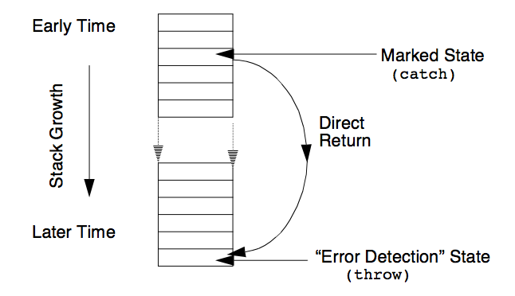
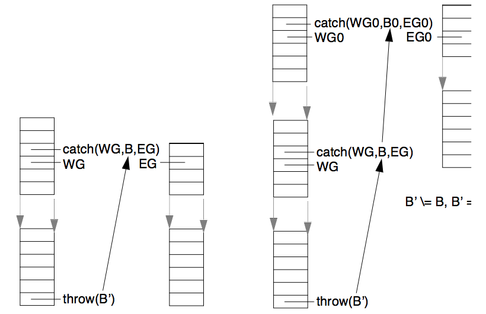

---
---

# 9 Freeze, Exceptions, Events, Interrupts, Signals
{:.no_toc}

* TOC
{:toc}

## 9.1 Freeze

ALS Prolog supports a 'freeze' control construct similar to those that appear in
some other prolog systems (See [carlsson] for general information on delay terms and implementation strategies). Using 'freeze', one can implement a variety of approaches to co-routining and delayed evaluation.
```
freeze/2
freeze(Var, Goal)
freeze(?, +)
```
In normal usage, Var is an uninstantiated variable which occurs in Goal. When invoked in module M, the call

    freeze(Var, Goal)

behaves as follows:
1.  If Var is instantiated, then M:Goal is executed;

2.  If Var is not instantiated, then the goal freeze(Var, Goal) immediately succeeds, but creates a 'delay term' (on the heap) which encodes information
about this goal. If Var becomes instantiated at some point in the future, at
that time, the goal M:Goal is run (with, of course, Var as instantiated).

For example, here is an example of an extremely simple producer-consumer coroutine:
```
pc2 :- freeze(S, produce2(0,S)), consume2(S).
produce2(N, [N | T])
    :- M is N+1,
       write('-p-'),
       freeze(T, produce2(M,T)).

consume2([N | T])
    :- write(n=N),nl,
       ((N > 3, 0 is N mod 3) -> gc; true),
       (N < 300 -> consume2(T) ; true).
```
Without the presence of the 'freeze' constructs, this program will simply loop in
produce2/2, doing nothing but incrementing the counter and printing '-p-' on the
terminal. However, using the freeze construct, the program 'alternates' between
produce2/2 and consume2/1, producing the following behavior on the terminal:
```
?- pc2.
-p-n = 0
-p-n = 1
-p-n = 2
-p-n = 3
-p-n = 4
<...snip...>
-p-n = 296
-p-n = 297
-p-n = 298
-p-n = 299
-p-n = 300
yes.
```
Here is one very simple illustrative example:
```
u :- freeze(W1, silly(W1,yellow)),
     freeze(W2, grump(W2,blue)),
     W2=W1,
     W2 = igloo.

grump(A,B)
    :- write(grump_running(A,B)),nl,flush_output.

silly(A,B)
    :- write(silly_running(A,B)),nl,flush_output.
```
Running u/0 yields:
```
?- u.
silly_running(igloo,yellow)
grump_running(igloo,blue)
yes.
```
Using silly and grump from above, here is another example:
```
u1 :- freeze(W1, silly(W1,yellow)),
      u11(W1).

u11(W1)
    :- freeze(W2, grump(W2,blue)),
       W2=W1,
       u111(W2).

u111(W2)
    :- freeze(W3, grump(W3,purple)),
       W3 = W2,
       u1_4(W3).

u1_4(W3)
    :- W3 = igloo.
       u11(W1).

u111(W1).

u1_4(W3).
```
Running this produces:
```
?- u1.
silly_running(igloo,yellow)
grump_running(igloo,blue)
grump_running(igloo,purple)
yes.
```
The following example (due to Bill Older) illustrates the interaction of freeze with backtracking:
```
fred(2) :- write(fred(2)),nl.
fred(3) :- write(fred(3)),nl.
fred(4) :- write(fred(4)),nl.
freeze_backtrack
    :- freeze(X, write(thaw(X))), fred(X), fail.
```
The output here is:
```
?- freeze_backtrack.
thaw(2)fred(2)
thaw(3)fred(3)
thaw(4)fred(4)
no.
```
Finally, here is an example (also due to Bill Older) of cascading freezes:
```
fd([], 1).
fd([A | As], B)
    :-!,
    freeze(A, fd(As, B)).

fdtest([A,B,C,D]) 
    :- fd([A], B),
       fd([A,B], C),
       fd([B,C], D).
```
Here are two different uses of fdtest:
```
?- fdtest([A,B,C,D]).
A-> fd([],B),user:fd([B],C) 
B-> fd([C],D)
C= C
D= D
yes.

?- fdtest([A,B,C,D]), A = 5.
A= 5 
B= 1
C= 1 
D= 1
yes. 
```

## 9.2 Exceptions
The exception mechanism of ALS Prolog allows programs to react to extraordinary
circumstances in an efficient and appropriate manner. The most common extraordinary circumstance to be dealt with is errors. Often an error (perhaps inappropriate user input, etc.) is detected deep in the calling sequence of predicates in a program.
The most appropriate reaction on the part of the program may be to return to a much
earlier state. However, if the code is written to support such a return using the ordinary predicate calling mechanisms, the result is often difficult to understand and
has poor efficiency. The exception mechanism allows the program to mark a point
in its calling state, and to later be able to return directly to this marked point independently of the pending calls between the marked state and the later state. This notion is illustrated in the figure below.


Figure. Direct Return to an Earlier State.

This exception mechanism is implemented using two predicates, catch/3 and throw/1.
```
catch/3
catch(WatchedGoal, Pattern, ExceptionGoal)
catch(+, +, +)

throw/1
throw(Term)
throw(+)
```
The two predicates catch/3 and throw/1 provide a more sophisticated controlled
abort mechanism than the primitive builtins catch/2 and throw/0 (although the
former are implemented in terms of the latter, which are described below). catch/
3 is used to mark a state in the sense of the discussion above. We will say that the call

    catch(WatchedGoal, Pattern, ExceptionGoal)

_catches_ a term T if T unifies with Pattern. A call throw(T) is caught by a call
on catch/3 if the argument T is caught by the call on catch/3, and there is no call
on catch/3 between the given calls on catch/3 and throw/1 which also catches T.

If M is the current module for the call on catch/3, then the first argument of catch/3,
WatchedGoal, is run in module M just as if by call/1; i.e., as if
catch/3 were call/1. If there is no subsequent call to throw/1 which is uncaught by an intervening call to catch/3, then the call on catch/3 is exactly like
a call on call/1. However, if 
i) there is a subsequent call to throw/1 whose argument Ball unifies with the second argument of the call on catch/3, and if 
ii) there is no interposed call to catch/3 whose second argument also unifies with
Ball, 
then all computation of the call on the first argument, WatchedGoal, is
aborted, and the third argument of the call to catch/3, ExceptionGoal, is run as
a result of the call to throw/1.

When the system executes throw/1, it will behave as if the head of catch/3 failed.
However, instead of backtracking to the most recent choicepoint, the system will
instead backtrack to the state it was in just before the most recent enclosing catch/
3 whose second argument unifies with the argument of the throw/1 call; then the
system will run the corresponding ExceptionGoal. 

catch and throw are dynamically
scoped in that throw/1 must be called somewhere in an execution of WatchedGoal
which is initially invoked by catch/3. If throw/1 is called outside the scope of some
invocation of catch/3 (meaning, with nothing to catch its abort of execution), the
system aborts to the Prolog shell. The figure below illustrates the behavior of these predicates.


Figure. Action of catch/3 and throw/1.

Consider the sample code:
```
ct :- catch(c1, p1(X), e(c1,X)).
c1 :- write(c1),nl, catch(c2, p2(X), e(c2,X)).
c2 :- write(c2),nl, catch(c3, p1(X), e(c3,X)).
c3 :- write('c3-->'), read(Item),
      write(throwing(Item)),nl, 
      throw(Item).
e(H,I) :- printf("Handler %t caught item %t\n",[H,I]).
```
This leads to the following execution behavior on a TTY interface, with the user input indicated by surrounding **.
```
?- ct.
c1
c2
c3-->**p1(a).**
throwing(p1(a))
Handler c3 caught item a
yes.
?- ct.
c1
c2
c3-->**p2(a).**
throwing(p2(a))
Handler c2 caught item a
yes.
```
The builtins file catch.pro records the item being thrown by throw/1 in the Prolog database, while the file catchg.pro records the item in a global variable. For small
items, there is no significant difference between the two versions, but for large
items, the catchy version will be more efficient.
```
catch/2
catch(WatchedGoal,ExceptionGoal)
catch(WatchedGoal,ExceptionGoal)

throw/0
throw
```
The two predicates catch/2 and throw/0 provide the primitive form of controlled abort underlying catch/3 and throw/1. The builtin abort/0 normally aborts to the Prolog shell.
* WatchedGoal is simply run from the current module as if by call/1.
* ExceptionGoal is a goal that will be run as a result of a call to throw/0 during the execution of the WatchedGoal.
When the system executes throw/0 it will behave as if the head of throw/0
failed. However, instead of backtracking to the most recent choicepoint, the system
will instead backtrack to the state it was in just before the most recent enclosing
catch/2 and then run the corresponding ExceptionGoal. catch/2 and throw/0
are dynamically scoped in that throw/0 must be called somewhere in the execution of WatchedGoal which is initially invoked by catch/2. If throw/0 is called outside the scope of some invocation of catch/2 (meaning, with nothing to catch its execution), the system aborts to the Prolog shell:
```
?- throw.
Execution aborted.
```
If we define the following clauses:
```
goal(Person) 
    :- printf("%t: Chris, take out that garbage!\n",[Person]),
       responseTo(Person), 
       okay(Person).
responseTo('Mom') :- throw.
responseTo('Dad').
okay(Person) 
    :- printf("Chris: Okay %t, I'll do it.\n",[Person]).
interrupt :- printf("Chris: I want to go hiking with Kev.\n").
```
Then:
```
?- catch(goal('Mom'),interrupt).
Mom: Chris, take out that garbage!
Chris: I want to go hiking with Kev.
yes.
?- catch(goal('Dad'),interrupt).
Dad: Chris, take out that garbage!
Chris: Okay Dad, I'll do it.
yes.
```
Notice that with Mom, it's okay to interrupt, but you don't try it with Dad. In the
above example, Chris responds to Dad with the okay/1 predicate, but Chris did
not respond to Mom because the okay/1 predicate was never reached. After a
throw/0 predicate is executed, control is given to the ExceptionGoal. After
the ExceptionGoal is run, control starts after the call to catch/2 which handled the exception. Invocations of catch/2 may be nested and a throw/0 will always
goes to the most recent enclosing catch/2.

## 9.3 Interrupts

Each time a procedure is called, ALS Prolog compares the distance between the top
of the heap and its boundary to see if a garbage collection is necessary. If this distance ever becomes less than a pre-defined value, called the heap safety value, the
program is interrupted, and the garbage collector is invoked. The test is done at the
entrance to every procedure. This check is the basis for the internal ALS Prolog
interrupt mechanism.

When a procedure is called by a WAM call or execute instruction (cf. [warren83]),
control is transfered to a location in the name table entry for the procedure which is
being called. The first action carried out in this patch of code is the heap overflow
check. If no overflow has been detected, control continues on. This overflow check
is useful as a general interrupt mechanism in Prolog. Since it is always carried out
upon procedure entry, and since all calls must go through the procedure table, any
call can be interrupted. If the overflow check believes that the heap safety value is
larger than the current distance between the heap and backtrack stack, the next call
will be stopped. The key word is ' believes': the heap safety value could have been
set to an absurdly large value leading to the interruption.

The key to using this as the basis for a general Prolog interrupt mechanism is to provide a method of specifying the reason for the interrupt, together with an interrupt
handler which can determine the reason for the interrupt and dispatch accordingly.
The entire mechanism is implemmented in Prolog code. Either ALS Prolog system
code or user code can trigger an interrupt by setting the heap safety to a value which
guarantees that the next call will be interrupted. When the interrupt occurs, the interrupted call is packaged up in a term and passed as an argument to the interrupt
handler. The continuation pointer for the handler will point into the interrupted
clause, and the computation will continue where it would have continued if the call
had never been interrupted after the handler returns.
An example will help make this clearer. Suppose the goal

    :- b, c, f(s,d), d, f.

is running , that the call for c/0 has returned, and that f/2 is about to be called.
Something happens to trigger an interrupt (i.e., to set the heap safety value to a very
large value) and f/2 is called. The heap overflow check code will run and the goal
will now operationally look as though it were

    :- b, c, '$int'(f(s,d)), d, f.

Rather than f/2 running, $int/1 will run. When $int/1 returns, d/0 will run,
which is what would have happened if f/2 had run and returned. If $int/1
decides to run f/2, all it has to do is call f/2. $int/1 can leave choicepoints on
the stack, and also be cut, since it is exactly like any other procedure call. Any cuts
inside $int/1 will have no effects outside of the call. In other words, it is a fairly
safe operation. Once the interrupt handler is called, the interrupt trigger should be
reset, or the interrupt handler will interrupt itself, and go into an infinite loop.
If some thought is given to the possibilities of this interrupt machanism, it becomes
apparent that it can be used for a variety of purposes, as sketched below.

_A clause decompiler in Prolog itself_: The $int/1 code might be of the form
```
'$int'(Goal) 
    :- save Goal somewhere,
       set a 'decompiler' interrupt.
```
The goal would be saved somewhere, and the interrupt code would merely return
after making sure that the next call would be interrupted. It is not necessary to call
Goal, because nothing below the clause being decompiled is of interest.

_A debugging trace mechanism_: The $int/1 code would be of the form
```
'$int'(Goal) 
    :- show user Goal,
       set a 'trace' interrupt and call Goal.
```
Here, the code will show the user the goal and then call it, after making sure that all
subgoals in Goal will be interrupted.

_A ^C trapper_: The $int/1 code would keep the current goal pending. Then the
user could be given a choice of turning on the trace mechanism, calling a break
package which would continue the original computation when it returned, or even
stop the computation altogether.

In order for the above operations to take place, the interrupt handler needs to know
which interrupt has been issued. This is done through the _magic value_. Magic is
a global variable, which is provided as the first argument to the $int/2 call

    '$int'(Magic,Goal)

Calling $int/2 with the value of Magic passed (as first argument) means that
the proper interrupt handler will be called. If the value of Magic is allowed to be
a regular term, information can be passed back from an interrupt, such as the accumlated goals from a clause which is being decompiled. The mechanisms of setting interrupts clearly must include the setting of Magic to appropriate values.

In order to write code such as the decompiler in Prolog, several routines are needed.
The system programmer must be able to set and examine the value of Magic. This
is done with the following calls:
```
setPrologInterrupt/1
getPrologInterrupt/1
```
The programmer must also be able to interrupt the next call. This is done with
the call:

    forcePrologInterrupt/0

For example, the goal

    :- forcePrologInterrupt, a.

will call

    '$int'(Magic,a)

If the clause

    b :- forcePrologInterrupt.

is called by the goal

    :- b,a.

then

    '$int'(Magic,a)

will be called once again, since after b returns, a/0 is the next goal called. Finally,
there must be a way of calling a goal, a, without interrupting it, but setting the interrupt
so that the the goal after the goal a will be interrupted. If a/0 is to be called
and the next call following it is to be interrupted, the call

:- callWithDelayedInterrupt(a)

is used. For example, if a/0 is defined by

    a :- b.
then

    :- callWithDelayedInterrupt(a).

will call

    :- '$int'(Magic,b).

not

    :- '$int'(Magic,a).

However, if a/0 is merely the fact

   a.

then the call

    :- callWithDelayedInterrupt(a),b.

will end up calling

    :- '$int'(Magic,b).

As an extended example of the use of these routines, we will construct a simple
clause decompiler. The code sketched earlier outlines the general idea:
```
'$int'(Goal) :- 
    save Goal somewhere,
    set a 'decompiler' interrupt.
```
The goal can be saved for the next call inside a term in the variable Magic. The
clause so far would be
```
'$int'(s(Goals,Final),NewGoal) 
    :- 
    setPrologInterrupt(s([Goal|Goals],Final)),
    forcePrologInterrupt.
```
The term being built inside Magic has the new goal added to it, and the trigger is
set for the next call. To start the decompiler, the clause should be called as though
it were to be run. However, each subgoal will be interrupted and discarded before
it can be run. The starting clause would be something of the form:
```
'$source'(Head,Body) 
    :- 
    setPrologInterrupt(s([],Body)),
    callWithDelayedInterrupt(Head).
```
First, the value of Magic is set to the decompiler interrupt term with an initially
empty body and a variable in which to return the completed body of the decompiled
clause. The goal is then called with callWithDelayedInterrupt/1, which
will make sure that the next goal called after Head will be interrupted. The above
clause for $int/2 will then catch all subgoals. The head code for Head will bind
any variables in Head from values in the head of the clause, and all variables that
are in both the head and body of the clause will be correct in the decompiled clause,
since an environment has been created for the clause. Since the clause is actually
running, each subgoal will pick up its variables from the clause environment. If the
decompiler should ever backtrack, the procedure for Head will backtrack, going on
to the next clause, which will be treated in the same way. The only tricky thing is
the stopping of the decompiler. The two clauses given above will decompile the entire computation, including the code which called the decompiler. The best method
is to have a goal which the decompiler recognizes as being an 'end of clause flag'.
However, having a special goal which would always stop the decompiler would
mean that the decompiler would not be able to decompile itself. So some way must
be found to make only the particular call to this 'distinguished' goal be the one at
which the decompiler will stop. The clauses above can be changed to the following
to achieve this goal:
```
'$int'(s(ForReal,Goals,Final),'$endSource'(Variable)
    :- ForReal == Variable,!.

'$int'(s(ForReal,Goals,Final),Goal) 
    :- setPrologInterrupt(s(ForReal, [Goal|Goals],Final)),
       forcePrologInterrupt.

'$source'(Head,Body) 
    :- setPrologInterrupt(s(ForReal,[],Body)),
       callWithDelayedInterrupt(Head),
       '$endSource'(ForReal).
```
Here, $source/2 has a variable ForReal in its environment. This is carried
through the interrupts inside the term in Magic. If the interrupted goal is ever
$endSource(ForReal), the decompiler stops. Note that $endSource(ForReal) will be caught when $source/2 is called, since all subgoals are then being caught, and it's argument will come from the environment of
$source/2. Otherwise, the interrupted goal is added to the growing list of subgoals, and the computation continues. If $source/2 is called by $source/2,
there will be a new environment and the first $endSource/1 encountered will be
caught and stored, but not the second one. The complete code for the decompiler
appears in the file builtins.pro. This decompiler is used as the basis for listing
as well as for retract. In addition, it is used to implement the debugger, found in
the file debugger.pro.

## 9.4 Events

The event handling mechanism of ALS Prolog (developed by Kevin Buettner, based on [Meier]) implements both the system-level error and exception mechanisms, together with the general user-level event mechanisms such as coupling to signals and application-based interrupts.  Most of the machinery of the event mechanism is readily discernible in the builtins file blt_evt.pro.
At the present time, there are five predefined types of events:
```
sigint - raised when control-C or its equivalent is hit

reisscntrl_c - raised for “reissued control-C”

lib load - raised when the stub of a library predicate is encountered

prolog_error - raised by prolog errors (mostly from builtins)

undefined_predicate - raised when an undefined predicate is encountered
```
Events are handled (and thereby defined) by a local or global event handler. Global
handlers are specified in a simple database builtins:global_handler/3:
```
global_handler(EventId, Module, Procedure):
    sigint, builtins, default_cntrl_c_handler
    reisscntrl_c, builtins, silent_abort
    libload, builtins, libload
    prolog_error, builtins, prolog_error
    undefined_predicate, builtins, undefined_predicate
```
The global_handler/3 database is best manipulated using the following
predicates (which are not exported from the module builtins):
```
set_event_handler/3
set_event_handler(Module, EventId, Proc)
set_event_handler(+, +, +)

remove_event/1
remove_event(EventId)
remove_event(+)
```
Additional global event handlers, for example to handle the signal sigalarm, are installed using set_event_handler/3, and removed used remove_event/1.

An event can be triggered by a program (including system programs) by the following predicate (which is exported from module builtins):
```
trigger_event/2
trigger_event(EventId, ModuleAndGoal)
trigger_event(+, +)
```
The argument ModuleAndGoal is normally of the form Module:Goal.

Local event handlers are installed and manipulated using the trap/2 system predicate:
```
trap/2
trap(Goal,Handler)
trap(Goal,Handler)
```
Here, `Handler` is a local handler such that

1. `Handler` is in force while `Goal` is running;
2. `Handler` ceases to be in force when `Goal` succeeds or fails;
3. `Handler` returns to force if `Goal` is backtracked into after succeeding
4. `Handler` is capable of dealing with any events which occur while `Goal` is running;

trap/2 is a module closure (meta-predicate), so that the module in which it is called
is available to its implementing code. Regarding item 4 above, Handler is usually
devoted to one particular type of event, such as handling specific kinds of signals;
it will deal with all other events by propagating them to the appropriate “higher level” handlers, either surrounding local handlers, or the global handlers. This propagation is carried out using the following predicate:
```
propagate_event/3
propagate_event(EventId,Goal,Context)
propagate_event(EventId,Goal,Context)
```
For example, here is an alarm handler which will be discussed in more detail in the
section on signals:
```
alarm_handler(EventId, Goal, Context)
    :- EventId \== sigalrm,
       !,
       propagate_event(EventId,Goal,Context).

alarm_handler(_,Goal,_)
    :- write('a_h_Goal'=Goal), nl,
       setSavedGoal(Goal),
       remQueue(NewGoal),
       NewGoal.
```
Note that the first clause uses propagate_event/3 to pass on all events except
sigalrm, which is handled by the second clause.

## 9.5 Signals

ALS Prolog provides a strong mechanism for interfacing to external operating system signaling
mechanisms. The machinery allows the programmer to connect external signals to internal Prolog events generally as described in the previous section. The details for the coupling are found in the builtins file blt_evt.pro. The connection between signal numbers and signal names is provided
by the predicate signal_name/2:
```
signal_name(1,sighup).
signal_name(2,sigint).    %% interrupt (as in Cntrl-C)
signal_name(3,sigquit).
.....
signal_name(13,sigpipe).
signal_name(14,sigalrm).  %% alarm clock
signal_name(15,sigterm).
.....
signal_name(29,siglost).
signal_name(30,sigusr1).
signal_name(31,sigusr2).
```
This database is used by the predicate signal_handler/3 to convert from numeric signal identifiers to symbolic identifiers:
```
signal_handler(SigNum,Module,Goal)
    :- signal_name(SigNum,SigName),
       !,
       get_context(Context),
       propagate_event(SigName,Module:Goal,Context).
```
signal_handler/3 is called by the underlying C-defined signal handling
mechanism to pass in signals from the operating system. At the present time, there
are only two signals for which this mechanism is in place: sigint (controlC) and sigalrm.
The alarm mechanism is currently only available for Unix/Linux-based versions of ALS
Prolog (including Mac OS X). Alarm signals are set using the predicate:
```
alarm/2
alarm(First, Interval)
alarm(+, +)
```
Both First and Interval should be non-negative real numbers. First specifies the number of seconds until the first alarm signal is sent to the ALS Prolog
process. If Interval > 0, an alarm signal is sent to the process every Interval seconds after the first signal is sent. Thus alarm(First, 0) will result in
only one alarm signal (if any) being sent. A subsequent call to alarm/2 causes
the alarm mechanism to be reset according to the parameters of the second call.
Thus, even if the first alarm has not yet been sent, a call alarm(0, 0) will turn
off all alarm signals (until another call to alarm/2 is used to set the alarms again).
The following sample program par1.pro illustrates the use of these mechanisms in implementing a simple producer-consumer program; the entry point is main/0.
```
main :- trap(main0,alarm_handler).

main0 :- initQueue,
         produce(0,L),
         consume(L).

consume(NV) :- nonvar(NV),
               consume0(NV).
consume(NV) :- consume(NV).

consume0([H|T]) :-!,
               write(H),nl,
               consume(T).
consume0([]).

produce(100,[]) :- !.
produce(N,[N|T]) :- NN is N+1,
                    sleep(produce(NN,T)).

    /*-----------------------------*
     | Process Management
     *-----------------------------*/
alarm_handler(EventId, Goal, Context) 
    :- EventId \== sigalrm,
       !,
       propagate_event(EventId,Goal,Context).
alarm_handler(_,Goal,_) 
    :- write('a_h_Goal'=Goal), nl,
       setSavedGoal(Goal),
       remQueue(NewGoal),
       NewGoal.

    /*------------------------------------------------*
     | sleep/1
     | - put a goal to sleep to wait for the next alarm.
     *-----------------------------------------------*/
:- compile time, module_closure(sleep,1).

sleep(M,G) 
    :- addQueue(M:G),
       getSavedGoal(SG),
       set_alarm,
       SG.
set_alarm 
    :- alarm(1.05,0).

    /*------------------------------------------------*
     | Queue Management:
     |
     | initQueue/0 -- initializes goal queue to empty
     | remQueue/1  -- removes an element to the queue
     | addQueue/1  -- adds an element to the queue
     *-----------------------------------------------*/
initQueue 
    :- setGoalQueue(gq([],[])).
remQueue(Item) 
    :- getGoalQueue(GQ),
       arg(1,GQ,[Item|QT]),   %% unify Item, QT, and test for nonempty
       remQueue(QT,GQ).       %% fix queue so front is gone

    %% Queue is empty:
remQueue([],GQ)
    :-!,
      mangle(1,GQ,[]),  %% adjust front to be empty
      mangle(2,GQ,[]).  %% adjust rear to be empty also

    %% Queue is not empty:
remQueue(QT,GQ) 
    :- mangle(1,GQ,QT). %% adjust front to point at tail

addQueue(Item) 
    :- getGoalQueue(Q),
       arg(2,Q,Rear),   %% get Rear of Queue
       addQueue(Rear,Q,[Item]).

addQueue([],Q,NewRear) 
    :-!,
      mangle(1,Q,NewRear),
      mangle(2,Q,NewRear).

addQueue(Rear,Q,NewRear) 
    :- mangle(2,Rear,NewRear),  %% add the new rear
       mangle(2,Q,NewRear).     %% new rear now rear of queue
```
