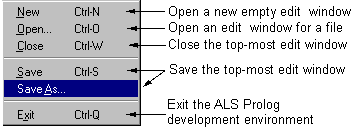

## FORMS

New, Open, Close, Save, and SaveAs apply to editor windows, and have their usual meanings. New opens a fresh editor window with no content, while Open allows one to select an existing file for editing. Quit allows you to exit from the ALS Prolog IDE.
