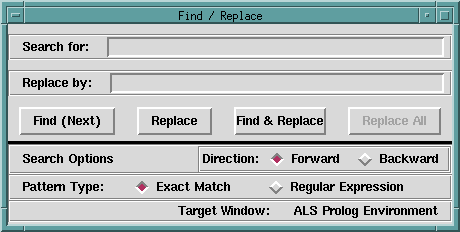

## FORMS

This dialog allows one to search in whatever window is top-most, and to carry out replacements in editor windows. If the text which has been typed into the **Search for:** box is located, then the window containing the text is adjusted so that the sought-for text is approximately centered vertically, and the text is highlighted.

