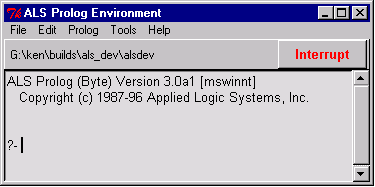

## FORMS

The
main
window on Unix : :

On Windows : :

On Macintosh : :

Parts of the main window :

The Location Display shows the current directory or folder.

The Interrupt Button is used to interrupt prolog computations.

The Help Menu will in the future provide access to the help system(which can also be run separately) . The Console Window is used to submit goals to the system and to view results.

