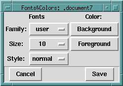

## FORMS

## DESCRIPTION

The Preferences choice produces the following popup window: 

Selections made using any of the buttons on this window immediately apply to the window(listener, debugger, or editor window) from which the Preferences button was pressed. Selecting Cancel simply removes the
Fonts &amp; Colors window without undoing any changes. Selecting Save records the selected preferences in the
initialization file(alsdev.ini) which is read at start-up time, and also records the selections globally for the current session. Although no existing editor windows are changed, all new editor windows created will use the newly recorded preferences. Preferences for the main listener window and the debugger window are saved separately from the editor window preferences.

