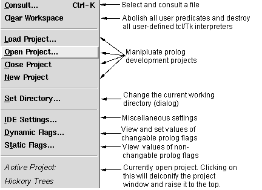
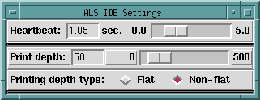

## FORMS

## DESCRIPTION

The menu controlling aspects of the alsdev prolog system is combined with the menu for managing Prolog Projects (the 2nd section in the picture below).  This page describes how to control aspects of the alsdev prolog system.  The [Prolog Projects Menu](Prolog_Projects_Menu.html) page describes how to manage Prolog Projects.

Choosing **Consult** produces two different behaviors, depending on whether the Prolog menu was pulled down from the main listener or debugger windows, or from an editor window. Using the accelerator key sequence (Ctrl-K on Unix and Windows, and &lt;AppleKey&gt;-K on Macintosh) 
produces equivalent behaviors in the different settings. 

If Consult is chosen from the main listener or debugger windows, a file selection dialog appears, and the selected file is(re) consulted into the current Prolog database. 

In contrast, if Consult is selected from an edit window (or the Ctrl/&lt;AppleKey&gt;-K 
accellerator key is hit over that window), the file associated with that window is(re) consulted into the Prolog database; if unsaved changes have been made in the editor window, the file/window is first Saved before consulting.

If a file containing syntax errors is consulted, these errors are collected, an editor window into the file is opened, and the errors are displayed, as indicated below :

For the error display, line numbers are added on the left, and the lines on which errors occur are marked in red. Lines in which an error occurs at a specified point are marked in a combination of red and green, with the change in color indicating the point at which the error occurs. Erroneous lines without such a specific error point, such as attempts to redefine comma, are marked all in red. A scrollable pane is opened below the edit window, and all the errors that occurred are listed in that pane. Double clicking on one the listed errors in the lower pane will cause the upper window to scroll until the corresponding error line appears in the upper pane. The upper pane is an ordinary edit window, and the errors can be corrected and the file saved. Choosing Prolog &gt; Consult, or typing ^K will cause the file to be reconsulted, and the error panes to be closed.

**Clear Workspace** causes all procedures which have been consulted to be abolished, including clauses which have been dynamically asserted. In addition, in future releases, all user-defined Tc/Tk interpreters will also be destroyed.

**Set Directory ...** allows you to change the current working directory.

Selecting **IDE Settings** raises the following dialog :

The **Heartbeat** is the time interval between moments when a Prolog program temporarily yields control to the Tcl/Tk interface to allow for processing of GUI events, including clicks on the Interrupt button.

The **Print depth** setting controls how deep printing of nested terms will proceed; when the depth limit is reached, some representation(normally ' * ' or ' ... ') is printed instead of continuing with the nested term.

The **Printing depth type** setting determines whether traversing a list or the top-level arguments of a term increases the print depth counter. 
The Flat setting indicates that the counter will not increase as one traverses a list or the top level of a term, while Non-flat specifies that the counter will increase.

Selecting **Dynamic Flags** produces a popup window which displays the current values of all of the changeable Prolog flags in the system, and allows one to reset any of those values.

Selecting **Static Flags** produces a popup window displaying the values of all of the unchangeable Prolog flags for the system

