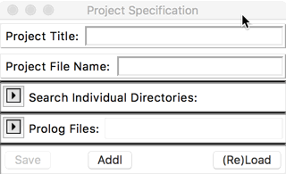
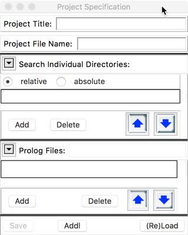

## FORMS

## DESCRIPTION

The menu for managing Prolog Projects (the 2nd section in the picture below) is combined with the menu controlling aspects of the alsdev prolog system.  This page describes how to manage Prolog Projects.  The [Prolog Menu](Prolog_Menu.html) page describes how to control aspects of the alsdev prolog system.  

The four Project-related buttons in the second section of the menu, as well as the bottom entry on this menu, are used for management of Prolog development projects.

**Load Project...** allows one to load an existing Prolog project into the current workspace, including asserting all appropriate Prolog clauses. Selecting Load Project... brings up a file selection focused on  the extension *.ppj.  When a project has been selected:

 1. The project code is loaded into the workspace;
 2. The project specification panel appears (see below);
 3. The name of the project is shown at the bottom of the menu, below _Active Project:_.

**Open Project** brings up a file selection dialog (see below) that
allows one to open the specification panel for an existing project _without_ loading code into the workspace.

**Close Project** will close the current project specification panel, whether it was opened using Load Project or Open Project; it will also save the project specification itself, after prompting the user.  However, if the panel was opened with Load Project, this will _NOT_ remove any code from the workspace.  For this, one should use Clear Workspace from the top section of the menu.

**New Project** will open an empty project specification panel that looks like the following two images:

____________

Type in a title for the project in the top text field, and a name for the project file in second text field.  Set search directories in the upper toggle field, and select prolog files that are to be part of the project using the lower toggle field.  In both cases, either type into the text field, or click the Add button to bring up a selection dialog.  Use the up/down arrows to re-arrange the order in which directories are searched, and the order in which files are consulted.  The (Re)Load button will load or reload the selected files.  The project can be saved by using the File > Save button on the File menu.

The Addl button on the bottom of the panel brings up a second project-related panel which allows you to specify additional information. (Not all aspects yet implemented - cf. Issue#57).
