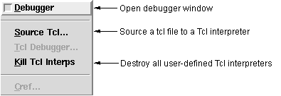

## FORMS

## DESCRIPTION

Selecting **Debugger** provides access to the GUI Debugger; this will be described in detail in [Chapter 18(_[Using,the,ALS,IDE,Debugger]_)](../guide/18-Using-the-ALS-IDE-Debugger.html).

**Source Tcl** allows one to "source" a Tcl/Tk file into a user/program-defined Tcl interpreter; the dialog prompts you for the name of the interpreter.

**Kill Tcl** Interps destroys all user-defined Tcl/Tk interpreters.

