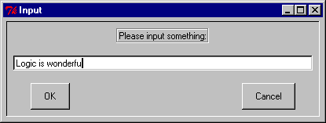

## FORMS
```
atomic_input_dialog(Msg, Input)

atomic_input_dialog(Msg, Title, Input)

atomic_input_dialog(Interp, Msg, Title, Input)
```
## DESCRIPTION

These predicates present the user with popup dialogs requesting input of text(as atoms) or numbers. The shorter versions are defined by :
```
atomic_input_dialog(Msg, Input)
    :-
    atomic_input_dialog(Msg, 'Input', Input) .

atomic_input_dialog(Msg, Title, Input)
    :-
    atomic_input_dialog(tcli, Msg, Title, Input) .
```
For the general call
```
atomic_input_dialog(Interp, Msg, Title, Input),
```
`Interp`, `Msg`, and `Title` should all be atoms, while `Input` should be an uninstantiated variable.


## EXAMPLES

The call
```
?- atomic_input_dialog('Please input something:', Input).
```
will popup the following window :



If the user types
```
Logic is wonderful
```
then the result would be
```
Atom = Logic is wonderful
```
## NOTES

The default Tcl interpreter for `atomic_input_dialog/[2,3,4]` is `tcli` as shown above.  This interpreter is *_NOT_* automatically intialized by alsdev.  You must first run `init_tk_alslib/0` or `init_tk_alslib/1`, or run `init_tk_alslib/2` with `Interp = tcli`.  If you wish to run `popup_select_items/4` with `Interp` bound to a Tcl interpreter `I` other than `tcli`, you must first run `init_tk_alslib/2` with `Interp` bound to this same `I` (only once is necessary).

## SEE ALSO

- [`init_tk_alslib/[0,1,2]`](inittkalslib012.html)
