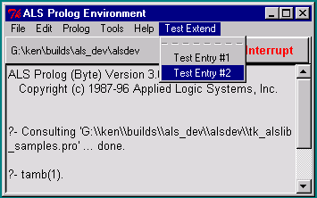

## FORMS
```
extend_main_menubar(Label, MenuEntriesList)

menu_entries_list(MenuPath, EntriesList)

menu_entries_list(Interp, MenuPath, EntriesList)

path_to_main_menu_entry(Index, SubMenuPath)

path_to_menu_entry(MenuPath, Index, SubMenuPath)

path_to_menu_entry(Interp, MenuPath, Index, SubMenuPath)

add_to_main_menu_entry(Index, Entry)

extend_cascade(Entry, MenuPath, Interp)
```
## DESCRIPTION

The general call
```
     extend_main_menubar(Label, MenuEntriesList)
```
adds entries to the main menubar in the ALS Prolog development environment.  `Label` should be the label which will appear on the menu bar, and `MenuEntriesList` is a Prolog list containing menu entry descriptors, which are either an `Atom` alone, or an expression of the form
```
     Atom + Expr
```
where `Atom` is a prolog atom which will serve as the new menu entry, and `Expr` is a menu entry action expression, which can be one of the following :

- `tcl(TclExpr)`

- `cascade(SubLabel, SubList)`

- PrologCall

Here, `TclExpr` can be any Tcl/Tk expression for evaluation, and `PrologCall` is any ground Prolog goal. The entry
```
cascade(SubLabel, SubList)
```
allows one to create menu entries which are themselves cascades. In this case, `SubLabel` must be an atom which will serve as the entry's label, and `SubList` is (recursively) a list of menu entry descriptors.

If `MenuPath` is a Tk path to a menu (top level or subsidiary), then the call
```
menu_entries_list(MenuPath, EntriesList)
```
will succeed if `EntriesList` is the list of labels for the entries on that menu, in order. As usual,
```
menu_entries_list(MenuPath, EntriesList)
     :-
     menu_entries_list(tcli, MenuPath, EntriesList).
```
Paths to menu entries are lists of integers representing the path from the root of the menu tree to a particular entry. When one indexes menu entries, the indicies are integers beginning at `0`. If` MenuPath` is a Tk path to a menu (top level or subsidiary), and if `Index` is an integer `>= 0`, and if the `Index'th` entry of `MenuPath` is a cascade, so that it has an associated menu, then `SubMenuPath` is a path to that associated menu.

As usual,
```
path_to_main_menu_entry(Index, SubMenuPath)
    :-
    path_to_menu_entry(shl_tcli, '.topals.mmenb', Index, SubMenuPath).

path_to_menu_entry(MenuPath, Index, SubMenuPath)
    :-
    path_to_menu_entry(tcli, MenuPath, Index, SubMenuPath).
```

Finally, one can add new entries at the ends(bottoms) of existing menu cascades, as follows:
```
add_to_main_menu_entry(Index, Entry)
    :-
    path_to_main_menu_entry(Index, MenuPath),
    extend_cascade(Entry, MenuPath, shl_tcli).
```
The predicate
```
extend_cascade(Entry, MenuPath, Interp)
```
adds `Entry` to the end of menu `MenuPath` under interpreter `Interp`.

## EXAMPLES

After executing the call
```
?- extend_main_menubar('Test Extend', ['Test Entry #1', 'Test Entry #2']).
```
the main listener window would look like this when clicking on the newly added menubar entry:



Suppose we define
```
test_write
    :-
    printf(user_output, 'This is a test ...\n', []),
    flush_input(user_input).
```
and replace the call considered above by:

?- extend_main_menubar('Test Extend', 
                ['Test Entry #1' + tcl('bell'), 
                 'Test Entry #2' + test_write]).

Then the appearance of the main menu and the new pulldown will be the same, but choosing `Test Entry #1` will cause the bell to ring, and choosing `Test Entry #2` will cause
```
This is a test ...
```
to be written on the listener console.

Note that the following is the case :
```
?- menu_entries_list(shl_tcli, ' .topals.mmenb ', EntriesList).

EntriesList = [File, Edit, Prolog, Tools, Help].
```
And,
```
?- path_to_main_menu_entry(4, SubMenuPath).

SubMenuPath = .topals.mmenb.help
```
Finally,
```
?- add_to_main_menu_entry(3, 'My Entry' + test_write).
```
will add an entry at the end of the `Tools` cascade.

## NOTES

The default Tcl interpreter for `menu_entries_list/3` and `path_to_main_menu_entry/4` is `tcli` as shown above.  This interpreter is *_NOT_* automatically initialized by alsdev.  You must first run [`init_tk_alslib/0` or `init_tk_alslib/1`, or run `init_tk_alslib/2` with `Interp = tcli`](init_tk_alslib.html).  If you wish to run `menu_entries_list/3` or `path_to_main_menu_entry/4` with `Interp` bound to a Tcl interpreter `I` other than `tcli`, you must first run `init_tk_alslib/2` with `Interp` bound to this same `I` (only once is necessary).

## SEE ALSO

- [`init_tk_alslib/[0,1,2]`](init_tk_alslib.html)
