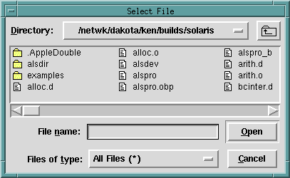

## FORMS
```
file_select_dialog(FileName)

file_select_dialog(Options, FileName)

file_select_dialog(Interp, Options, FileName)
```
## DESCRIPTION

These predicates allow the user to select a file using the native file selection dialogs on each platform. The shorter versions are defined by :
```
file_select_dialog(FileName)
    :-
    file_select_dialog(tcli, [title = ' Select File ' ], FileName) .

file_select_dialog(Options, FileName)
    :-
    file_select_dialog(tcli, Options, FileName) .
```
For the general call
```
file_select_dialog(Interp, Options, FileName)
```
`Interp` should be an atom naming a Tcl interpreter, `Filename` should be an uninstantiated variable, and `Options` should be a list of options as follows :

`defaultname = DefaultName`
&nbsp;&nbsp;&nbsp;&nbsp;&nbsp;&nbsp;&nbsp;&nbsp;_default file name_

`ext = Ext`
&nbsp;&nbsp;&nbsp;&nbsp;&nbsp;&nbsp;&nbsp;&nbsp;_to either add or use for selection_

`mode = new/select/save_as`
&nbsp;&nbsp;&nbsp;&nbsp;&nbsp;&nbsp;&nbsp;&nbsp;_default = `select`_

`initialdir = Initial`
&nbsp;&nbsp;&nbsp;&nbsp;&nbsp;&nbsp;&nbsp;&nbsp;_dir in which to begin..._

`title = WindowTitle`

`filetypes = FileTypesList`
<br>&nbsp;&nbsp;&nbsp;&nbsp;&nbsp;&nbsp;&nbsp;&nbsp;_where `FileTypesList` is a list of the form   
&nbsp;&nbsp;&nbsp;&nbsp;&nbsp;&nbsp;&nbsp;&nbsp;`[[Desc1 [ext1]], [Desc2, [ext2],...]`     
&nbsp;&nbsp;&nbsp;&nbsp;&nbsp;&nbsp;&nbsp;&nbsp;and the `Desci` and `exti` are all atoms_

## EXAMPLES
The call
```
?- file_select_dialog(File).
```
would produce this popup :



## NOTES

The default Tcl interpreter for `file_select_dialog/[1,2]` is `tcli` as shown above.  This interpreter is *_NOT_* automatically initialized by alsdev.  You must first run [`init_tk_alslib/0` or `init_tk_alslib/1`, or run `init_tk_alslib/2` with `Interp = tcli`](init_tk_alslib.html).  If you wish to run `file_select_dialog/3` with `Interp` bound to a Tcl interpreter `I` other than `tcli`, you must first run `init_tk_alslib/2` with `Interp` bound to this same `I` (only once is necessary).

## SEE ALSO

- [`init_tk_alslib/[0,1,2]`](init_tk_alslib.html)
