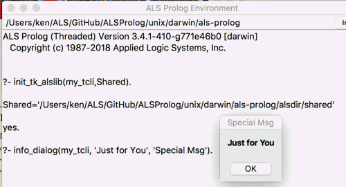

## FORMS
```
init_tk_alslib

init_tk_alslib(Shared)

init_tk_alslib(Interp,Shared)
```

## DESCRIPTION

These predicates are used to initial the TclTk library for alsdev, together with a Tcl interpreter devoted to that library.  The default Tcl interpreter is `tcli`.  The shorter versions of these predicates are defined by:
```
init_tk_alslib
        :-
        init_tk_alslib(tcli,_).

init_tk_alslib(Shared)
        :-
        init_tk_alslib(tcli, Shared).
```

The full version is `init_tk_alslib(Interp,Shared)`, where `Interp` is an atom which is _NOT_ the name of a Tcl interpreter, and `Shared` is an uninstantiated variable.  After successful execution of this predicate, `Interp` will be the name of a Tcl interpreter, and `Shared` will be unified with the ALS Prolog shared folder, which is a subfolder of the `alsdir` folder associated with the ALS Prolog installation:
```
        alsdir/
            builtins/ images/   library/  shared/
```

## EXAMPLES
The example below shows the result of first executing `?-init_tk_alslib(my_tcli,Shared).` in alsdev, and then executing `?- info_dialog(my_tcli, 'Just for You', 'Special Msg').`



## NOTES
A number of useful utility predicates are available in the ALS Prolog library for alsdev (`alsdir/library/tk_alslib.pro`); they are automatically loaded when invoked.  They include:
```
    popup_select_items/[2,3,4]
    extend_main_menubar/[2,3,4]
    extend_menubar_cascade/[2,4]
    info_dialog/[1,2,3]
    yes_no_dialog/[2,3,4,6]
    atomic_input_dialog/[2,3,4]
    user_pw_input_dialog/[2,3,4]
    file_select_dialog/[1,2,3]
    create_image/[2,3]
    display_image/[1,3,5]
    create_display_image/[1,2,3]
    extend_cascade/3
    menu_entries_list/[2,3]
    path_to_main_menu_entry/2
    path_to_menu_entry/[3,4]
```
The (short) versions of these predicates which do not use an `Interp` argument default their Tcl interpreter to `tcli`.  To use these, you need only ensure that you run one of `init_tk_alslib/[0,1]` (just once) before calling the short predicates.  To use the versions of these predicates with an `Interp` argument other than `tcli`, you must ensure that you first run (just once) the predicate `init_tk_alslib/2` with `Interp` set to the name for the interpreter you wish to use.
