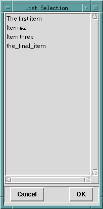
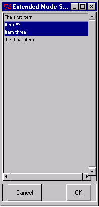

## FORMS
```
popup_select_items(SourceList, ChoiceList)

popup_select_items(SourceList, Options, ChoiceList)

popup_select_items(Interp, SourceList, Options, ChoiceList)
```
## DESCRIPTION

These predicates present popup lists to the user, who is expected to choose one or more items. The shorter versions are defined by
```
popup_select_items(SourceList, ChoiceList)
    :-
    popup_select_items(tcli, SourceList, [ ], ChoiceList) .

popup_select_items(SourceList, Options, ChoiceList)
    :-
    popup_select_items(tcli, SourceList, Options, ChoiceList) .
```
For the general call
```
popup_select_items(Interp, SourceList, Options, ChoiceList)
```
`Interp` should be an atom naming a Tcl interpreter, `SourceList` should be a list of atoms, `ChoiceList` should be an uninstantiated variable, and `Options` should be a list of equations of the forms:
```
    mode = SelectMode

    title = Atom
```
where `SelectMode` is one of: `browse single multiple extended`.

If the selection mode is `single` or `browse`, at most one element can be selected in the listbox at once. In both of these modes, clicking button 1 on an element selects it and deselects any other selected item. In `browse` mode it is also possible to drag the selection with button 1.

If the selection mode is `multiple` or `extended`, any number of elements may be selected at once, including discontiguous ranges. In `multiple` mode, clicking button 1 on an element toggles its selection state without affecting any other elements. In `extended` mode, pressing button 1 on an element selects it, deselects everything else, and sets the anchor to the element under the mouse; dragging the mouse with button 1 down extends the selection to include all the elements between the anchor and the element under the mouse, inclusive.

## EXAMPLES

The call
```
?- popup_select_items(['The first item', 'Item #2', 'Item three', the_final_item ], Selection).
```
produces the popup shown below:



In this case, the user is allowed to select a single item; if the user selected &quot;Item three&quot; and clicked OK, the result would be:
```
Selection = [Item three].
```
Even though in this case the user was restricted to selection of one item, the `popup_select_items/_` predicate returns a list of the selected items. 

The `Options` argument for `popup_select_items/[3,4]` allows the programmer to place the popup list box in any of the other standard Tk listbox selection modes. For example, the call
```
?- popup_select_items(['The first item', 'Item #2', 'Item three', the_final_item],
                      [mode = extended, title = 'Extended Mode Selection'],
                      Selection).
```
will popup a list box whose appearance is identical (apart from the different title requested) to the previous listbox. However, it will permit selection of ranges of elements, as seen below



The result of clicking OK will be: `Selection = [Item #2,Item three]`.

## NOTES

The default Tcl interpreter for `popup_select_items/[2,3]` is `tcli` as shown above.  This interpreter is *_NOT_* automatically initialized by alsdev.  You must first run [`init_tk_alslib/0` or `init_tk_alslib/1`, or run `init_tk_alslib/2` with `Interp = tcli`](init_tk_alslib.html).  If you wish to run `popup_select_items/3` with `Interp` bound to a Tcl interpreter `I` other than `tcli`, you must first run `init_tk_alslib/2` with `Interp` bound to this same `I` (only once is necessary).

## SEE ALSO

- [`init_tk_alslib/[0,1,2]`](init_tk_alslib.html)
