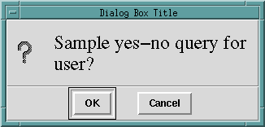

## FORMS

```
yes_no_dialog(Msg, Answer)

yes_no_dialog(Msg, Title, Answer)

yes_no_dialog(Interp, Msg, Title, Answer)

yes_no_dialog(Interp, Msg, Title, YesLbl, NoLbl, Answer)
```

## DESCRIPTION

These dialogs present popup dialogs with a question and two buttons to the user.
The shorter versions are defined by:

```
yes_no_dialog(Msg, Answer) :-
  yes_no_dialog(Msg, ' Info ', Answer).

yes_no_dialog(Msg, Title, Answer) :-
  yes_no_dialog(tcli, Msg, Title, Answer).

yes_no_dialog(Interp, Msg, Title, Answer) :-
  yes_no_dialog(Interp, Msg, Title,
  ' Yes ', ' No ', Answer).
```

For the general call

```
yes_no_dialog(Interp, Msg, Title, YesLbl, NoLbl, Answer)
```

`Interp`, `Msg`, `Title`, `YesLbl`, and `NoLbl` should all be atoms, and `Answer` should be an uninstantiated variable.


## EXAMPLES

The call:

```
? - yes_no_dialog(' Sample yes-no query for user ? ',

Answer) .
```

produces the following popup dialog:


If the user clicks " Yes ", the result is `Answer = Yes` while clicking " No " yields `Answer = No.`

The call:

```
yes_no_dialog(tcli,
' Sample yes-no query for user ? ',
' Dialog Box Title ',
' OK ', ' Cancel ', Answer) .
```

produces the popup dialog:



Clicking " OK " yields `Answer = OK` while clicking " Cancel " yields
`Answer = Cancel`.

## NOTES

The default Tcl interpreter for `yes_no_dialog/4` and `yes_no_dialog/6` is `tcli` as shown above.  This interpreter is *_NOT_* automatically initialized by alsdev.  You must first run [`init_tk_alslib/0` or `init_tk_alslib/1`, or run `init_tk_alslib/2` with `Interp = tcli`](init_tk_alslib.html).  If you wish to run `yes_no_dialog/4` or `yes_no_dialog/6` with `Interp` bound to a Tcl interpreter `I` other than `tcli`, you must first run `init_tk_alslib/2` with `Interp` bound to this same `I` (only once is necessary).

## SEE ALSO

- [`init_tk_alslib/[0,1,2]`](init_tk_alslib.html)

