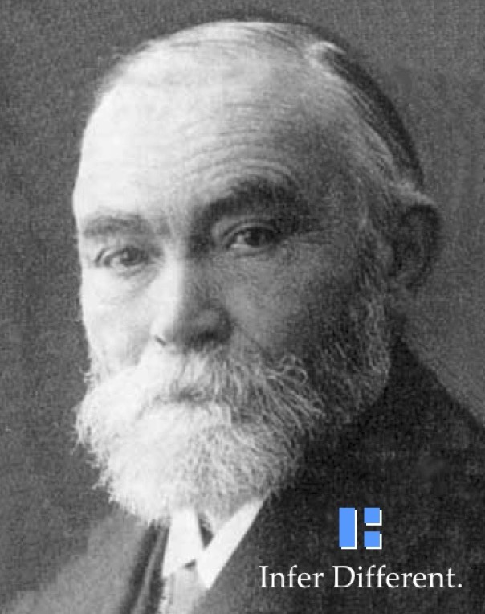

Late last century, a certain [fruit-based computer company ran an advertising campaign
with the slogan "Think Different."](https://en.wikipedia.org/wiki/Think_different) 
The [TV](https://www.youtube.com/watch?v=cpzvwkR1RYU)
and [posters](http://www.thecrazyones.it/poster.html)
featured portraits of many creative geniuses, but one group was conspicuously missing:
Logicians!

To correct this, ALS produced parody posters featuring some of the founders of
mathematical logic,
[David Hilbert](https://en.wikipedia.org/wiki/David_Hilbert) and
[Gottlob Frege](https://en.wikipedia.org/wiki/Gottlob_Frege).
Going beyond mere "thinking", the poster exhort us to
"Unify Different." and "Infer Different."

The Posters:

- 

- 

