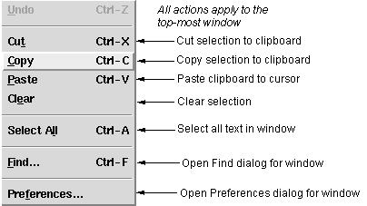

## FORMS

Cut,
Copy,
Paste,
Clear, and
Select All apply as usual to the current selection in any editor window.

Paste in the main window always pastes into the last line of the window.

Find opens the Find Dialog window in association with the top-most window.

Preferences... opens the Preferences Dialog window for the top-most window.

